<p align="center">
  
</p>

<p align="center">
  <a href="./README.md">English</a>
  &nbsp;·&nbsp;
  <a href="./README.zh-CN.md">简体中文</a>
  &nbsp;·&nbsp;
  <strong>Español</strong>
  &nbsp;·&nbsp;
  <a href="./docs/GUIDE.md">Guía</a>
  &nbsp;·&nbsp;
  <a href="./docs/ACP.md">ACP</a>
  &nbsp;·&nbsp;
  <a href="./docs/EXTENSIONS.md">Extensiones</a>
  &nbsp;·&nbsp;
  <a href="./docs/SPEC.md">Especificación</a>
  &nbsp;·&nbsp;
  <a href="https://esengine.github.io/DeepSeek-Reasonix/">Sitio web</a>
  &nbsp;·&nbsp;
  <strong><a href="https://discord.gg/XF78rEME2D">Discord</a></strong>
</p>

<p align="center">
  <a href="https://www.npmjs.com/package/reasonix"></a>
  <a href="https://github.com/esengine/DeepSeek-Reasonix/actions/workflows/ci.yml"></a>
  <a href="./LICENSE"></a>
  <a href="https://www.npmjs.com/package/reasonix"></a>
  <a href="https://github.com/esengine/DeepSeek-Reasonix/stargazers"></a>
  <a href="https://atomgit.com/esengine/DeepSeek-Reasonix"></a>
  <a href="https://github.com/esengine/DeepSeek-Reasonix/graphs/contributors"></a>
  <a href="https://github.com/esengine/DeepSeek-Reasonix/discussions"></a>
  <a href="https://discord.gg/XF78rEME2D"></a>
</p>

<p align="center">
  <a href="https://trendshift.io/repositories/27020?utm_source=trendshift-badge&amp;utm_medium=badge&amp;utm_campaign=badge-trendshift-27020" target="_blank" rel="noopener noreferrer"></a>
  <a href="https://trendshift.io/repositories/27020?utm_source=repository-badge&amp;utm_medium=badge&amp;utm_campaign=badge-repository-27020" target="_blank" rel="noopener noreferrer"></a>
</p>

<br/>

<p align="center"><strong>Código abierto · MIT · un único binario en Go</strong></p>
<h3 align="center">Un agente de codificación que puedes dejar ejecutándose.</h3>
<p align="center">Un motor local con cuatro vías de acceso: terminal, aplicación de escritorio, navegador o tu editor mediante ACP. El modo de planificación, los permisos, el entorno aislado (sandbox) del espacio de trabajo y los puntos de control (checkpoints) por turno hacen que una ejecución autónoma prolongada siga siendo legible y reversible.</p>

<div align="center">
  <video src="https://github.com/user-attachments/assets/ab2f3878-e224-4931-8254-060e7695cfb9" controls preload="metadata" width="560"></video>
</div>

<br/>

> [!IMPORTANT]
> **Comunidad · 加入社区** — Discord bilingüe para asistencia de configuración (`#help` / `#求助`), demostraciones de flujos de trabajo e ideas de funciones. → **<https://discord.gg/XF78rEME2D>**

<br/>

## Características

- **Basado en configuración.** Los proveedores, el agente, las herramientas habilitadas y los plugins se declaran en `reasonix.toml`. Sin modelos codificados de forma fija (*hardcoded*).
- **Multimodelo y componible.** DeepSeek se incluye como ajuste predeterminado; cualquier endpoint compatible con OpenAI es simplemente una entrada de configuración, sin necesidad de código nuevo. Opcionalmente, ejecuta dos modelos juntos (ejecutor + planificador) en sesiones independientes y con estabilidad de caché.
- **Impulsado por plugins.** Los servidores MCP aportan herramientas, *prompts* y recursos; los *sidecars* del Protocolo de Extensión v1 también pueden interceptar eventos en tiempo de ejecución, aportar Proveedores e interfaz gráfica estructurada, y distribuir paquetes de plugins versionados.
- **Mantenimiento de contexto optimizado para caché.** Al inicio se inyecta un breve resumen de entorno estable; la salida obsoleta de herramientas se recorta o depura antes de la compactación de resúmenes, y el contrato del esquema de herramientas integradas está documentado para revisiones contra regresiones.
- **Distribución sin fricciones.** Binario único compilado con `CGO_ENABLED=0`; compilación cruzada hacia seis plataformas destino con un solo comando. El resultado es un binario estático completamente autónomo: nada que instalar en la máquina de destino salvo el binario mismo.

## Instalación

Elige la opción que mejor se adapte a cómo deseas usar Reasonix. La CLI/TUI, la aplicación de escritorio y la extensión de VS Code utilizan el mismo motor local de Reasonix.

### Ruta A: CLI / TUI

Instala el binario nativo mediante npm en cualquier plataforma compatible, o usa Homebrew en macOS:

```sh
npm i -g reasonix                  # cualquier SO; descarga el binario nativo precompilado
brew install esengine/reasonix/reasonix   # macOS
```

Los archivos comprimidos precompilados (`darwin|linux|windows × amd64|arm64`) y los archivos `SHA256SUMS` están disponibles en cada [versión publicada de GitHub](https://github.com/esengine/DeepSeek-Reasonix/releases).

### Ruta B: Aplicación de escritorio

Visita la [página oficial de descargas](https://reasonix.io/?download=desktop#start) para obtener la compilación de escritorio más reciente.

| Plataforma | Paquete | Arquitectura |
| --- | --- | --- |
| macOS | `.dmg` universal o `.zip` | Apple Silicon / Intel |
| Windows | Instalador `.exe` o portátil `.zip` | x64 / ARM64 |
| Linux | `.deb` o `.tar.gz` | x64 |

Los instaladores de Windows cuentan con firma digital de código a través de [SignPath.io](https://signpath.io/) con un certificado gratuito proporcionado por la [SignPath Foundation](https://signpath.org/).

### Ruta C: Extensión de VS Code

Completa la Ruta A primero. La extensión no incluye la CLI de forma integrada; inicia tu backend local de `reasonix acp` y añade chat nativo, contexto del editor, aprobaciones de llamadas a herramientas, selección de modelos y sesiones en el espacio de trabajo.

- **VS Code:** [instalar desde Visual Studio Marketplace](https://marketplace.visualstudio.com/items?itemName=SivanLiu.reasonix-agent)
- **VSCodium / Eclipse Theia:** [instalar desde Open VSX Registry](https://open-vsx.org/extension/SivanLiu/reasonix-agent)
- **ID de la extensión:** `SivanLiu.reasonix-agent` · [código fuente y guía de uso](https://github.com/SivanCola/reasonix-vscode)

### Ruta D: Compilación desde el código fuente

Clona primero el repositorio:

```sh
git clone https://github.com/esengine/DeepSeek-Reasonix.git
cd DeepSeek-Reasonix
```

#### CLI

La compilación de la CLI requiere **Go 1.26+**. El módulo fija una directiva `toolchain`; mantén `GOTOOLCHAIN=auto` para que Go descargue la cadena de herramientas fijada, o instálala manualmente.

```sh
make build      # -> bin/reasonix(.exe)
make cross      # -> dist/ (darwin|linux|windows × amd64|arm64)
```

#### Escritorio

La compilación de escritorio requiere adicionalmente **Node 24+ y pnpm 10** (`npm install -g pnpm@10`) para el frontend y el contenedor de Electron:

```sh
scripts/desktop-build.sh darwin/arm64 v0.0.0-dev   # una plataforma por ejecución
```

No se requieren dependencias de webview del sistema operativo: el contenedor incluye su propio Chromium. Consulta la [guía de compilación de escritorio](desktop/README.md#prerequisites).

## Inicio rápido

### CLI / TUI

Estos comandos corresponden a la CLI/TUI instalada mediante la Ruta A:

```sh
reasonix setup                      # configurar un proveedor y modelo
reasonix                            # iniciar una sesión interactiva
reasonix run "implement the TODOs in main.go"
```

En una sesión interactiva, ejecuta `/init` cuando quieras que Reasonix genere instrucciones de proyecto.

### Aplicación de escritorio

Descarga el instalador correspondiente a tu plataforma desde la [página oficial de descargas](https://reasonix.io/?download=desktop#start), instala e inicia Reasonix, y luego configura un proveedor y modelo en la aplicación. Los comandos de la CLI descritos arriba no son necesarios para la aplicación de escritorio.

Para un uso avanzado de la CLI y configuración, consulta la **[referencia de la CLI](./docs/CLI.md)**, la **[Guía](./docs/GUIDE.md)** y las **[rutas de configuración](./docs/CONFIG_PATHS.md)**.

## Documentación

- **Primeros pasos:** [Guía](./docs/GUIDE.md) · [Referencia de la CLI](./docs/CLI.md) ·
  [Rutas de configuración](./docs/CONFIG_PATHS.md) · [Integración de editor ACP](./docs/ACP.md)
- **Funcionalidades y solución de problemas:** [Perfiles de subagentes](./docs/SUBAGENT_PROFILES.md) ·
  [Context Engine v2](./docs/SESSION_MEMORY_RETRIEVAL.md) ·
  [Entregables de archivos y la herramienta `present`](./docs/PRESENT_TOOL.md) ·
  [Diagnóstico de capacidades](./docs/CAPABILITY_DIAGNOSTICS.md) ·
  [Recuperación y actualizaciones](./docs/RECOVERY.md) · [Guía de bots](./docs/BOT_GUIDE.md) ·
  [Puntos de control (checkpoints) y reversión (rewind)](./docs/CHECKPOINTS.md)
- **Ingeniería y migración:** [Especificación](./docs/SPEC.md) ·
  [Contratos de tareas y política de pausa](./docs/TASK_CONTRACT.md) ·
  [Contrato de herramientas](./docs/TOOL_CONTRACT.md) · [Migración desde 0.x](./docs/MIGRATING.md)
- **Desarrollo de extensiones:** [Extensiones](./docs/EXTENSIONS.md) ·
  [Paquetes de plugins y Manifest v1](./docs/PLUGIN_PACKAGES.md) ·
  [Protocolo de extensión](./docs/EXTENSION_PROTOCOL.md) ·
  [SDK de Go y proyecto inicial](./sdk/go/README.md)

## Historial de estrellas (Star History)

<a href="https://www.star-history.com/?repos=esengine%2FDeepSeek-Reasonix&type=date&legend=top-left">
 <picture>
   <source media="(prefers-color-scheme: dark)" srcset="https://raw.githubusercontent.com/esengine/DeepSeek-Reasonix/star-history/assets/star-history/star-history-dark.svg" />
   <source media="(prefers-color-scheme: light)" srcset="https://raw.githubusercontent.com/esengine/DeepSeek-Reasonix/star-history/assets/star-history/star-history-light.svg" />
   
 </picture>
</a>

<br/>

## Agradecimientos

Una breve lista de personas cuyo trabajo ha influido profundamente en Reasonix: actualmente los 20 principales colaboradores por cantidad de commits. El gráfico completo de colaboradores se encuentra en [GitHub](https://github.com/esengine/DeepSeek-Reasonix/graphs/contributors?all=1).

<!-- reasonix-top-contributors:start -->
| Contributor | Contributor | Contributor | Contributor |
| --- | --- | --- | --- |
| [**SivanCola**](https://github.com/SivanCola) | [**esengine**](https://github.com/esengine) | [**ttmouse**](https://github.com/ttmouse) | [**lifu963**](https://github.com/lifu963) |
| **reasonix** | [**HUQIANTAO**](https://github.com/HUQIANTAO) | [**GTC2080**](https://github.com/GTC2080) | [**light-front-theory**](https://github.com/light-front-theory) |
| **merge-order-check** | [**Li-Charles-One**](https://github.com/Li-Charles-One) | [**eghrhegpe**](https://github.com/eghrhegpe) | **wufengfan** |
| [**CVEngineer66**](https://github.com/CVEngineer66) | [**dependabot\[bot\]**](https://github.com/apps/dependabot) | [**lanshi17**](https://github.com/lanshi17) | [**SuMuxi66**](https://github.com/SuMuxi66) |
| [**CnsMaple**](https://github.com/CnsMaple) | [**cyq1017**](https://github.com/cyq1017) | [**JesonChou**](https://github.com/JesonChou) | [**XTLine**](https://github.com/XTLine) |
<!-- reasonix-top-contributors:end -->

Agradecimiento especial a [**Bernardxu123**](https://github.com/Bernardxu123) por diseñar el logotipo del proyecto y el video de presentación.

<p align="center">
  <a href="https://github.com/esengine/DeepSeek-Reasonix/graphs/contributors">
    
  </a>
</p>

<br/>

---

<p align="center">
  <sub>MIT — consulta <a href="./LICENSE">LICENSE</a></sub>
  <br/>
  <sub>Creado por la comunidad en <a href="https://github.com/esengine/DeepSeek-Reasonix/graphs/contributors">esengine/DeepSeek-Reasonix</a></sub>
</p>

---

<p align="center"><sub><strong>Apoya este proyecto</strong></sub></p>

Si Reasonix te ha sido útil y deseas expresar tu agradecimiento, puedes hacerlo. Se mantiene como un café, no un contrato: las donaciones no compran prioridad de funciones ni alteran la clasificación de incidencias (*issues*).

- **Internacional** — PayPal: [paypal.me/yuhuahui](https://paypal.me/yuhuahui)
- **国内** — WeChat Pay (escaneo de código)

<p align="center">
  
</p>
