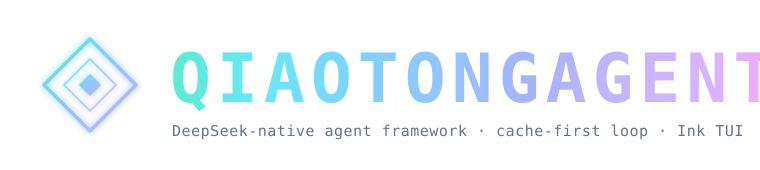

<p align="center">
  
</p>

<p align="center">
  <a href="./README.md">English</a>
  &nbsp;·&nbsp;
  <a href="./README.zh-CN.md">简体中文</a>
  &nbsp;·&nbsp;
  <strong>Русский</strong>
  &nbsp;·&nbsp;
  <a href="./docs/GUIDE.md">Guide</a>
  &nbsp;·&nbsp;
  <a href="./docs/ACP.md">ACP</a>
  &nbsp;·&nbsp;
  <a href="./docs/EXTENSIONS.md">Extensions</a>
  &nbsp;·&nbsp;
  <a href="./docs/SPEC.md">Spec</a>
  &nbsp;·&nbsp;
  <a href="https://esengine.github.io/DeepSeek-Reasonix/">Website</a>
  &nbsp;·&nbsp;
  <strong><a href="https://discord.gg/XF78rEME2D">Discord</a></strong>
</p>

<p align="center">
  <a href="https://www.npmjs.com/package/reasonix"></a>
  <a href="https://github.com/esengine/DeepSeek-Reasonix/actions/workflows/ci.yml"></a>
  <a href="./LICENSE"></a>
  <a href="https://www.npmjs.com/package/reasonix"></a>
  <a href="https://github.com/esengine/DeepSeek-Reasonix/stargazers"></a>
  <a href="https://atomgit.com/esengine/DeepSeek-Reasonix"></a>
  <a href="https://github.com/esengine/DeepSeek-Reasonix/graphs/contributors"></a>
  <a href="https://github.com/esengine/DeepSeek-Reasonix/discussions"></a>
  <a href="https://discord.gg/XF78rEME2D"></a>
</p>

<p align="center">
  <a href="https://trendshift.io/repositories/27020?utm_source=trendshift-badge&amp;utm_medium=badge&amp;utm_campaign=badge-trendshift-27020" target="_blank" rel="noopener noreferrer"></a>
  <a href="https://trendshift.io/repositories/27020?utm_source=repository-badge&amp;utm_medium=badge&amp;utm_campaign=badge-repository-27020" target="_blank" rel="noopener noreferrer"></a>
</p>

<br/>

<h3 align="center">DeepSeek-native AI coding agent для вашего терминала.</h3>
<p align="center">Тонкий harness на конфигурации и плагинах — один статический Go-бинарник, заточенный под prefix cache DeepSeek, чтобы стоимость токенов оставалась низкой в длинных сессиях.</p>

<br/>

> [!IMPORTANT]
> **Community · 加入社区 · Сообщество** — bilingual Discord: помощь с установкой (`#help` / `#求助`), воркфлоу и идеи фич. → **<https://discord.gg/XF78rEME2D>**

<br/>

## Возможности

- **Config-driven.** Providers, agent, включённые tools и plugins объявляются в
  `reasonix.toml`. Модели не захардкожены.
- **Multi-model и composable.** DeepSeek идёт как preset; любой
  OpenAI-compatible endpoint — это запись в конфиге, а не новый код. Опционально
  два модели вместе (executor + planner) в отдельных cache-stable sessions.
- **Plugin-driven.** MCP servers дают tools, prompts и resources;
  Extension Protocol v1 sidecars могут перехватывать runtime events, добавлять
  Providers и structured UI, а также поставлять versioned plugin packages.
- **Cache-aware обслуживание контекста.** При старте — небольшой стабильный
  environment summary; устаревший tool output snip/prune до summary compaction;
  built-in tool schema contract задокументирован для regression review.
- **Zero-friction distribution.** `CGO_ENABLED=0` single binary; cross-compile
  на шесть targets одной командой. На целевой машине нужен только сам бинарник.

## Установка

Выберите путь под ваш сценарий. CLI/TUI, desktop app и VS Code extension
используют один и тот же локальный движок Reasonix.

### Путь A: CLI / TUI

Установите native binary через npm на любой supported platform или через
Homebrew на macOS:

```sh
npm i -g reasonix                  # any OS; pulls the prebuilt native binary
brew install esengine/reasonix/reasonix   # macOS
```

Prebuilt archives (`darwin|linux|windows × amd64|arm64`) и `SHA256SUMS` — в
каждом [GitHub release](https://github.com/esengine/DeepSeek-Reasonix/releases).

### Путь B: Desktop app

Актуальную desktop-сборку берите на
[официальной странице загрузок](https://reasonix.io/?download=desktop#start).

| Платформа | Пакет | Архитектура |
| --- | --- | --- |
| macOS | Universal `.dmg` или `.zip` | Apple Silicon / Intel |
| Windows | Installer `.exe` или portable `.zip` | x64 / ARM64 |
| Linux | `.deb` или `.tar.gz` | x64 |

Windows-installer’ы code-signed через [SignPath.io](https://signpath.io/)
бесплатным сертификатом [SignPath Foundation](https://signpath.org/).

### Путь C: VS Code extension

Сначала завершите путь A. Расширение **не** бандлит CLI: оно стартует локальный
бэкенд `reasonix acp` и добавляет native chat, editor context, tool-call
approvals, выбор модели и workspace sessions.

- **VS Code:** [Visual Studio Marketplace](https://marketplace.visualstudio.com/items?itemName=SivanLiu.reasonix-agent)
- **VSCodium / Eclipse Theia:** [Open VSX Registry](https://open-vsx.org/extension/SivanLiu/reasonix-agent)
- **Extension ID:** `SivanLiu.reasonix-agent` · [исходники и гайд](https://github.com/SivanCola/reasonix-vscode)

### Путь D: Сборка из исходников

```sh
git clone https://github.com/esengine/DeepSeek-Reasonix.git
cd DeepSeek-Reasonix
make build      # -> bin/reasonix(.exe)
make cross      # -> dist/ (darwin|linux|windows × amd64|arm64)
```

## Быстрый старт

### CLI / TUI

Команды для CLI/TUI, установленного через путь A:

```sh
reasonix setup                      # configure a provider and model
reasonix                            # start an interactive session
reasonix run "implement the TODOs in main.go"
```

В интерактивной сессии выполните `/init`, когда нужно, чтобы Reasonix создал
project instructions.

### Desktop app

Скачайте installer для своей платформы с
[официальной страницы загрузок](https://reasonix.io/?download=desktop#start),
установите и запустите Reasonix, затем настройте provider и model в приложении.
CLI-команды выше для desktop не обязательны.

Продвинутый CLI и конфигурация: **[CLI reference](./docs/CLI.md)**,
**[Guide](./docs/GUIDE.md)** и
**[configuration paths](./docs/CONFIG_PATHS.md)**.

## Документация

Сейчас подробные docs на русском ещё не переведены — ссылки ведут на английские
версии (как fallback). Китайские варианты: `*.zh-CN.md`.

- **Старт:** [Guide](./docs/GUIDE.md) · [CLI reference](./docs/CLI.md) ·
  [Configuration paths](./docs/CONFIG_PATHS.md) · [ACP editor integration](./docs/ACP.md)
- **Фичи и troubleshooting:** [Subagent profiles](./docs/SUBAGENT_PROFILES.md) ·
  [Context Engine v2](./docs/SESSION_MEMORY_RETRIEVAL.md) ·
  [Capability diagnostics](./docs/CAPABILITY_DIAGNOSTICS.md) ·
  [Recovery and updates](./docs/RECOVERY.md) · [Bot guide](./docs/BOT_GUIDE.md) ·
  [Checkpoints & rewind](./docs/CHECKPOINTS.md)
- **Engineering & migration:** [Spec](./docs/SPEC.md) ·
  [Task contracts & pause policy](./docs/TASK_CONTRACT.md) ·
  [Tool contract](./docs/TOOL_CONTRACT.md) · [Migrating from 0.x](./docs/MIGRATING.md)
- **Extension development:** [Extensions](./docs/EXTENSIONS.md) ·
  [Plugin packages and Manifest v1](./docs/PLUGIN_PACKAGES.md) ·
  [Extension Protocol](./docs/EXTENSION_PROTOCOL.md) ·
  [Go SDK and starter](./sdk/go/README.md)

## Star History

<a href="https://www.star-history.com/?repos=esengine%2FDeepSeek-Reasonix&type=date&legend=top-left">
 <picture>
   <source media="(prefers-color-scheme: dark)" srcset="https://raw.githubusercontent.com/esengine/DeepSeek-Reasonix/star-history/assets/star-history/star-history-dark.svg" />
   <source media="(prefers-color-scheme: light)" srcset="https://raw.githubusercontent.com/esengine/DeepSeek-Reasonix/star-history/assets/star-history/star-history-light.svg" />
   
 </picture>
</a>

<br/>

## Благодарности

Небольшой список людей, чья работа сильнее всего сформировала Reasonix —
текущий top 20 contributors по числу коммитов. Полный граф:
[GitHub](https://github.com/esengine/DeepSeek-Reasonix/graphs/contributors?all=1).

<!-- reasonix-top-contributors:start -->
| Contributor | Contributor | Contributor | Contributor |
| --- | --- | --- | --- |
| [**SivanCola**](https://github.com/SivanCola) | [**esengine**](https://github.com/esengine) | [**ttmouse**](https://github.com/ttmouse) | [**lifu963**](https://github.com/lifu963) |
| **reasonix** (anonymous) | [**HUQIANTAO**](https://github.com/HUQIANTAO) | [**GTC2080**](https://github.com/GTC2080) | [**light-front-theory**](https://github.com/light-front-theory) |
| **merge-order-check** (anonymous) | [**Li-Charles-One**](https://github.com/Li-Charles-One) | [**eghrhegpe**](https://github.com/eghrhegpe) | **wufengfan** (anonymous) |
| [**CVEngineer66**](https://github.com/CVEngineer66) | [**dependabot\[bot\]**](https://github.com/apps/dependabot) | [**lanshi17**](https://github.com/lanshi17) | [**SuMuxi66**](https://github.com/SuMuxi66) |
| [**CnsMaple**](https://github.com/CnsMaple) | [**cyq1017**](https://github.com/cyq1017) | [**JesonChou**](https://github.com/JesonChou) | [**XTLine**](https://github.com/XTLine) |
<!-- reasonix-top-contributors:end -->

Отдельное спасибо [**Bernardxu123**](https://github.com/Bernardxu123)
за дизайн логотипа проекта и
[AIGC Link](https://xhslink.com/m/80ngts127cA) за промо на XiaoHongShu.

<p align="center">
  <a href="https://github.com/esengine/DeepSeek-Reasonix/graphs/contributors">
    
  </a>
</p>

<br/>

---

<p align="center">
  <sub>MIT — см. <a href="./LICENSE">LICENSE</a></sub>
  <br/>
  <sub>Built by the community at <a href="https://github.com/esengine/DeepSeek-Reasonix/graphs/contributors">esengine/DeepSeek-Reasonix</a></sub>
</p>

---

<p align="center"><sub><strong>Поддержать проект</strong></sub></p>

Если Reasonix оказался полезен и хочется сказать «спасибо» — можно. Это
кофе, а не контракт: донаты не покупают приоритет фич и не меняют triage issues.

- **International** — PayPal: [paypal.me/yuhuahui](https://paypal.me/yuhuahui)
- **国内** — 微信支付（扫码）

<p align="center">
  
</p>
