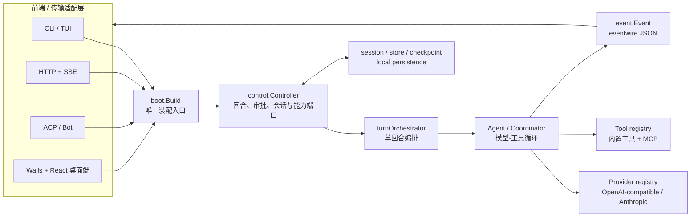
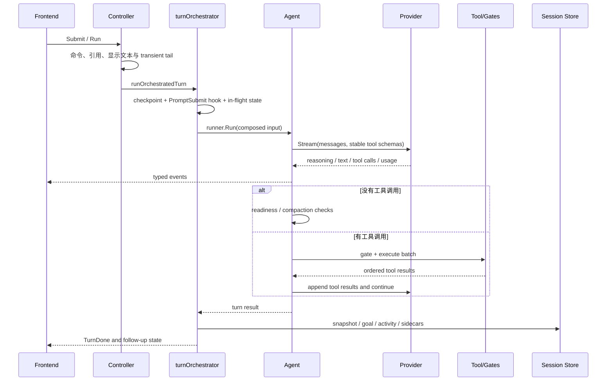

# Reasonix 架构与设计理念（按当前代码还原）

> 基线：`main-v2`，提交 `988190f3`（2026-07-15）。本文描述当前实现，而不是早期设想。
> [`SPEC.md`](SPEC.md) 仍是工程契约；当两者与代码不一致时，应先确认代码行为和测试，
> 再决定修正文档还是修改实现。

## 1. 先建立一个最小心智模型

Reasonix 不是“一个 CLI 外加若干工具”，而是一个可被多种前端驱动的 Agent 内核：

1. `boot.Build` 把配置、Provider、工具、插件、权限、记忆和持久化装配成一个
   `control.Controller`。
2. CLI、HTTP/SSE、ACP、Bot 和 Wails 桌面端都驱动同一个 Controller 契约。
3. Controller 负责一次用户回合的编排；`agent.Agent` 负责“模型调用—工具调用—再调用模型”循环。
4. 内核只发出类型化 `event.Event`，由各前端决定如何展示。
5. 会话、checkpoint、goal、后台任务等状态围绕同一个 session path 落盘。



入口文件是 [`cmd/reasonix/main.go`](../cmd/reasonix/main.go)。它通过空导入注册内置
Provider 和 Tool，然后进入 [`internal/cli`](../internal/cli)。真正的依赖装配集中在
[`internal/boot/boot.go`](../internal/boot/boot.go)，而不是散落在各个前端。

## 2. 从代码中可以确认的设计原则

| 原则 | 代码中的落实 | 维护时的含义 |
|---|---|---|
| 一个内核，多种前端 | `control.Controller` 和 `control.SessionAPI` 是传输无关端口 | 通用行为优先放进 `internal/control` 或更低层，不要只修某个 UI |
| 装配与执行分离 | `boot.Build` 负责构造，Controller/Agent 负责运行 | 新依赖先判断属于“启动期装配”还是“回合期行为” |
| 接口与 registry 驱动 | `provider.Provider`、`tool.Tool`、进程级 factory/builtin registry | 新 Provider/Tool 不应进入按名称分支的巨大 `switch` |
| 类型化事件代替输出耦合 | `internal/event` 描述事实，`internal/eventwire` 统一 JSON 形状 | 内核不直接依赖 ANSI、React 或 HTTP 表现层 |
| Cache-first | system prompt、tool schema、standing memory 尽量保持字节稳定 | 修改模型可见前缀、工具顺序或 schema 是产品行为变更，不只是重构 |
| 默认最小权限 | plan mode、permission、Guardian、hooks、sandbox 分层门控 | 不要用一个“已批准”状态绕开其他独立安全边界 |
| 本地状态可恢复、可审计 | append-only event log、snapshot、lease、conflict log、checkpoint | 会话写入、删除和恢复必须一起设计，不能只改主 JSONL |
| 可选能力延迟接入 | MCP 分层连接、Skills 按需读取、能力路由 | 不要为了一个可选插件破坏默认启动或稳定前缀 |
| CLI 与桌面构建隔离 | 根模块可静态交叉编译；`desktop/` 是 Wails/CGO 嵌套模块 | 根模块通过不代表桌面通过，桌面必须在目标 OS 的原生工具链验证 |

其中“单一 Controller”“cache-first”等原则也明确写在根目录
[`REASONIX.md`](../REASONIX.md) 中。它会进入项目会话的 standing memory，因此应保持
简洁、稳定，只放长期成立的维护约束。

## 3. 分层和目录职责

### 3.1 主运行时

| 路径 | 主要职责 | 不应承担的职责 |
|---|---|---|
| `cmd/reasonix` | 二进制入口、编译期注册 | 业务流程 |
| `internal/cli` | 参数、子命令、TUI、退出码 | 重复装配内核 |
| `internal/boot` | composition root：配置到 Controller | 展示逻辑、长期运行状态机 |
| `internal/control` | 前端端口、输入编排、审批、goal、session 生命周期 | Provider 协议细节、UI 渲染 |
| `internal/agent` | 会话、模型/工具循环、并发只读调用、compaction | 某一前端的状态 |
| `internal/provider` | 模型请求/流式响应抽象和 registry | 工具执行策略 |
| `internal/tool` | Tool 接口、schema、运行期 registry | Controller 的交互流程 |
| `internal/event` | 内核事件领域模型 | JSON/React/SSE 特有字段 |
| `internal/eventwire` | 多前端共用的 JSON 事件契约 | 业务决策 |

[`internal/control/port.go`](../internal/control/port.go) 把 Controller 的大接口拆成
Lifecycle、TurnControl、Approvals、Goals、SessionHistory、MemoryControl、Capabilities、
Status、SessionPersistence、Input、Settings 等子端口。这既是前端依赖边界，也是未来继续
拆分 Controller 的自然接缝。

### 3.2 支撑域

| 域 | 关键目录 | 说明 |
|---|---|---|
| 配置 | `internal/config` | defaults → 用户配置 → 项目配置，再合并 MCP/旧配置；部分安全和执行上限只允许用户全局控制 |
| 权限与隔离 | `internal/permission`、`planmode`、`guardian`、`hook`、`sandbox`、`winsandbox` | 分层决策，不能简单合并成一个布尔值 |
| 会话与恢复 | `internal/store`、`agent/save.go`、`checkpoint`、`jobs` | transcript、事件日志、sidecar、锁、lease、checkpoint 和后台任务 |
| 上下文知识 | `internal/memory`、`history`、`retrieval`、`memorycompiler` | standing memory、历史检索、自动记忆、Memory v5 是不同机制 |
| 扩展能力 | `internal/plugin`、`pluginpkg`、`skill`、`command`、`capability` | MCP、插件包、Skills、斜杠命令和能力路由 |
| 交付证据 | `internal/evidence`、`instruction`、`autoresearch` | todo、验收证据、项目检查、持续研究 |
| 恢复平面 | `cmd/reasonix-guard`、`internal/repair` | 离线诊断、配置快照与事务撤销、启动健康跟踪、更新回滚和 Safe Mode |
| 其他前端 | `internal/serve`、`acp`、`bot`、`botruntime` | 把外部协议映射到 Controller 端口和事件 |

包注释通常就是最短的领域说明。开始修改某个包前，先读该包入口文件的 package comment，
再读同目录测试，比从全局搜索结果直接跳入实现更可靠。

## 4. 启动装配：`boot.Build`

`boot.Build` 是全项目最重要的 composition root，顺序大致如下：

1. 解析 workspace root 和额外可写目录。
2. 迁移旧配置并执行 `config.LoadForRoot`。
3. 解析模型引用、Provider、价格、上下文窗口和推理参数。
4. 组装稳定 system prompt：基础提示、环境快照、standing memory、输出风格和 Skills 索引。
5. 建立 per-run Tool Registry，加入启用的内置工具以及 MCP/插件工具。
6. 建立权限 Policy、交互审批桥、hooks、sandbox、sub-agent、history、memory、jobs 等依赖。
7. 创建 `agent.Agent`；配置 planner model 时，再以独立 session 包成 `Coordinator`。
8. 创建 `control.Controller`，挂接 goal、checkpoint、Guardian、能力路由和持久化。

前端只应通过 `boot.Options` 提供自身确实拥有的运行参数，例如 sink、workspace root、
session dir、headless approval mode、宿主文件 overlay。若一个新功能要求每个前端各自复制一套
装配代码，通常说明它放错了层。

Safe Mode 是与 Economy/Delivery profile 正交的启动边界。它由进程内
`REASONIX_SAFE_MODE` 开关触发，只用内置默认配置，不读写用户/项目 TOML；
为让恢复会话仍能连接明确选择的内置 Provider，凭据仍从全局 credential store 解析。
`boot.Build` 还会跳过旧状态迁移、session 清理对账、standing memory、Skills、
Memory compiler 和所有 MCP（包括宿主传入的 server）。它仍是可以运行内置工具的
Agent，不等于“整个进程只读”；工具仍受普通 permission 和 sandbox 约束。

## 5. 一次用户回合如何流动



关键实现位置：

- [`internal/control/turn_orchestrator.go`](../internal/control/turn_orchestrator.go)：可见回合与合成回合、checkpoint、hooks、goal 续跑。
- [`internal/agent/agent.go`](../internal/agent/agent.go)：Provider stream、消息追加、工具批处理、readiness 和 compaction。
- [`internal/control/controller.go`](../internal/control/controller.go)：公开命令、审批桥、session 和前端端口。

`Agent.Run` 在每一轮发送当前消息和稳定的工具 schema。没有 tool call 时才尝试结束；有 tool
call 时执行并把结果作为成对的 tool message 追加，再进入下一轮。`maxSteps <= 0` 表示不设置
这个可选轮数上限，因此不能把“所有运行都必然由 maxSteps 截断”当成不变量。

### 5.1 工具批处理和顺序

Agent 会保持模型给出的调用顺序发出 dispatch：

- 连续、已知且 `ReadOnly() == true` 的调用可以并行执行；
- 写调用、未知调用和混合边界按顺序执行；
- 当前并行批次最多同时运行 8 个调用；
- 即使内部并行，结果事件和写回模型的 tool results 仍保持调用顺序。

`ReadOnly` 因而不是 UI 标签，而是调度与权限语义。新增工具时错误标成只读，可能同时造成
越权和竞态。

### 5.2 一次工具调用经过哪些门

当前 `executeOne` 的主要顺序是：

1. 工具存在性、重复成功和 stale edit anchor 等本地循环保护。
2. plan mode 策略；外部 MCP 的 `readOnlyHint` 默认不被当作可信声明。
3. proxy/capability tool 解析为真实目标，并针对真实目标再次检查 plan mode。
4. delivery profile 的验收条件检查。
5. permission gate。需要询问时，Controller 可以先执行 Guardian 评审，再按规则要求真人确认；
   `remember`、`forget` 等特殊动作始终要求新鲜真人批准。
6. `PreToolUse` hook。
7. 对可预览的写工具建立 pre-edit checkpoint。
8. 工具执行；文件工具和 shell 工具在自身执行层继续遵守路径约束和 OS sandbox。
9. `PostToolUse`、证据记录、secret redaction、截断和结果事件。

这里的“多层”是刻意设计：plan mode 判断阶段合法性，permission 判断用户授权，hook 承载
项目策略，sandbox 约束进程实际能力。某一层放行不代表可以绕过其他层。

### 5.3 Todo 串行合约与自适应进度租约

`todo_write` 每次提交完整列表，但不能借“全量替换”绕过连续性：已经是
`in_progress` 的当前项不能被删除、换成无关任务或退回 `pending`，新增的
`completed` 也必须有 `complete_step` 收据。两级列表仍只允许一个当前项：执行
level-1 子步骤时，level-0 阶段保持 `pending`；子步骤全部签收后，阶段才升为
`in_progress` 并做最终签收。

在非 plan mode 的执行阶段，Agent 为活跃 Todo 维护进度租约。新完成项、新的成功读取、
命令或修改会续期，同一进度签名的精确重复不算进展。连续 8 个 tool-call round
无进展时宿主只注入一次重新评估提示；到 16 轮仍无进展时暂停当前回合，
保留会话供下一次用户回合继续。

`[agent].max_steps` 和 `planner_max_steps` 已退役：字段仍保留在解码结构中以兼容旧版，
但加载后始终归零。正常 boot 会以原子重写尝试从用户和项目 TOML 移除这两个 key；
即使移除失败，旧值也不会恢复运行时上限。Safe Mode 不执行这项迁移。CLI
`--max-steps` 仍是单次运行的显式预算，`[bot].max_steps` 仍是无人值守 Bot 的独立上限。

## 6. Cache-first：模型可见内容也是公共契约

Reasonix 针对前缀缓存做了架构级优化。可以把模型输入分成两类：

| 稳定前缀，尽量只在新 session 改变 | 回合尾部，可随当前状态改变 |
|---|---|
| base system prompt | plan mode marker |
| Provider 可见工具名、顺序、描述和 schema | goal/todo 提醒 |
| 启动时折叠的 standing memory | 本回合 reference 内容 |
| Skills 名称/摘要索引 | mid-session memory 更新提示 |
| 输出风格等低频设置 | 自动计划、恢复或执行提示 |

直接后果：

- 不要在每轮重建或重排 tool registry；schema 在注册时 canonicalize。
- 不要把一个临时开关写进 system prompt；优先由 `control.Compose` 注入 turn tail。
- 修改 `internal/boot`、`tool`、`provider`、`config`、`memory`、`skill`、`outputstyle` 时，
  必须做 cache-impact 审查并填写 PR 元数据。
- compaction 是明确的低频 cache reset point，不是普通回合都执行的整理动作。

### 6.1 运行 profile 如何改变模型可见 schema

在正常 boot 下：

| Profile | 启动工具面 | Cache / schema 语义 |
|---|---|---|
| Balanced（内部值 `full`） | 默认完整工具面 | `balanced` 是 `full` 别名，与未显式选择 profile 的 system message 和 tool schemas 字节一致 |
| Economy | 默认 9 个核心工具（`[tools].enabled` 可继续缩窄），其他来源由 `connect_tool_source` 按需加入 | 每次成功连接新来源会在下一次请求增加 schema，因而是一次明确的前缀变化；之后保持稳定 |
| Delivery | Balanced 全部工具 + 稳定的 `use_capability` 代理 | 附加稳定 system/turn 交付合约；可选 MCP 经代理调用，不把每个动态工具 schema 加入主请求 |

`Controller.ToolContractEntries()` 直接来自当前 registry，其名称、描述和 canonical JSON schema
应与 Provider 实际看到的工具面逐项一致。因此 profile 不只是 UI 标签：改动初始工具集、
`connect_tool_source` 的来源分组或 `use_capability` 的稳定形状，都要同时审查工具合约和前缀缓存。

## 7. 会话身份与持久化

### 7.1 不要混淆四种身份

桌面端尤其需要区分：

| 身份 | 含义 | 适合做 key 的状态 |
|---|---|---|
| Workspace / Project | 配置、工具、权限和文件边界 | 项目树、workspace 布局、项目设置 |
| Topic | 侧边栏逻辑分组，可包含多个 session | 产品明确要求在同 topic 共享的偏好 |
| Session | 精确 transcript 和全部 sidecar 的运行身份 | todo、历史加载、恢复、运行中状态、证据 |
| Tab | 当前可见容器，可重新绑定 session | 纯 UI 瞬态状态 |

`desktop/tabs.go` 会在 topic、session 和 tab 之间复用或重绑 Controller。前端虽然以 `tabId`
接收事件，但 session 级状态不能默认只以 `tabId` 持久化。当前代码已经对 history/todo 等关键
路径校验或使用 `sessionPath`；修改导航、恢复和 draft 行为时必须先写清预期身份语义。

### 7.2 session 文件不是只有一个 JSONL

[`internal/store/session.go`](../internal/store/session.go) 集中了 session sidecar 命名。一个
`<id>.jsonl` 周围可能同时存在：

| 产物 | 用途 |
|---|---|
| `<id>.events.jsonl` | append-only transcript event log；存在后是权威重放来源 |
| `<id>.event-index.json` | 事件偏移和摘要索引 |
| `<id>.jsonl.meta` | branch metadata |
| `<id>.goal-state.json` | active goal 状态 |
| `<id>.ckpt/` | checkpoint 快照 |
| `<id>.jobs/` | 后台任务产物 |
| `<id>.conflicts.jsonl` | snapshot 冲突恢复诊断 |
| `<id>.jsonl.lock`、lease 文件 | 写锁与运行所有权 |
| `<id>.cleanup-pending.json` | 延迟物理清理标记 |

`.jsonl` 主文件仍是发现和兼容锚点，但不能只删除它。修改 clear、trash、fork、resume 或迁移
逻辑时，应审计 CLI、desktop、serve、ACP 等所有 session 表面，并复用 `internal/store` 的
路径 helper。

## 8. 六种容易混淆的“记忆/上下文”机制

| 机制 | 目的 | 何时进入模型上下文 | 权威来源 |
|---|---|---|---|
| Standing docs | 项目长期约束 | 启动时折入稳定前缀 | `REASONIX.md` / `AGENTS.md` / `CLAUDE.md` 层级 |
| Auto-memory | 经确认的长期事实 | 下个 session 进入前缀；当前 session 走 tail | per-project fact files + `MEMORY.md` index |
| History retrieval | 找回原话、工具输出、旧会话证据 | 调用 `history` 时按需返回 | session/event logs 和 archive |
| Compaction | 控制当前上下文长度 | 阈值触发；保留 user brief 与 digest | 当前 session，原文归档 |
| Memory v5 compiler | 用本地规则和历史执行信号生成执行 IR | 真正用户回合的 transient contract | `internal/memorycompiler` state/traces |
| AutoResearch / Goal | 管理持续研究、验收和续跑 | Controller 合成回合和证据提示 | goal state、evidence、autoresearch store |

经验规则：需要“精确原话或旧工具输出”时查 history；需要“以后都应遵守的已确认事实”时才写
memory；不要把 compaction 摘要当原始证据，也不要把 Memory v5 的版本号误认为整个 Reasonix
产品版本。

## 9. 扩展点

| 要扩展什么 | 正确入口 | 必做检查 |
|---|---|---|
| 内置 Tool | 实现 `tool.Tool`，在 `internal/tool/builtin` 注册 | `ReadOnly`、schema canonicalization、权限/plan mode、工具合约和 cache impact |
| Provider | 实现 `provider.Provider` 并注册 factory | stream 增量、tool-call 配对、usage、reasoning/image 能力、错误重试 |
| MCP server | `internal/plugin` + config | schema 隔离、命名空间、外部 read-only 信任、生命周期和失败降级 |
| Skill | Markdown discovery + 索引，正文按需载入 | scope、启停、read-only/sub-agent profile、前缀索引稳定性 |
| Slash command | `internal/command` 或 Controller input path | 是否只是输入展开，还是需要内核状态机 |
| Hook | `internal/hook` | 明确 hook 阶段、退出码和是否允许阻断 |
| 新前端 | 依赖 `control` 子端口并消费 `event.Event`/`eventwire` | 不复制 boot、权限或 session 逻辑 |

Provider 和内置 Tool 通过子包 `init()` 自注册，所以二进制入口必须保留相应空导入。MCP 工具
在运行期进入 per-run registry，模型可见名称为 `mcp__<server>__<tool>`。

## 10. 前端和桌面端

### 10.1 CLI / Serve / ACP / Bot

- CLI 路由在 `internal/cli/cli.go`，所有需要内核的命令最终应走 `boot.Build`。
- `internal/serve` 把 Controller 事件转为 HTTP/SSE。
- `internal/acp` 是 JSON-RPC/NDJSON 协议适配层，不是第二套 Agent。
- Bot 只依赖所需的 Controller 子端口，不应看到无关的 checkpoint/memory 能力。

ACP 把五个选择维度分开，不应再合成一个“会话模式”开关：

| 维度 | 值 / 协议面 | 更改时的运行时行为 |
|---|---|---|
| 协作方式 | `normal` / `plan` / `goal`，`modes` + `session/set_mode` | 直接改 Controller 状态；Goal 可把下一条 prompt 变成活动 goal |
| 模型 | `configOptions:model`；旧客户端可用 `session/set_model` | 原子重建 Controller |
| 推理强度 | `configOptions:effort` / `thought_level` | 原子重建 Controller |
| 工作模式 | `economy` / `balanced` / `delivery`，`configOptions:work_mode` | 原子重建 Controller，换用对应 profile |
| 工具审批 | `ask` / `auto` / `yolo`，`configOptions:tool_approval` | 直接更新当前 Controller，不重建 |

模型、effort 和工作模式的重建队列按 axis 合并：同一 axis 最后写入胜出，不同
axis 的待处理变更都会保留，并在应用时以最新 session 状态重新解析。新 Controller
构建成功前不替换旧实例；换入后会重施协作方式、工具审批、session path 和客户端
I/O。这些维度会写入 ACP session metadata；旧 `default` / `auto` mixed-mode id 只是兼容入口。

### 10.2 Wails 桌面端

`desktop/` 是独立 Go module：

```text
React/TypeScript
  bridge.ts  <->  Wails generated bindings/runtime events
      |                     ^
      v                     |
desktop App / WorkspaceTab / event sink
      |
      v
boot.Build -> control.Controller
```

关键文件：

- `desktop/main.go`：窗口、embed 产物和 Wails 生命周期。
- `desktop/app.go`：绑定给前端的命令面；一个 App 管理多个 workspace tabs。
- `desktop/tabs.go`：tab/topic/session/runtime 身份、Controller 装配和带 `tabId` 的事件队列。
- `desktop/frontend/src/lib/bridge.ts`：Wails 与 browser mock 的唯一桥接 seam。
- `desktop/frontend/src/lib/useController.ts`：每 tab 运行状态机和事件 reducer。
- `desktop/frontend/src/App.tsx`：页面级编排。

桌面事件先由 [`internal/eventwire`](../internal/eventwire) 的 `ToWire` 生成共用结构，再附加
`tabId`。异步 emitter 必须保持
FIFO；`runtime:rebuilt` 等控制事件也要走同一个队列，否则前端会先看到新 runtime、后看到旧
runtime 的残余事件。

### 10.3 Guard、`internal/repair` 与 Safe Mode

`reasonix-guard` 是与桌面端并排交付的小型恢复二进制，不加载 Wails/WebView、插件、
MCP、Hooks、Bot 或 session 正文。它的离线恢复动作集中复用 `internal/repair` 基础设施：

- `check` / `diagnose` 默认只读；`repair`、`restore`、`rebuild`、`apply-plan` 等显式命令才写入。
- 配置修复优先隔离无法解析的文件，而不是删除凭据、session 或项目源码；项目
  `reasonix.toml` 只在显式 `--project` 时进入修复范围。
- 健康配置快照有 SHA-256 校验，修复作为可撤销事务持久化；多动作计划失败时回滚
  已执行前缀，中断的 `undo` 可重跑继续。
- 更新回滚以整个 release unit 为边界，先校验备份哈希；无法完成的混装回滚会拒绝启动，
  而不是带着新旧二进制继续运行。

桌面端记录 `starting` → `ready` → `healthy` / `clean-exit`；5 分钟内 3 次未完成启动时，
Guard 才建议修复、Safe Mode 或退出。Safe Mode 不恢复已保存 tabs，不持久化临时 tab 集合，
不运行 recovery GC，也不上报/消费待发 telemetry 或 crash payload。详细命令和恢复不变量见
[`RECOVERY.zh-CN.md`](RECOVERY.zh-CN.md)。

## 11. 仓库中不属于核心运行时的表面

| 路径 | 作用 | 是否是本地 Agent 启动必需 |
|---|---|---|
| `site/` | Astro 官网 | 否 |
| `workers/accounts` | 账户/授权 Cloudflare Worker | 否；相关云功能需要 |
| `workers/forum` | 社区论坛 Worker | 否 |
| `workers/crash-report` | 崩溃、更新网关等服务 | 否；桌面线上服务需要 |
| `npm/` | npm CLI 包装和平台二进制分发 | 否；发布渠道需要 |
| `benchmarks/` | 上下文维护等基准/端到端实验 | 否 |
| `.github/workflows/` | CI、发布和 Worker/Pages 部署 | 开发约束的权威证据 |

不要因为某个 Worker 或站点不可用，就把它误判为本地 CLI 内核无法运行；也不要因为根 Go
模块通过，就认为这些独立 Node/Cloudflare 表面已经验证。

这些表面的依赖、身份、扩展信任和发布关系详见
[`ECOSYSTEM.zh-CN.md`](ECOSYSTEM.zh-CN.md)。

## 12. 当前维护热点和结构风险

以下不是“必须立刻重写”的结论，而是接手时应提高审查强度的区域：

- `internal/control/controller.go`、`internal/agent/agent.go` 和 `internal/boot/boot.go` 责任密度高；
  优先沿 `port.go`、`turn_orchestrator.go` 和领域 collaborator 继续拆分，不要继续把状态塞回
  Controller 主文件。
- `desktop/app.go`、`desktop/tabs.go` 同时处理运行时、导航、恢复和平台行为；任何改动都要覆盖
  tab/topic/session 重绑以及运行中关闭的路径。
- `App.tsx`、`SettingsPanel.tsx`、`Composer.tsx`、`bridge.ts`、`useController.ts` 是前端热点；
  新状态应先判断属于 persistent layout、transient overlay、per-session runtime 还是组件局部。
- `bridge.ts` 有手写绑定类型，生成的 Wails 方法名能提供部分编译保护，但事件字段仍需要 Go/TS
  两侧测试共同守护。
- 后台 writer sub-agents 共享同一工作树；并发上限只能降低风险，不能提供 worktree 隔离，
  因而仍需把写入范围拆开并检查冲突。
- plugin package 状态写入有进程内同步和原子替换，但没有跨进程锁；多个 Reasonix 进程同时
  安装/启停同一 package 仍是需要避免的竞争面。
- `internal/repair` 同时牵涉配置、恢复事务、启动健康和跨平台更新；改动一个回滚动作时，
  必须同时审查事务可恢复性、安装单元边界、哈希/路径校验和 Windows/macOS/Linux 差异。
- feature design 文档中可能保留实现前计划、旧行号或 open questions。它们解释“为什么”，
  但当前行为必须以代码、测试和共享 wire contract 为准。
- 配置不是简单的后者全覆盖前者：Memory compiler 和 secrets 等存在用户全局保护，
  已退役的 agent step-limit 则在合并后归零。修改 merge 规则时应先找对应回归测试。

## 13. 变更应该从哪里开始

| 需求 | 先读 | 通常还要改/测 |
|---|---|---|
| 改一轮对话行为 | `control/turn_orchestrator.go`、`agent/agent.go` | Controller tests、Agent tests、所有前端事件 |
| 增加 Controller 能力 | `control/port.go`、相关 collaborator | boot wiring、CLI/desktop/serve 适配 |
| 改工具 | `tool/tool.go`、目标 builtin/plugin | schema contract、plan/permission、并发、cache guard |
| 改配置 | `config/load.go`、`config/paths.go` | user/project precedence、migration、desktop workspace root |
| 改会话 | `agent/save.go`、`store/session.go` | resume/fork/delete/recovery/lease、各前端 |
| 改桌面导航 | `desktop/tabs.go`、`useController.ts`、`App.tsx` | exact session path、stale async result、Windows path folding |
| 改事件 | `event/event.go`、`eventwire/wire.go` | kind completeness、serve/desktop wire、TS types/reducer |
| 改 memory | `memory`、`history`、`memorycompiler` | cache prefix、真人批准、archive、telemetry content boundary |

## 14. 文档权威层级

1. **可执行事实**：代码、测试、CI workflow。
2. **工程契约**：[`SPEC.md`](SPEC.md)、[`TOOL_CONTRACT.md`](TOOL_CONTRACT.md)。
3. **当前架构导览**：本文与 [`MAINTAINER_GUIDE.zh-CN.md`](MAINTAINER_GUIDE.zh-CN.md)。
4. **用户行为文档**：README、CLI、GUIDE、CONFIG_PATHS、BOT_GUIDE。
5. **子系统设计记录**：CHECKPOINTS、SESSION_MEMORY_RETRIEVAL、
   SESSION_REFERENCE_ARCHITECTURE、GOAL_ENFORCEMENT 等；可能包含历史计划，需与测试交叉验证。
6. **发布与审计记录**：`RELEASING.md`、workflows、特定版本 checklist。特定子系统的 v5/v6
   版本不等于产品 `v1.x` 发布线。

当实现与第 2～6 层不一致时，不要静默接受漂移：在同一 PR 中修正文档，或明确记录为什么
代码需要回到既有契约。
