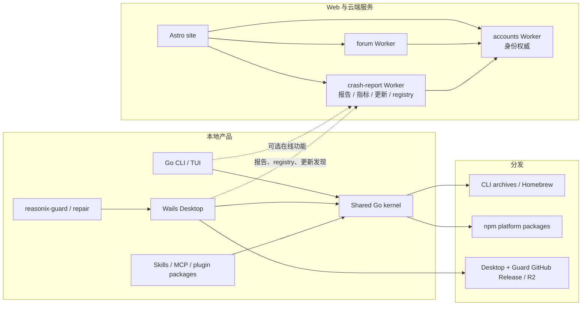

# Reasonix 扩展、服务与发布工程地图

> 基线：`main-v2`，提交 `988190f3`（2026-07-15）。本文补充核心 Agent 架构之外的
> Skills/MCP/plugin packages、官网、Cloudflare Workers、npm 和发布流水线。

## 1. 先划清“本地核心”和“在线生态”

Reasonix 的本地 Agent 不依赖官网、论坛或账户服务才能启动。最重要的边界是：



| 表面 | 本地 Agent 基本运行是否需要 | 主要用途 |
|---|---|---|
| 根 Go module | 是 | CLI、Agent 内核、多前端共享领域逻辑 |
| `desktop/` | 仅桌面产品需要 | Wails 原生壳和 React UI |
| `cmd/reasonix-guard` / `internal/repair` | 仅恢复与桌面健康启动需要 | 离线诊断、Safe Mode、事务修复和更新回滚 |
| `internal/plugin` / Skills | 框架属于核心；具体扩展可选 | MCP、Skills、commands、hooks |
| `workers/crash-report` | 否 | 崩溃/反馈、匿名指标、更新网关、Skill/MCP registry、管理表面 |
| `workers/accounts` | 否 | 网站登录、邮箱验证、资料和 device authorization 服务端 |
| `workers/forum` | 否 | 社区论坛 |
| `site/` | 否 | 官网、下载、账号/论坛/registry 门户 |
| `npm/` | 否 | npm 安装渠道和平台二进制选择 |
| `benchmarks/` / `cmd/e2ebench` | 否 | 真实 Provider 评估与上下文实验 |

当前 accounts Worker 已实现 device flow 服务端，但根 CLI/desktop 没有对应客户端调用。因此
不能把“服务端 API 已存在”写成“本地产品已经支持账户登录”。

## 2. 三个容易混淆的扩展概念

### 2.1 `internal/plugin`：运行时 MCP Host

这里的 plugin 是 MCP client/host。它把 stdio 和 Streamable HTTP 等 JSON-RPC transport 统一
适配成 `tool.Tool`：

- 每个服务独立启动和失败隔离，单个 MCP 不应拖垮整个 session；
- 远端工具使用 `mcp__<server>__<tool>` 命名空间；
- 外部 `readOnlyHint` 不自动获得 plan mode 的一方信任；
- lazy discovery 的模型可见 schema 在一个 session 内冻结，新 schema 延迟到下一 session；
  Economy 中显式 `connect_tool_source` 成功后，则在下一次请求加入 schema 并形成新稳定前缀。

### 2.2 `internal/pluginpkg`：可安装能力包

plugin package 是更高层的分发单元，一个包可以同时导出：

- Skills；
- slash commands；
- hooks；
- MCP servers；
- 插件所属、手动调用的 Agent profiles。

它可解析 Reasonix、Codex 和 Claude 风格 manifest，并在安装预检中报告
`full` / `partial` / `incompatible`；非原生包没有任何可映射能力时会被拒绝。
面向用户的 Skill/command 可用
`/<plugin>:<name>` 消除同名冲突；Claude `agents/*.md` 转成手动调用的
`/<plugin>:agent:<name>` 子代理配置。这些用户侧命名空间不改变模型内部 Skill 索引的
稳定短标识。

Claude 兼容是显式的适配层，不是“任意 Claude Code 插件无损运行”的承诺：

- Skills、commands、agents、command hooks 和 `.mcp.json` 会归一化到 Reasonix manifest；导入
  MCP 默认 `auto_start=false`，避免安装后立即改变启动工具 schema。
- Hook matcher、`tool_name`、`tool_input` 和部分 `tool_response` 会做 Claude 工具名/字段转换；
  `PreToolUse` / `UserPromptSubmit` 可拒绝，`PermissionRequest` 可拒绝或代答批准。
- `updatedInput`、`if`、`asyncRewake` 不生效，`Stop` / `SubagentStop` 不能阻止回合结束；
  `WebFetch.prompt`、`NotebookEdit.cell_id` 和多任务 `TaskOutput.task_id` 也无法总是无损映射。
  预检会把这些静态可知缺口标为 `partial`；`full` 只表示声明能力已解析和映射，
  不是对 Hook 所有运行时 stdout 分支的保证。

详细字段对照和警告条件见 [`PLUGIN_PACKAGES.zh-CN.md`](PLUGIN_PACKAGES.zh-CN.md)。导入的 hook
shell command 和 stdio MCP 在启用后仍可执行外部代码；兼容适配不替代 permission、sandbox
和对扩展来源的运行时信任判断。

### 2.3 `internal/installsource`：安装规划与落盘

远程安装不是拿 URL 后立即执行：

1. 默认只生成确定性安装 plan 和风险信息；
2. 明确 `apply=true` 后才执行已批准 plan；
3. GitHub 来源固定到批准时的 commit，HEAD 改变时仍使用该快照或拒绝；
4. 内容先进入 staging，重新解析并校验能力数量，再原子替换旧安装；
5. manifest 路径不能逃出 plugin root；远程获取经过 SSRF 防护。

安装阶段不会执行第三方 install script，但启用后的 hook shell command 和 stdio MCP 可以执行
外部代码。因此要区分：

- **安装完整性**：拿到的是否是批准的固定内容；
- **运行时信任**：启用该扩展后允许它做什么。

“安装安全”不等于“扩展运行时无需信任”。

## 3. Skills、Commands 和 Hooks

### Skills

Skill discovery 兼容项目和用户目录，覆盖顺序以更具体 scope 优先。启动时只把 Skill 的名称和
描述放进 cache-stable prompt，正文按需读取；这样既控制前缀大小，也避免无关 Skill 内容占用
每一轮上下文。

### Slash commands

自定义 Markdown command 主要是输入展开机制。若功能需要维护 goal、approval、session 或
其他长期状态，不应只藏在 command 模板里，而应进入 Controller/domain 层。

### Hooks

Hooks 是可信项目/用户自动化，可以在 PromptSubmit、PreToolUse、PostToolUse、Stop 等阶段
观察或阻断流程。它们属于策略层，不替代 permission 和 sandbox。诊断代码应使用只读配置加载，
避免仅“查看配置”就触发旧 MCP 配置落盘迁移。

## 4. 在线服务关系

### 4.1 Accounts：唯一身份权威

`workers/accounts` 保存账户、session、邮箱验证和 device authorization。它同时接受 Web cookie
与 Bearer session，使其他服务无需复制身份数据库。

### 4.2 Forum：委托认证

`workers/forum` 把共享 cookie 转成 Bearer 后调用 accounts `/me`。Forum 自己保存社区内容、
角色和 trust 等领域数据，不成为第二个身份权威。

### 4.3 Crash-report Worker：多个在线子域的聚合宿主

`workers/crash-report` 当前同时承担：

- crash/feedback；
- anonymous launch ping 和聚合质量指标；
- desktop release/update gateway；
- Skill/MCP registry API；
- registry moderation/dashboard；
- retention/sentinel 等定时运维。

Registry 的身份同样转发给 accounts；它保存元数据和 source pointer，不在服务端抓取或执行
第三方包。真正的内容获取与安装仍由本地 `install_source` 完成。

这一 Worker 的职责密度和故障半径都较高。维护时至少要明确路由所属子域、D1 binding、环境
变量、认证方式和数据保留策略，避免把一次 registry 修改误发布成整个报告/更新网关变更。

### 4.4 Site：静态门户与服务组合层

`site/` 是 Astro 项目，组合下载页、账号 UI、论坛 UI 和 registry UI。它不是身份或社区数据的
权威来源。`npm run build` 的 prebuild 会刷新 tracked 的 community snapshot；本地构建后应检查
是否产生与功能无关的 `site/src/data/community.json` diff。

## 5. 配置、状态与迁移原则

配置加载大致为 defaults → user config → project config → `.mcp.json` → legacy MCP，但它不是
简单的后者覆盖前者：

- user/project plugins 会按名称重新合并；
- Memory compiler 和 secret protection 等保留为用户全局控制；
- `[agent].max_steps` / `planner_max_steps` 配置已退役并会在升级时移除；CLI 单次
  `--max-steps` 与 Bot 无人值守上限仍是独立显式控制；
- `LoadForRoot` 允许执行旧 MCP tier 的落盘迁移；只读诊断应使用 `LoadForRootReadOnly`；
- `REASONIX_HOME` 将 config、credentials、sessions、cache、skills、commands、hooks、plugin
  package 状态和桌面状态隔离到一棵树中。

迁移遵循非破坏性、一次性、可救援的方向：旧文件不就地删除，marker 防止用户已删除的旧配置
再次复活，`/migrate` 提供显式补救路径。

## 6. 三条独立发布线

| 产品表面 | Tag | 主要流水线 | 产物 |
|---|---|---|---|
| CLI | `v<semver>` | `.github/workflows/release.yml` + GoReleaser | archives、checksums、Homebrew |
| npm | `npm-v<semver>` | `release-npm.yml` + `npm/build.mjs` | 主 JS shim + 六个平台 optional packages |
| Desktop | `desktop-v<semver>` | `release-desktop.yml` + `scripts/desktop-build.sh` | 桌面主程序 + Guard/启动器（或 macOS Bundle）、签名、manifest、R2 mirror |

桌面 Wails/CGO 使用各目标 OS 的原生 runner，不能从 Linux 一次交叉编译所有 GUI 产物。稳定版、
RC 和 canary 对 npm dist-tag 与 R2 pointer 的影响不同，以 [`RELEASING.md`](RELEASING.md) 和
当前 workflow 为准，不要只根据 tag 名猜测发布结果。
自动更新与回滚也以这个完整 release unit 为边界：Windows/Linux 必须一起处理
桌面主程序和 Guard/启动器，macOS 处理整个 Bundle，避免新旧版本混装。

真实发布还涉及 secrets、受保护 environment、签名/公证和外部 R2/GitHub 状态。普通 PR 的
“代码可构建”不等于“已验证发布”。

## 7. CI 当前实际覆盖什么

### 已有主门禁

- 根 Go module：Linux/macOS/Windows vet/build/test，Linux race，lint，cache guard；
- desktop Linux：frontend build、Go format/tidy/vet/lint/build/test；
- desktop Windows：frontend build、整个嵌套 Go module tests（含 update helper 和 Windows-only 语义），
  并用 NSIS 构建 `windows/amd64` canary installer 和 portable archive；
- site：安全敏感的 Node tests；
- govulncheck：信息性检查。

### 当前覆盖缺口（事实）

- Desktop CI 会 build frontend，但没有运行 `pnpm test`/`test:all`；
- accounts/forum 没有单元测试脚本，主 PR CI 也未运行它们的 typecheck；
- crash Worker 的 typecheck/test 位于部署 workflow，而不是 PR gate；
- Worker 数据库迁移不随 deploy 自动应用；forum 仍以重复执行 `schema.sql` 为主，crash/registry
  也需要人工选择正确的 schema/migration 命令；
- 前端 `package.json` 的测试列表是显式长命令，新测试文件必须确认已加入 suite。

这些是“当前没有自动证明”的范围，不等于代码已经错误。接手后较高收益的工程改进是：

1. 把 desktop frontend tests 加入 PR CI；
2. 把三个 Worker 的 typecheck/已有 tests 加入 PR CI；
3. 建立数据库 migration 台账和发布前兼容矩阵；
4. 逐步拆分 crash-report Worker 的路由/部署责任，或至少建立独立 smoke checks。

以上四项是基于现状的维护建议，不是当前实现已承诺的功能。

## 8. 独立验证命令

```bash
# Root kernel
make vet
make test
make build

# Desktop (target OS native environment)
pnpm --dir desktop/frontend install --frozen-lockfile
pnpm --dir desktop/frontend build
pnpm --dir desktop/frontend test:all
(cd desktop && go vet ./... && go test ./... && wails build -nocolour)

# Site
(cd site && npm ci && npm test && npm run build)

# Workers
(cd workers/accounts && pnpm install --frozen-lockfile && pnpm typecheck)
(cd workers/forum && pnpm install --frozen-lockfile && pnpm typecheck)
(cd workers/crash-report && npm ci && npm run typecheck && npm test)
```

数据库 migration、Worker deploy、真实 Provider E2E 和发布 workflow 都会访问外部状态、使用
secret 或产生费用，不属于默认本地验证。执行前应单独确认授权、环境和回滚路径。

## 9. 生态维护阅读顺序

1. `go.mod`、`desktop/go.mod`、Makefile、CI：先理解模块和验证边界。
2. `internal/config/load.go`、`paths.go`、`migrate.go`：状态从哪里来。
3. `internal/skill`、`plugin`、`pluginpkg`、`installsource`：扩展、命名、信任和缓存。
4. `workers/accounts` → `workers/forum` → crash Worker registry：按身份依赖方向读。
5. `docs/RECOVERY.zh-CN.md`、`cmd/reasonix-guard`、`internal/repair`：理解启动与更新失败如何自救。
6. desktop 的 telemetry/metrics/crash/updater bindings：对齐本地客户端与网关。
7. `site/src`：理解门户如何组合服务。
8. `RELEASING.md` 和三条 release workflows：只有接手发布时再深入。

核心运行时请回到 [`ARCHITECTURE.zh-CN.md`](ARCHITECTURE.zh-CN.md)，日常开发流程见
[`MAINTAINER_GUIDE.zh-CN.md`](MAINTAINER_GUIDE.zh-CN.md)。
