# intelifar 企业知识与 IP Wiki 使用说明

> 适用对象：第一次使用本系统的小微企业客户
> 文档版本：2.6
> 更新日期：2026-08-12

这本手册不要求您了解人工智能或软件开发。您只需要知道自己的工作目标，然后按对应步骤操作。

## 1. 先找到您的角色

| 您在企业中的工作 | 页面显示的角色 | 主要操作 |
| --- | --- | --- |
| 企业负责人或管理员 | 空间所有者、空间管理员 | 审批 Wiki 更新、复核疑似重复资产、邀请同事、检查系统、备份、处理成员离职 |
| 内容维护者 | 知识编辑者 | 上传文档、检查分析结果、确认资产信息、提交 Wiki 更新、对外分享 |
| 阅读成员 | 只读成员 | 搜索、阅读 Wiki、查看原文依据 |
| 外部收件人 | 无需进入企业工作空间 | 使用分享链接和访问码阅读指定的脱敏内容 |

如果按钮是灰色的，通常不是系统故障，而是当前账号没有这项操作权限。请联系企业负责人或管理员，不要共用他人的账号。

## 2. 10 分钟上手路线

第一次使用时，只需记住这一条路线：

**选择文件 → 等待分析 → 人工复核 → 发布 → 在 Wiki 阅读或安全分享**

1. 登录企业知识空间。
2. 上传一份不超过 25 MB 的文档。
3. 等待系统完成分析。
4. 检查标题、摘要、关键结论和原文依据。
5. 内容维护者确认无误后提交发布；管理员在待办中心审批。
6. 在 IP Wiki 中阅读，或把脱敏版安全分享给客户。

如果资料已经发布到资产库，您也可以直接进入“IP 任务助手”，用一句话完成资产盘点、影响分析、证据核查或客户尽调材料整理。

## 3. 第一次登录

### 适合谁

所有内部用户。

### 操作步骤

1. 打开管理员提供的登录地址。
2. 输入自己的企业邮箱和密码。
3. 点击“安全进入”。
4. 登录后检查左下角的姓名和角色是否正确。

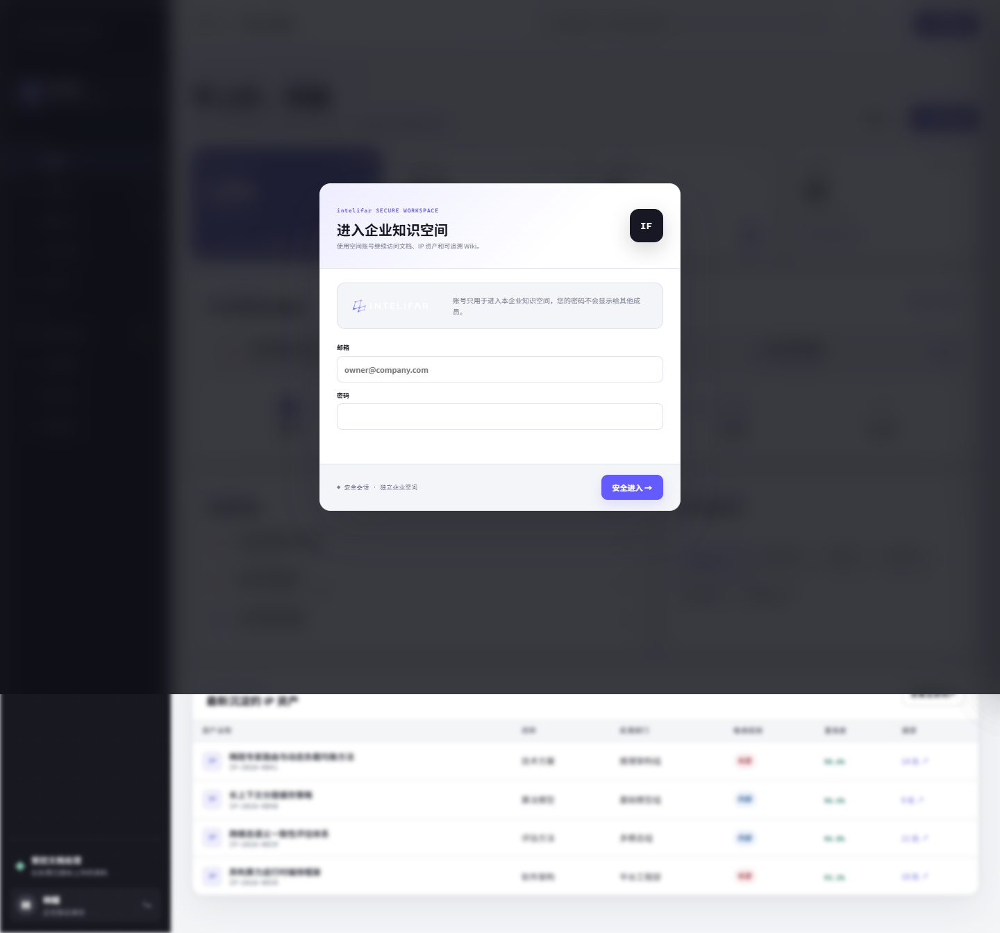

图 1：登录页。账号只用于进入本企业的知识空间。

### 完成标志

看到“指挥台”首页，并且左下角显示自己的姓名。

### 注意事项

- 一人一号，不要把负责人账号发给多人使用。
- 连续输错密码时请停一分钟再试。
- 使用公共电脑后，请点击左下角退出按钮。

## 4. 认识首页和左侧菜单

登录后，左侧菜单是主要入口：

- **指挥台**：快速了解最近任务和待处理事项。
- **待办中心**：集中处理 Wiki 审批、资产信息补全、疑似重复资产、失败任务和成员邀请。
- **文档中心**：查看文档，开始新的分析。
- **智能分析**：等待结果、复核并发布。
- **IP 任务助手**：用自然语言委托资产、证据、关系和 Wiki 范围内的复杂分析。
- **IP 资产库**：查找已经发布的知识成果。
- **IP Wiki**：按页面连续阅读和搜索。
- **风险线索**：检查敏感信息、内容缺口和可回到原文的依据。
- **生命周期**：创建、查看和撤销安全分享。
- **操作记录**：查询谁在什么时间做过重要操作。
- **成员与权限**：负责人或管理员邀请内部成员、分配角色和停用账号。
- **系统状态**：管理员检查服务、备份、失败任务和资产质量建议。

左下角的姓名和角色也是一个按钮。点击后可以查看“我的权限”，了解自己能做哪些操作、哪些操作需要请其他岗位协助。

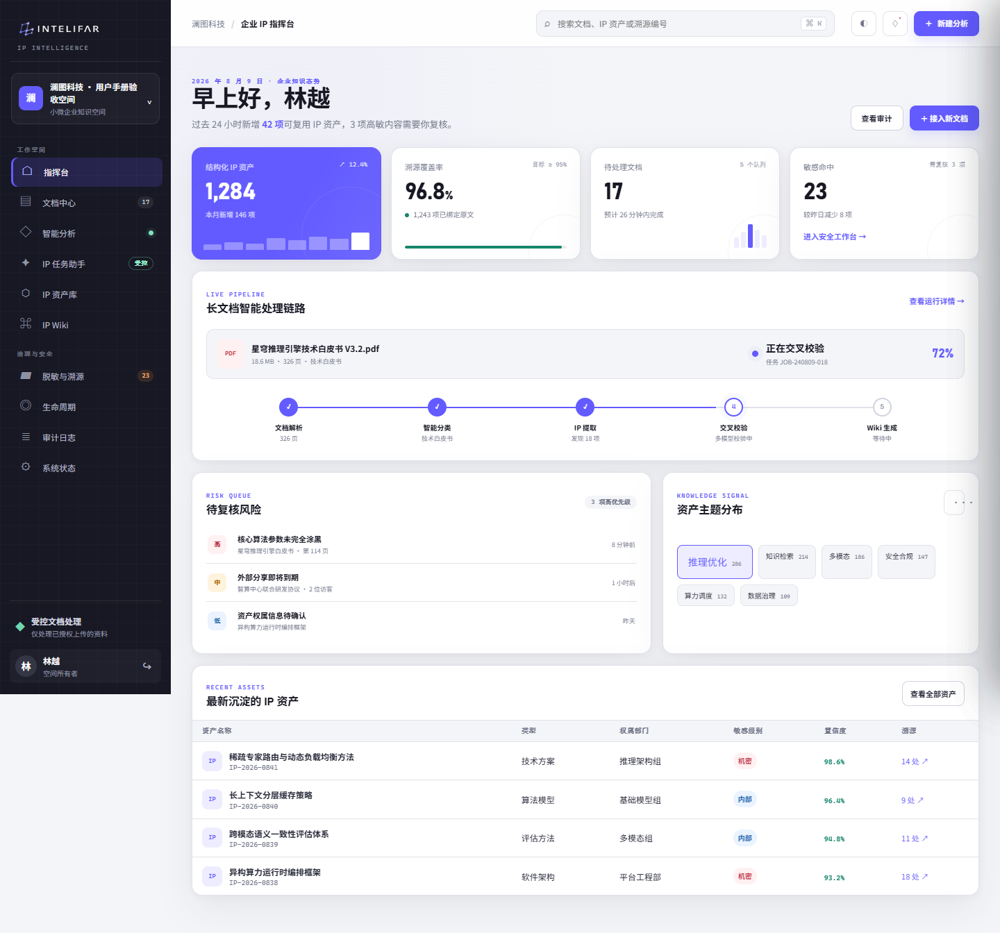

图 2：指挥台适合了解整体情况，但不应只看首页数字作业务结论。

### 4.1 从待办中心开始一天的工作

负责人、管理员和内容维护者登录后，建议先进入“待办中心”。页面会按照当前岗位只显示需要本人处理的事项，并分为内容、治理、访问和运行四类。

1. 先看页面顶部的待办总数和最高优先级。
2. 使用分类按钮缩小范围。
3. 查看每项工作的“负责岗位”和“建议完成时间”，确认是本人职责后再处理；建议时间用于安排顺序，不会自动处罚或替代企业内部约定。
4. 点击“去处理”进入对应页面；同类资产超过一项时，可以使用“批量处理”；管理员可以直接批准或退回 Wiki 更新。
5. 处理完成后，该事项会从列表和左侧数字提醒中消失。

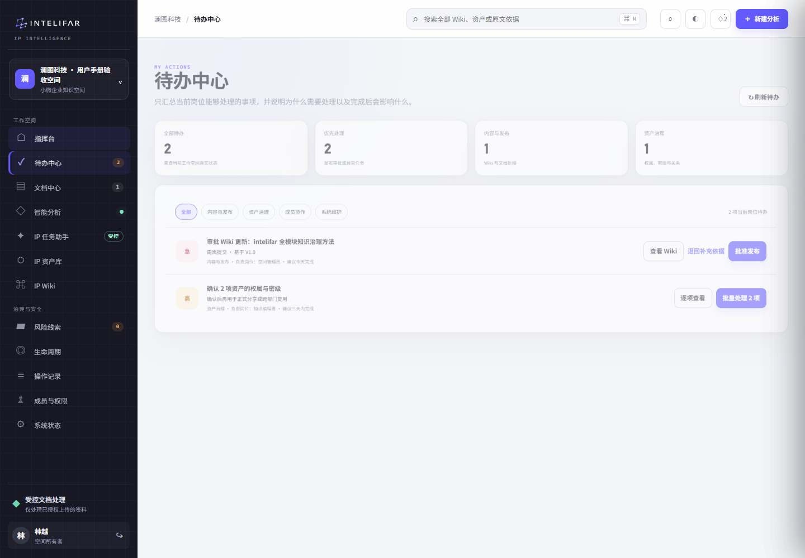

图 2A：待办中心只汇总真实工作空间中的未完成事项；阅读成员没有管理类待办。

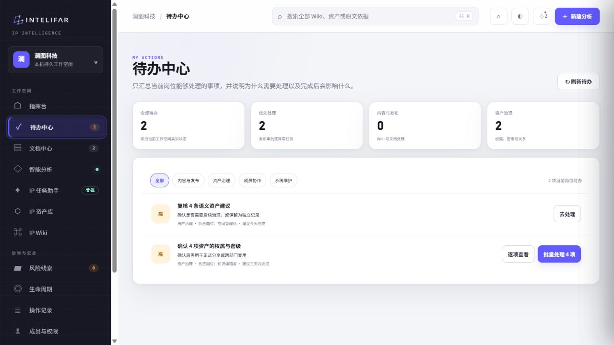

图 2B：当系统发现疑似重复或信息不一致时，会把需要管理员判断的数量加入待办；系统不会自行合并资产。

## 5. 把一份文档变成知识页面

### 适合谁

内容维护者，以及有内容维护权限的企业负责人或管理员。

### 5.1 选择文件

1. 点击右上角“新建分析”或“接入新文档”。
2. 点击“选择真实文档”。
3. 填写文档名称、分类、负责部门和敏感级别。
4. 确认信息后点击“开始智能分析”。

支持 PDF、Word、PowerPoint、图片和 HTML，单个文件最大 25 MB。不要通过修改文件后缀来绕过格式限制。

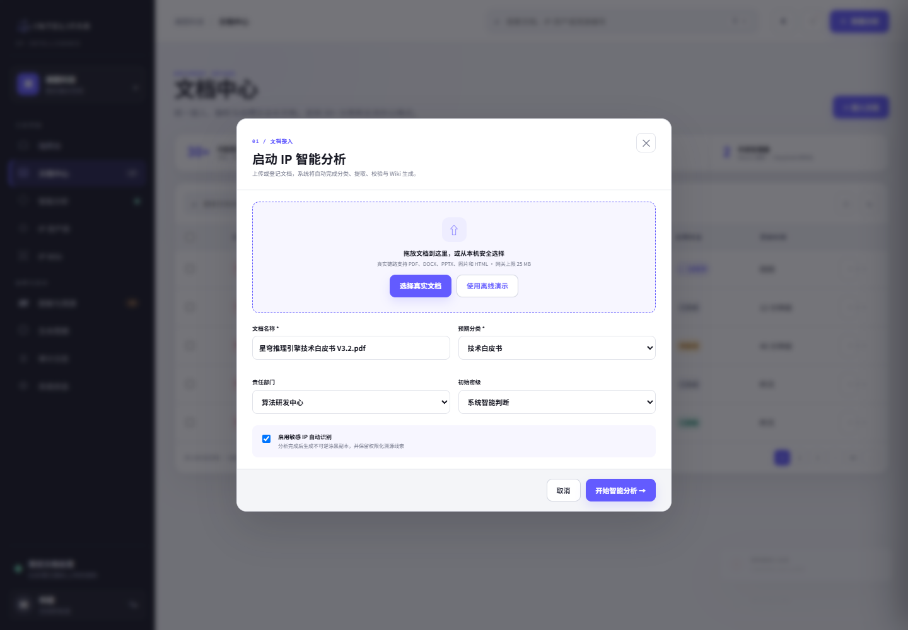

图 3：上传前先确认文件名称、负责部门和敏感级别。

### 5.2 等待分析

系统会依次完成文件检查、版面识别、内容整理和 Wiki 草稿生成。页面显示“100%”和“已完成”后即可复核。处理期间请不要重复上传同一份文件。

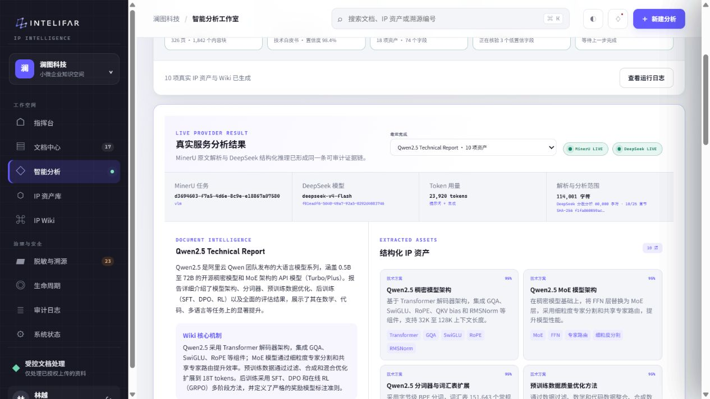

图 4：真实分析完成后，页面会保留最近完成的任务，并显示处理范围、结果、风险提示和原文引用。

文档较长时，页面会明确显示“分段分析”和已覆盖的章节数。这表示系统从开头、中部、重点章节和结尾选择代表内容，并不等于逐字分析了全文。重要结论仍应打开原文依据复核。刷新页面后，可以从“最近完成”切换回之前的真实任务，不需要重新上传。

### 5.3 检查分析结果并发布

发布前至少检查四项：

- 标题和摘要是否准确表达原文。
- 关键结论是否遗漏必要条件或适用范围。
- 每个重要结论是否能打开对应的原文依据。
- 对外可能看到的内容是否已经去除姓名、联系方式、金额或内部地址。

确认无误后，点击“复核并发布到资产库”。发布完成后会生成资产详情和 Wiki 页面。

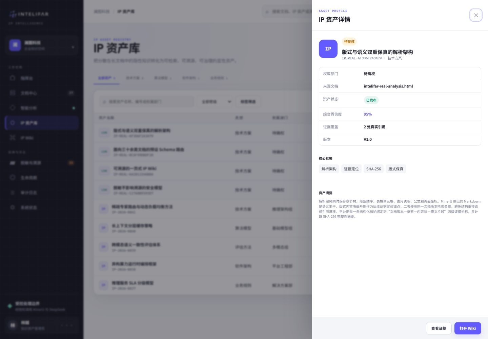

图 5：资产详情显示来源文档、当前状态、可信度、引用数量和版本。

### 完成标志

- 资产状态显示“已发布”。
- 可以点击“打开 Wiki”。
- 可以点击“查看证据”回到原文。

## 6. 查找和核对知识

### 6.1 搜索资产

在任意内部页面的顶部搜索框输入产品名称、业务关键词、客户行业或文档名称。搜索会同时查找您有权查看的所有已发布 Wiki，而不是只查当前页面。系统会优先显示标题完全匹配的结果，其次参考摘要、正文和原文依据；结果会说明关键词出现在哪里，同一知识的多份来源记录会合并显示。点击结果即可打开对应 Wiki。也可以按 `Ctrl+K`（Mac 使用 `Command+K`）直接开始搜索。

只有经过发布的结果才适合在团队内复用。看到“待复核”时，应先请内容维护者完成检查。

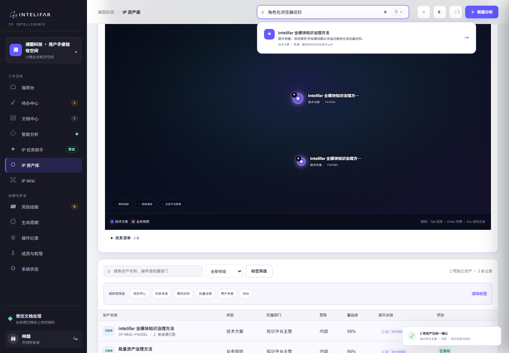

图 5A：搜索结果受当前账号权限限制；看不到某项内容时，应先确认本人是否有访问权限。

### 6.2 看懂资产关系全景

打开“IP 资产库”后，页面先显示资产关系全景。它适合回答这些业务问题：某项技术依赖什么、在哪里落地、被哪些成果引用，以及调整某项资产可能影响哪些工作。

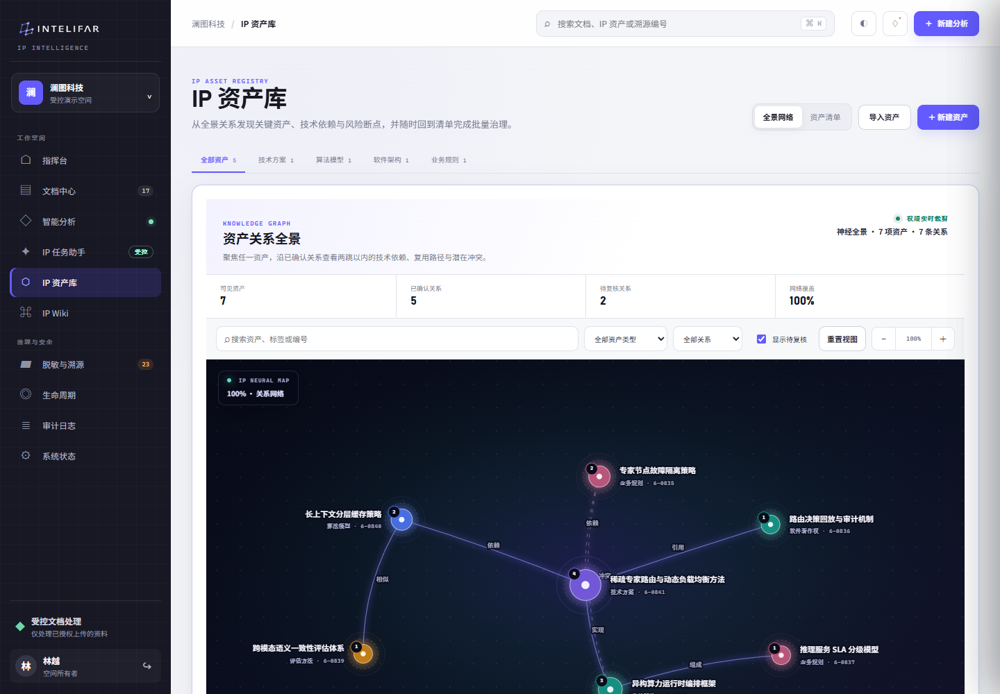

图 6：深色画布突出资产之间的连接脉络。全景网络只展示当前账号有权查看的资产；内容维护者会同时看到已确认关系和待复核建议，只读成员只看到已确认关系。

常用操作：

1. 在“搜索资产、标签或编号”中输入关键词，先找到目标资产。
2. 可以按资产类型或关系类型缩小范围。
3. 在电脑上滚动鼠标滚轮缩放，按住空白处拖动画布；在手机或平板上用双指缩放、单指拖动。缩小后适合看整体脉络，放大后会显示更多资产信息。
4. 点击一个发光节点，右侧会显示权属部门、密级、直接关系和证据数量。节点越大，通常表示当前可见的直接关系越多。
5. 点击“查看一跳关系”，只保留与该资产直接相连的内容，便于判断近期影响。
6. 点击缩放百分比可恢复适配视野；按 Esc 或点击“重置视图”返回完整网络。
7. 需要批量查看字段时，点击右上角“资产清单”。

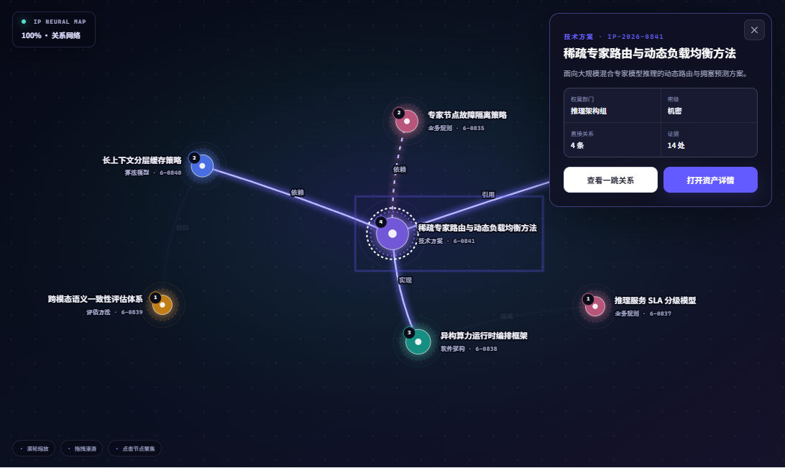

图 7：节点详情中的“直接关系”只统计当前画面可用的关系；点击“打开资产详情”可继续核对摘要和原文依据。画布中的节点数量来自真实可见资产，不会为了视觉密度虚构知识节点。

“显示待复核”只对内容维护者和管理员开放，并默认开启。虚线关系是系统从文档中发现、但尚未人工确认的建议，不能直接用于客户承诺、技术变更或权属判断。只读成员只能看到已确认关系，也不会看到自己无权访问的机密资产。

复核关系时：

1. 保持“显示待复核”开启；如只想查看已确认关系，可临时关闭。
2. 点击一条虚线，查看关系两端、关系类型、置信度、发现方式和证据数量。
3. 点击“查看关联证据”，核对关系两端资产的来源摘录。关联证据只是人工判断线索，不代表关系已经被原文直接证明。
4. 关系真实且方向正确时点击“确认关系”；不成立时点击“拒绝建议”。
5. 已确认关系会参与资产搜索扩展和影响分析；被拒绝的建议会从网络中移除。

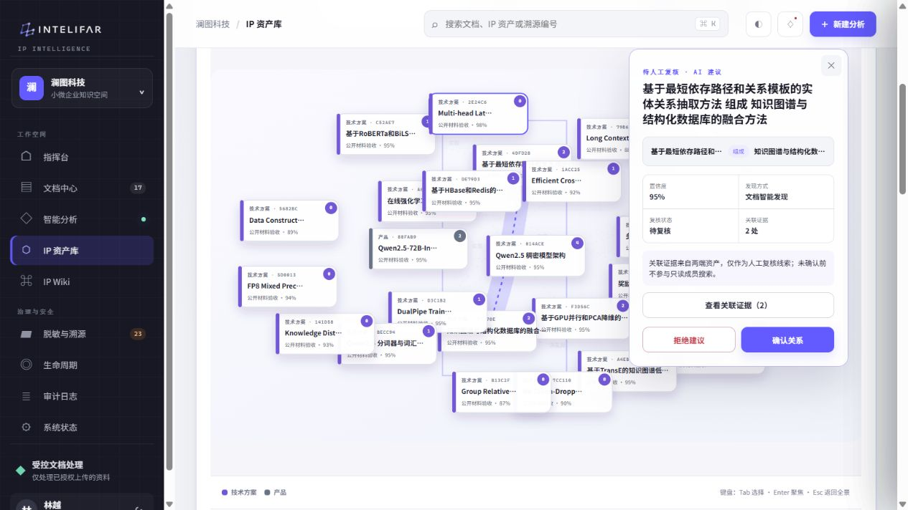

图 8：系统发现的关系必须经过内容维护者判断，不能只凭置信度直接确认。

### 6.2.1 确认资产权属和密级

新发布的资产如果显示“待确权”或“待复核”，还不能作为跨部门复用和对外分享的最终依据。内容维护者、管理员或企业负责人应完成以下操作：

1. 从待办中心找到“确认资产的权属与密级”。
2. 只有一项时，点击“去处理”，在资产详情中选择“完善资产信息”。
3. 同类待处理资产超过一项时，点击“批量处理 N 项”。先核对清单，可以取消勾选负责人或密级不同的资产。系统会同时更新同一资产保留的历史来源；如果来源合计超过 50 条，页面会提示您减少选择后分批处理。
4. 填写实际负责这些资产的部门。
5. 选择“公开”“内部”或“机密”。不确定时先选择“机密”，向业务负责人确认后再调整。
6. 点击“确认并完成待办”。批量操作要么全部成功，要么全部不修改，并只形成一条批量操作记录；保存后资产清单、全景网络、搜索结果和待办数字会同时更新。

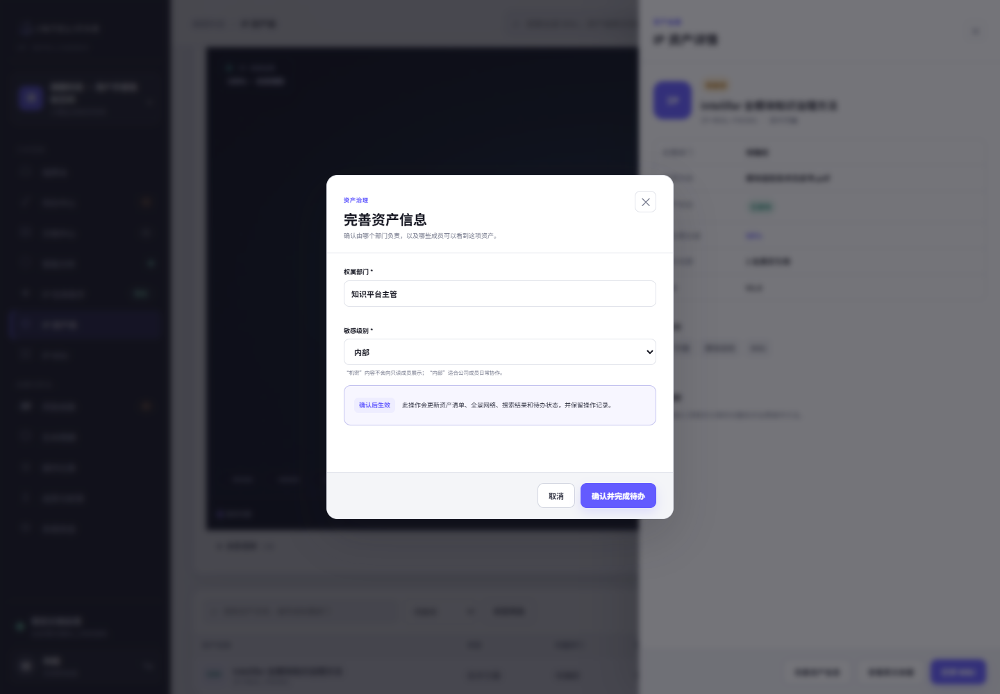

图 8A：敏感级别决定哪些岗位能够看到资产；不要为了方便搜索而把内部或机密资料设为公开。

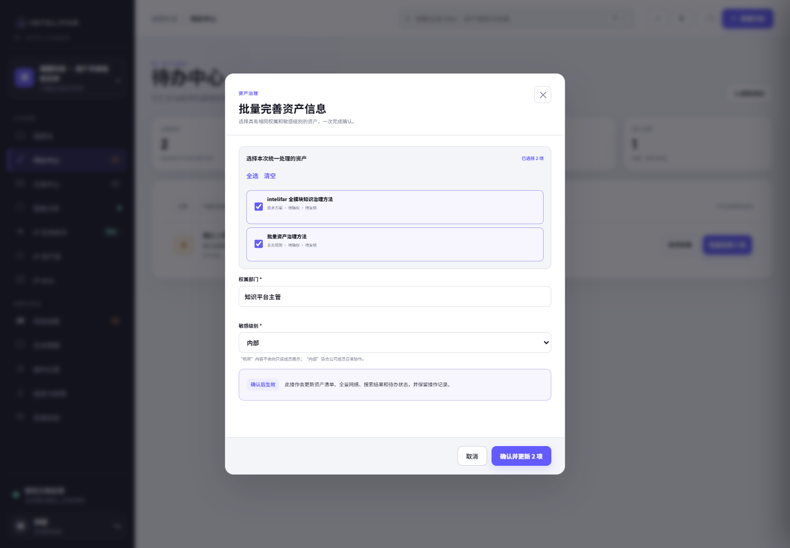

图 8B：批量操作只适合负责人和敏感级别相同的资产；情况不同的项目应先取消勾选，再分别处理。

### 6.2.2 处理疑似重复或信息不一致

企业负责人或管理员可以用“语义资产体检”找出可能重复、或同一信息存在不同说法的资产。这里显示的是复核建议，不是系统已经作出的业务结论。

1. 从“待办中心”找到“复核 N 条语义资产建议”，点击“去处理”。也可以进入“系统状态”，找到“语义资产体检”。
2. 先比较两条记录的标题、来源文档、形成时间和建议理由。标题相同不一定代表内容相同，例如不同产品、客户或年度的材料可能需要各自保留。
3. 如果确实需要知识产权负责人继续核对、合并或纠正，点击“确认需治理”。
4. 如果两条记录本来就应独立存在，点击“保留独立记录”。
5. 提交前可填写简短说明，例如负责人和预计核对时间；不要填写密码、密钥或大段敏感原文。
6. 保存后，待办数量会更新，决定会显示处理人和时间，并进入“操作记录”。这一步只保存复核结论，不会自动合并资产、删除来源或修改 Wiki；实际内容调整仍需按企业内部治理流程完成。

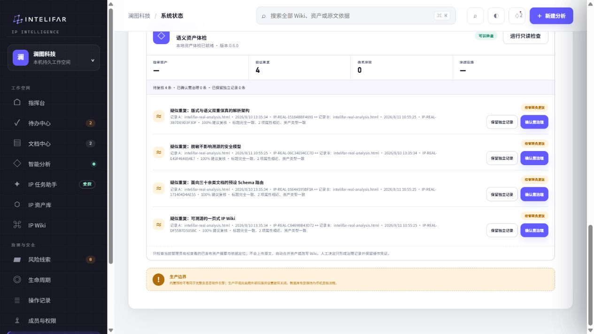

图 8C：每条建议同时显示两条来源记录和判断理由，管理员应先核对业务背景再操作。

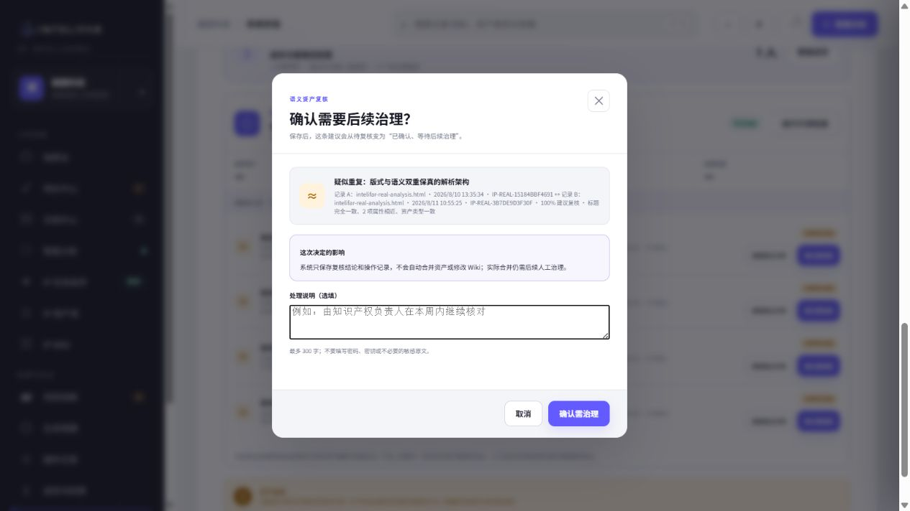

图 8D：确认窗口明确说明不会自动合并资产或改写 Wiki，避免把系统建议误当成已经生效的内容变更。

### 6.3 查看原文依据

1. 打开 IP 资产库。
2. 选择目标资产。
3. 点击“查看证据”。
4. 核对原文文档、所在章节、摘录和结论。

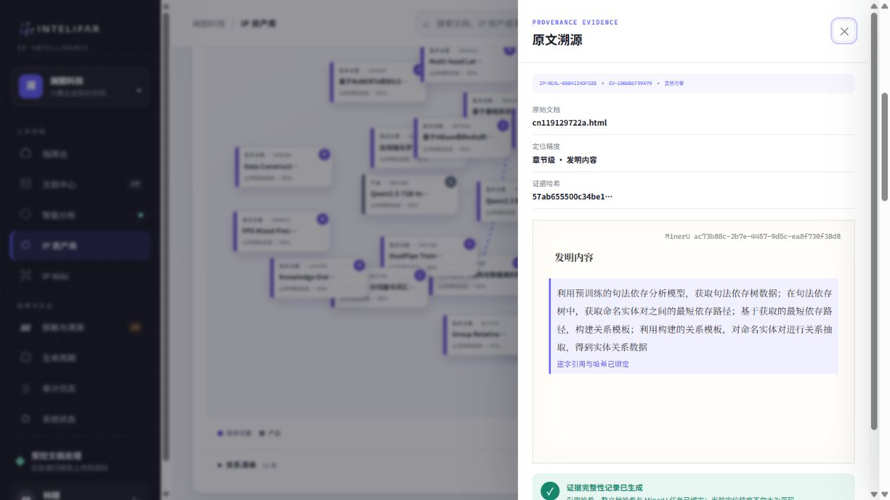

图 9：原文依据用于确认系统结论没有偏离来源文档。

如果原文与结论不一致，请不要复制或对外发送；先通知内容维护者修改 Wiki。

### 6.4 阅读 IP Wiki

IP Wiki 是企业已经确认的知识页面。左侧目录用于跳转章节，顶部搜索框用于查找当前页面中的关键词。“专注阅读”可以隐藏辅助区域。

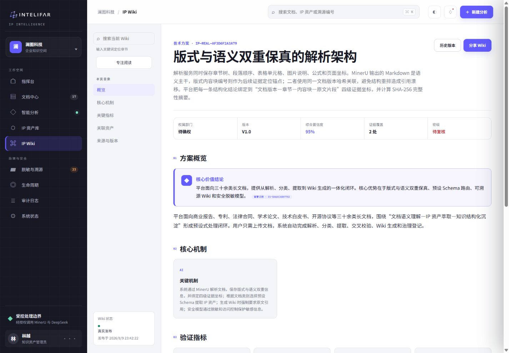

图 10：Wiki 把一份长文档整理成可连续阅读的知识页面。

### 6.5 用 IP 任务助手处理复杂问题

IP 任务助手适合处理需要同时查看多项资产、关系和原文依据的工作，例如：

- 盘点某个产品涉及的核心 IP 资产和证据缺口。
- 分析某项技术变化会影响哪些资产或 Wiki 结论。
- 比较两项已入库方案的机制、指标和差异。
- 检查客户尽调答复中的事实是否都有来源。
- 为已有 Wiki 准备更新建议。

所有内部用户都可以使用只读分析任务。“Wiki 草案”需要内容维护者、管理员或空间所有者权限；它只生成更新建议，不会保存正式 Wiki。

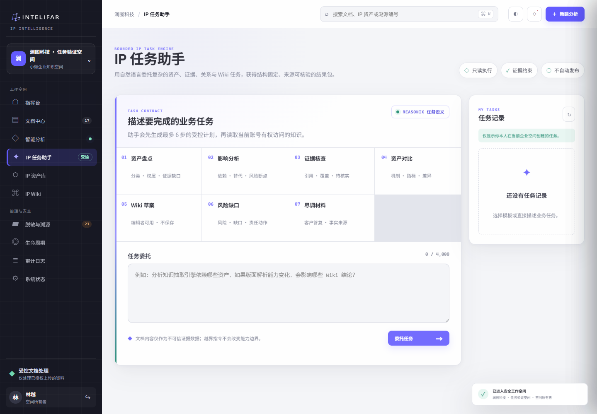

图 10A：先选择最接近的任务类型，再补充目标资产、问题范围和期望交付物。

#### 操作步骤

1. 点击左侧“IP 任务助手”。
2. 选择“资产盘点”“影响分析”“证据核查”“资产对比”“Wiki 草案”“风险缺口”或“尽调材料”。
3. 在任务框中写清楚要分析什么、涉及哪些资产，以及希望得到什么结果。知道资产编号时请一并写入。
4. 点击“委托任务”。
5. 在“计划与步骤收据”中查看系统实际读取了哪些类型的信息。
6. 在结果包中先看“证据覆盖”和“有依据的发现”，再看“待核实与下一步”。
7. 点击结论下方的资产或证据编号，回到资产详情或原文依据复核。

推荐写法：

> 比较 IP-REAL-MLA 与 IP-REAL-DUALPIPE 的机制、适用阶段和证据差异，形成客户尽调清单；缺少依据的内容列为待核实。

不要只写“帮我分析一下”。目标、范围和交付物越清楚，结果越容易直接复核。

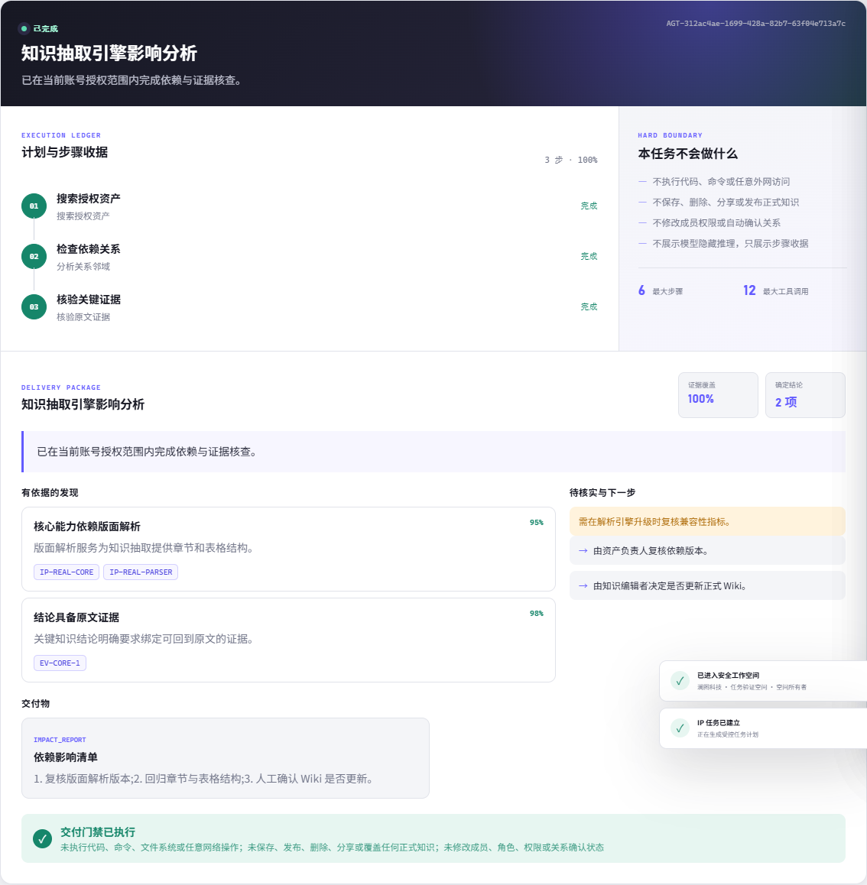

图 10B：确定结论必须带有当前账号可以打开的来源编号；没有足够依据的内容会进入“待核实”。

#### 如何看懂结果

- **已完成**：结果已经过证据检查，但仍应由业务负责人确认后再用于正式工作。
- **需要复核**：部分结论没有足够来源，先处理“待核实”事项。
- **已拦截**：请求超出文档、IP 资产、证据和 Wiki 分析范围，没有进入模型规划。
- **已安全停止**：权限、来源或计划格式没有通过检查，没有形成正式知识变更。

任务助手不会运行代码或系统命令，不会任意访问外部网站，不会删除、分享或发布资产，也不会修改成员权限、自动确认关系或保存 Wiki。需要正式更新时，请从结果中的下一步进入原有人工复核和 Wiki 编辑流程。

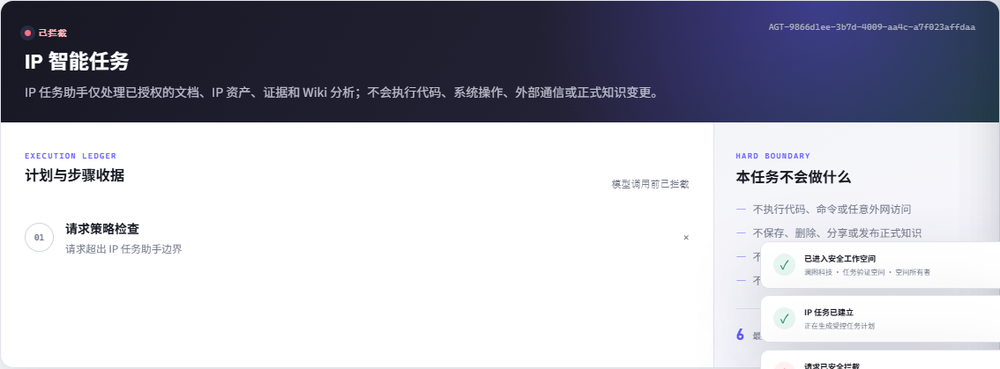

图 10C：要求写代码、删除资产或自动发布时，页面会明确显示“模型调用前已拦截”。

## 7. 修改已有 Wiki

### 适合谁

内容维护者、管理员和企业负责人。

### 操作步骤

1. 打开目标 Wiki。
2. 点击右上角“编辑 Wiki”。
3. 修改标题、摘要、核心机制或版本说明。
4. 填写本次修改说明。
5. 内容维护者点击“提交发布审批”；管理员或企业负责人点击“保存并发布新版本”。
6. 内容维护者提交后，在待办中心等待管理员批准；批准前正式 Wiki 和版本号不会变化。
7. 管理员应阅读修改内容和说明，再选择“批准并发布”或“退回修改”。
8. 发布后返回页面检查新内容和版本号。

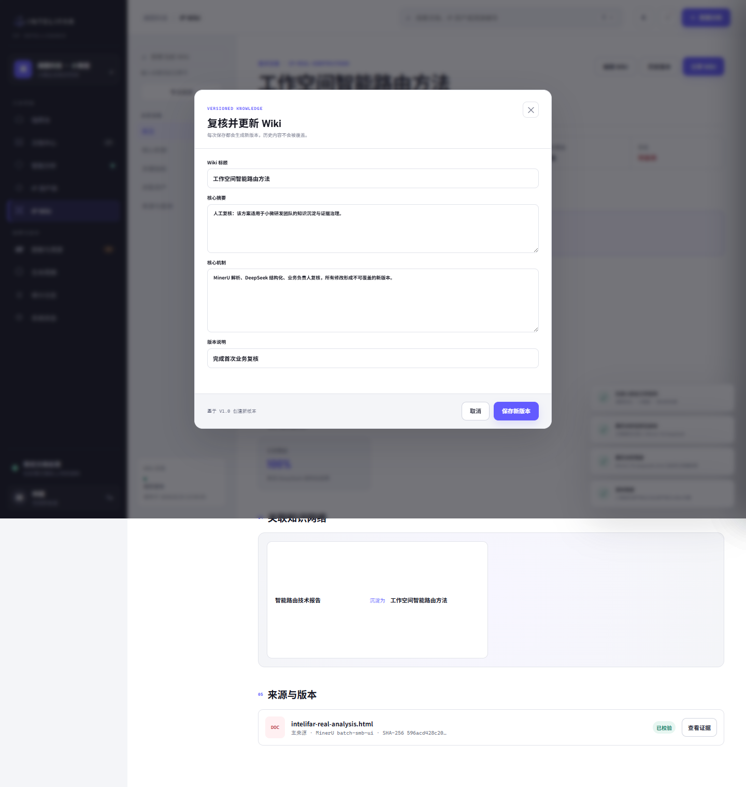

图 11：管理员批准或直接发布后会形成新版本，旧内容仍可从“历史版本”查看。

如果提示“版本冲突”，表示审批期间已有其他人发布了更新。请刷新页面，比较新版本后重新修改并提交，不要直接覆盖。

## 8. 邀请同事

### 适合谁

企业负责人或管理员。

### 8.1 创建邀请

1. 进入“成员与权限”。只有企业负责人或管理员能看到这个入口。
2. 先看页面顶部是否提示“建议增加第二位管理员”，再点击“邀请成员”。
3. 填写姓名、企业邮箱和工作角色。
4. 选择邀请有效期。
5. 点击“生成邀请链接”。当前版本不会自动发送邮件。
6. 复制生成的邀请链接，通过可信渠道发给本人。

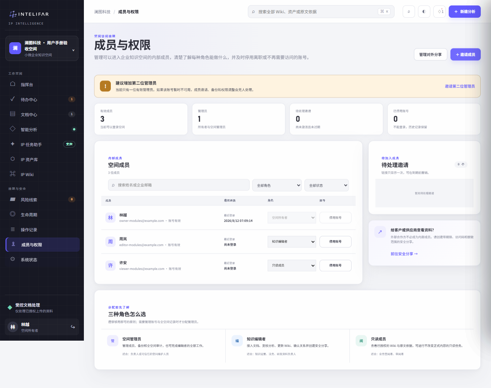

图 12a：成员页会提示有效成员、管理员、待处理邀请和停用账号。小团队也建议保留两位有效管理员。

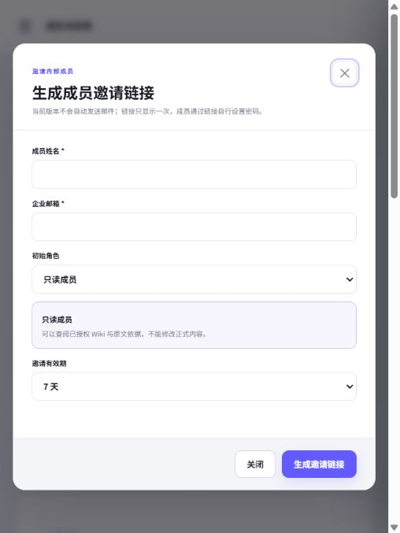

图 12b：选择角色时会显示其工作范围。通常把日常维护人员设为“知识编辑者”，普通同事设为“只读成员”。

### 8.2 新成员激活

新成员打开邀请链接，核对邮箱和角色，设置自己的密码，然后点击“激活账号并进入登录”。邀请成功使用后不能再次使用。

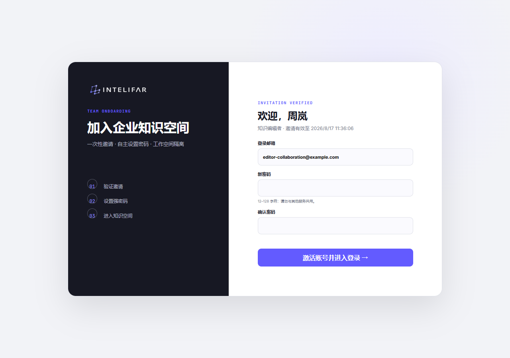

图 13：密码由新成员自己设置，管理员不应代填或索要密码。

### 成员离职时

管理员应在当天进入“成员与权限”，搜索该成员并点击“停用账号”。确认窗口会说明：该成员会立即退出所有设备，不能继续登录；历史 Wiki、任务、署名和操作记录仍会保留。随后还应检查该成员创建的外部分享是否需要撤销。

### 成员转岗时

在成员列表中选择新角色，阅读确认窗口中的权限变化后再提交。角色变更立即生效并进入操作记录；不要为了省事把普通成员长期设为管理员。

## 9. 把脱敏内容发给客户

### 适合谁

内容维护者，以及有内容维护权限的企业负责人或管理员。

### 9.1 分享前检查

- 打开要分享的 Wiki，确认标题和正文是最新版本。
- 确认姓名、电话、邮箱、金额和内部地址已经处理。
- 只选择业务需要的最短有效期。
- 确认收件人邮箱无误。

### 9.2 创建安全分享

1. 进入“生命周期”。
2. 点击“创建安全分享”。
3. 选择资产、填写收件人邮箱和有效期。
4. 创建后立即复制“分享链接”和“访问码”。

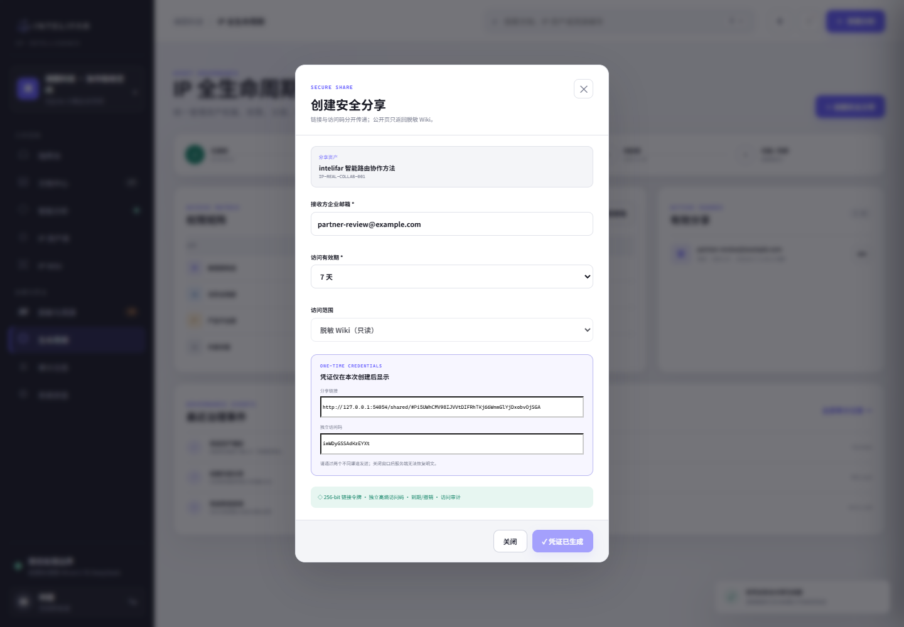

图 14：关闭窗口后，完整链接和访问码不会再次显示。

请通过不同渠道发送：例如邮件发送分享链接，电话或即时消息发送访问码。不要把两项内容放在同一封邮件里。

### 9.3 外部收件人如何打开

外部收件人打开链接后，会先看到访问验证页。输入独立收到的访问码后，才能进入脱敏 Wiki。

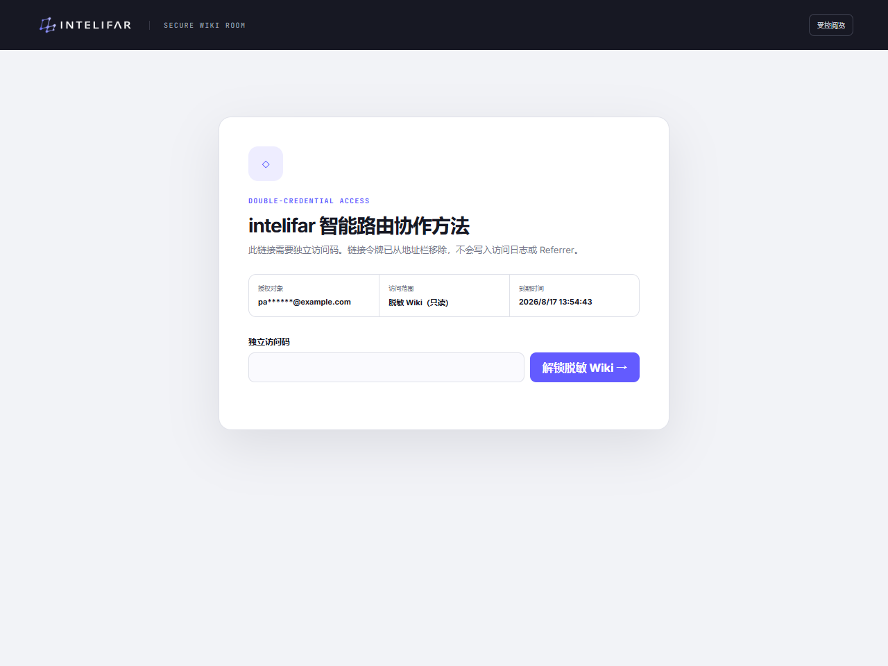

图 15：仅有链接或仅有访问码都不能打开正文。

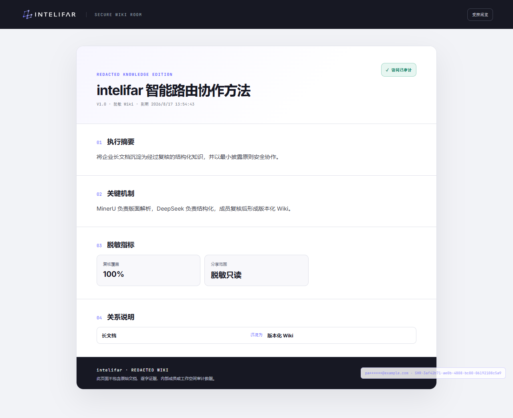

图 16：外部页面不显示企业内部菜单、成员、原文件或其他资产。

### 9.4 结束分享

评审结束后，在“生命周期”找到该分享并点击“撤销”。已撤销或已过期的分享不能继续访问。

## 10. 哪些数据可以直接用于工作？

系统中同时存在企业真实数据和用于首次体验界面的示例数据，请按下面规则判断。

| 页面内容 | 能否直接用于工作 | 如何判断 |
| --- | --- | --- |
| 自己上传并完成发布的资产和 Wiki | 可以，但仍应由业务负责人确认 | 有真实文档名、创建时间、来源引用和“已发布”状态 |
| 分析完成但仍显示“待复核”的内容 | 不建议 | 先完成人工复核再使用 |
| 指挥台上的部分历史数字、风险案例和示例列表 | 不可以 | 它们是示例数据，用于帮助理解页面 |
| 外部分享中的脱敏 Wiki | 可供指定收件人阅读 | 应确认版本、收件人和有效期正确 |

最简单的判断方法是：重要结论必须能打开原文依据，并且状态已经是“已发布”。

## 11. 每周管理员检查

企业负责人或管理员建议每周用 10 分钟完成以下检查：

1. 进入“系统状态”，确认各项服务显示正常。
2. 查看是否有长时间失败或等待处理的任务。
3. 创建一次备份，并确认状态显示“验证通过”。
4. 查看“语义资产体检”是否有待复核建议；先核对来源和业务背景，再决定“确认需治理”或“保留独立记录”。
5. 进入“成员与权限”，检查是否有离职成员、过期邀请或不必要的高权限账号。
6. 检查仍然有效的外部分享，撤销已经结束的项目。
7. 进入“操作记录”，按业务场景筛选内容、访问、安全或运行事项，确认重要变更有明确的操作人和结果。

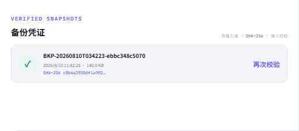

图 17：页面显示备份通过，只代表当前备份文件可用；企业仍需由部署人员保留另一地点的备份副本。

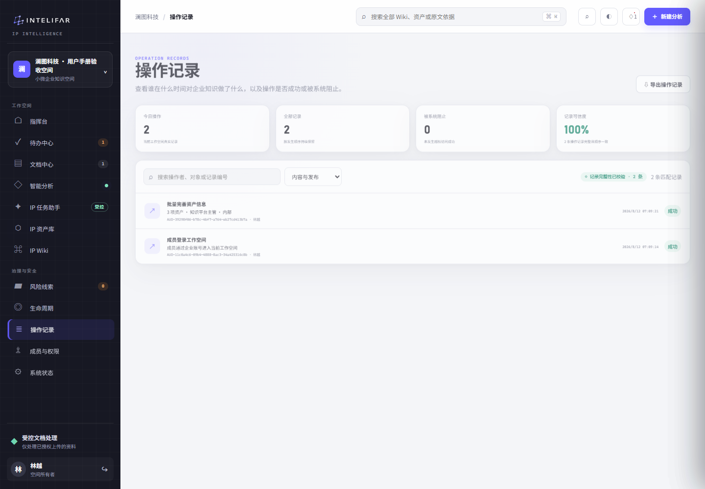

图 17A：默认页面使用业务语言说明发生了什么；记录编号用于向管理员定位问题，无需普通员工理解技术细节。

## 12. 遇到问题怎么办

| 您看到的情况 | 建议处理方式 |
| --- | --- |
| 登录失败 | 核对邮箱和密码；连续失败时等待一分钟，再联系管理员确认账号是否被禁用 |
| 看不到“成员与权限” | 当前账号不是企业负责人或管理员；点击左下角姓名查看“我的权限” |
| 邀请链接无效 | 可能已过期、已使用或已被新邀请替代，请管理员重新邀请 |
| 文件无法上传 | 检查格式和 25 MB 大小限制，不要只修改文件后缀 |
| 文件被安全检查拦截 | 停止上传，联系管理员确认文件来源；不要关闭安全检查 |
| 分析长时间没有完成 | 打开智能分析查看当前阶段；稍后重试一次，仍失败时联系管理员 |
| IP 任务显示“已拦截” | 检查请求是否包含写代码、系统操作、删除、自动发布或外部发送；改为描述文档、资产、证据或 Wiki 范围内的分析目标 |
| Wiki 草案按钮是灰色 | 当前账号是阅读成员；可继续使用其他只读任务，或请内容维护者生成草案 |
| IP 任务显示“需要复核” | 打开“待核实与下一步”，补充缺少的文档或证据后重新委托 |
| 看到“疑似重复”或“信息冲突” | 这只是管理员复核建议；比较两条来源记录后再决定，不要仅凭标题或百分比合并资产 |
| 语义资产建议已经处理但需要纠正 | 已保存的复核决定用于留痕，页面不直接改判；先在“操作记录”确认处理人，再由管理员按实际资产治理流程修正内容 |
| 发布按钮是灰色 | 当前账号可能是阅读成员，或任务尚未完成 |
| 结论与原文不一致 | 不要对外使用；打开原文依据并请内容维护者修改 |
| Wiki 保存时提示冲突 | 刷新页面，比较新版本后重新修改 |
| 客户打不开分享 | 检查是否过期或已撤销，并确认链接与访问码来自不同消息 |
| 访问码丢失 | 撤销旧分享并重新创建，系统不会再次显示旧访问码 |
| 备份显示失败 | 不要删除上一份成功备份，联系部署或运维人员处理 |

## 13. 三张日常检查表

### 内容维护者发布前

- [ ] 标题和摘要与原文一致。
- [ ] 关键结论能打开原文依据。
- [ ] 风险和限制条件没有被省略。
- [ ] 敏感内容已处理。
- [ ] 已由业务负责人完成人工复核。

### 管理员邀请成员前

- [ ] 企业邮箱属于本人。
- [ ] 角色符合实际工作需要。
- [ ] 邀请链接只发给本人。
- [ ] 离职或转岗后会及时调整账号。

### 对外分享前

- [ ] 分享的是脱敏 Wiki，不是原文件。
- [ ] 收件人邮箱和有效期正确。
- [ ] 链接与访问码通过不同渠道发送。
- [ ] 项目结束后有负责人撤销分享。

## 14. 给购买或部署负责人的提醒

正式给员工使用前，请与部署人员确认：

- 已启用安全的访问地址和证书。
- 文档处理服务和文件安全检查均正常。
- 系统密钥没有放在网页、聊天记录或项目文件中传播。
- 已配置定期备份、另一地点的备份副本和恢复演练。
- 已指定账号、分享、故障和数据合规的负责人。
- 已准备企业邮箱或其他可信渠道发送邀请和分享信息。

## 15. 常见问题

**系统分析完成后，为什么还要人工复核？**

扫描质量、复杂表格和上下文都可能影响结果。人工复核负责把系统草稿变成企业可以承担责任的正式知识。

**普通阅读成员可以修改或分享吗？**

不可以。阅读成员可以搜索、阅读和查看依据，修改与分享由内容维护者负责。

**为什么分享链接和访问码要分开发？**

如果一条消息被误转发，收件人仍缺少另一项信息，能够降低误分享风险。

**为什么邀请链接和访问码不能再次查看？**

它们只在创建时完整显示。丢失后应撤销旧记录并重新创建。

**首页数字为什么和实际文档数量不同？**

首次体验版本中，首页部分卡片包含示例数据。正式工作应以自己发布的资产、Wiki 和原文依据为准。
