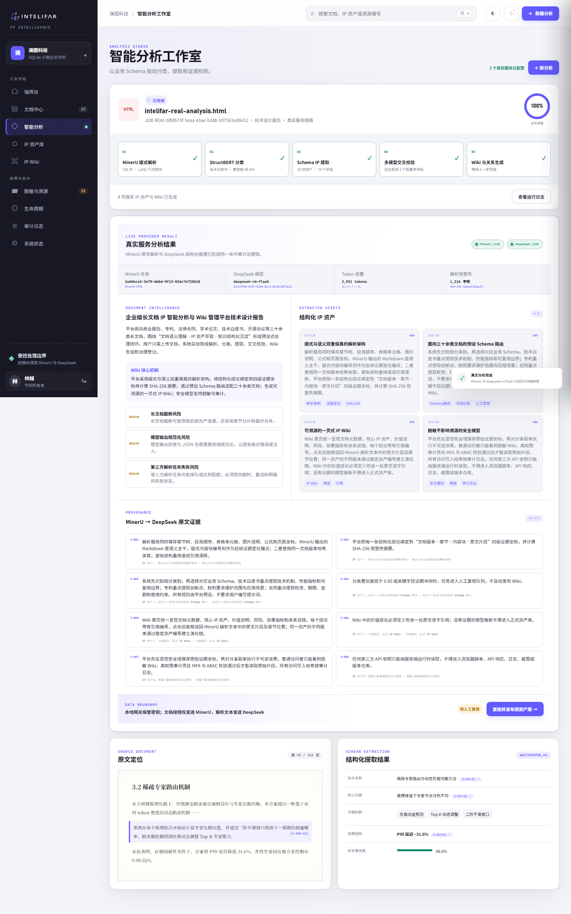
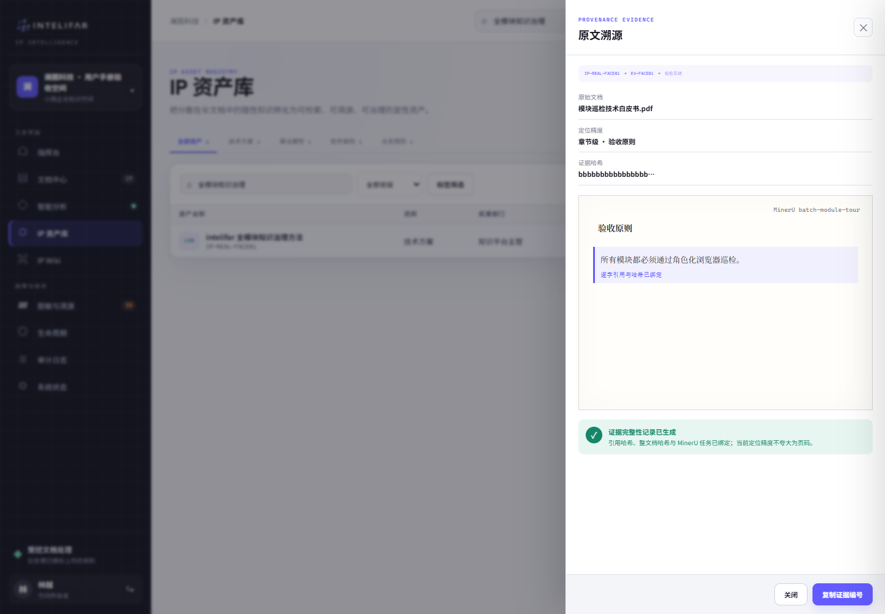

# intelifar 企业知识与 IP Wiki 使用说明

> 适用对象：第一次使用本系统的小微企业客户
> 文档版本：2.0
> 更新日期：2026-08-10

这本手册不要求您了解人工智能或软件开发。您只需要知道自己的工作目标，然后按对应步骤操作。

## 1. 先找到您的角色

| 您在企业中的工作 | 页面显示的角色 | 主要操作 |
| --- | --- | --- |
| 企业负责人或管理员 | 空间所有者、空间管理员 | 邀请同事、检查系统、备份、处理成员离职 |
| 内容维护者 | 知识编辑者 | 上传文档、检查分析结果、发布和修改 Wiki、对外分享 |
| 阅读成员 | 只读成员 | 搜索、阅读 Wiki、查看原文依据 |
| 外部收件人 | 无需进入企业工作空间 | 使用分享链接和访问码阅读指定的脱敏内容 |

如果按钮是灰色的，通常不是系统故障，而是当前账号没有这项操作权限。请联系企业负责人或管理员，不要共用他人的账号。

## 2. 10 分钟上手路线

第一次使用时，只需记住这一条路线：

**选择文件 → 等待分析 → 人工复核 → 发布 → 在 Wiki 阅读或安全分享**

1. 登录企业知识空间。
2. 上传一份不超过 25 MB 的文档。
3. 等待系统完成分析。
4. 检查标题、摘要、关键结论和原文依据。
5. 确认无误后发布。
6. 在 IP Wiki 中阅读，或把脱敏版安全分享给客户。

## 3. 第一次登录

### 适合谁

所有内部用户。

### 操作步骤

1. 打开管理员提供的登录地址。
2. 输入自己的企业邮箱和密码。
3. 点击“安全进入”。
4. 登录后检查左下角的姓名和角色是否正确。

图 1：登录页。账号只用于进入本企业的知识空间。

### 完成标志

看到“指挥台”首页，并且左下角显示自己的姓名。

### 注意事项

- 一人一号，不要把负责人账号发给多人使用。
- 连续输错密码时请停一分钟再试。
- 使用公共电脑后，请点击左下角退出按钮。

## 4. 认识首页和左侧菜单

登录后，左侧菜单是主要入口：

- **指挥台**：快速了解最近任务和待处理事项。
- **文档中心**：查看文档，开始新的分析。
- **智能分析**：等待结果、复核并发布。
- **IP 资产库**：查找已经发布的知识成果。
- **IP Wiki**：按页面连续阅读和搜索。
- **脱敏与溯源**：检查对外内容和原文依据。
- **生命周期**：创建、查看和撤销安全分享。
- **审计日志**：查询谁在什么时间做过重要操作。
- **系统状态**：管理员检查服务、备份和成员。

图 2：指挥台适合了解整体情况，但不应只看首页数字作业务结论。

## 5. 把一份文档变成知识页面

### 适合谁

内容维护者，以及有内容维护权限的企业负责人或管理员。

### 5.1 选择文件

1. 点击右上角“新建分析”或“接入新文档”。
2. 点击“选择真实文档”。
3. 填写文档名称、分类、负责部门和敏感级别。
4. 确认信息后点击“开始智能分析”。

支持 PDF、Word、PowerPoint、图片和 HTML，单个文件最大 25 MB。不要通过修改文件后缀来绕过格式限制。

图 3：上传前先确认文件名称、负责部门和敏感级别。

### 5.2 等待分析

系统会依次完成文件检查、版面识别、内容整理和 Wiki 草稿生成。页面显示“100%”和“已完成”后即可复核。

MinerU 和 DeepSeek 是后台使用的两项处理服务。您不需要配置它们；只需在结果页确认两项服务均已完成。处理期间请不要重复上传同一份文件。

图 4：真实分析完成后，页面会显示结果、风险提示和原文引用。

### 5.3 检查分析结果并发布

发布前至少检查四项：

- 标题和摘要是否准确表达原文。
- 关键结论是否遗漏必要条件或适用范围。
- 每个重要结论是否能打开对应的原文依据。
- 对外可能看到的内容是否已经去除姓名、联系方式、金额或内部地址。

确认无误后，点击“复核并发布到资产库”。发布完成后会生成资产详情和 Wiki 页面。

图 5：资产详情显示来源文档、当前状态、可信度、引用数量和版本。

### 完成标志

- 资产状态显示“已发布”。
- 可以点击“打开 Wiki”。
- 可以点击“查看证据”回到原文。

## 6. 查找和核对知识

### 6.1 搜索资产

在顶部搜索框输入产品名称、技术关键词、客户行业或文档名称。点击搜索结果后可进入资产详情或 Wiki。

只有经过发布的结果才适合在团队内复用。看到“待复核”时，应先请内容维护者完成检查。

### 6.2 查看原文依据

1. 打开 IP 资产库。
2. 选择目标资产。
3. 点击“查看证据”。
4. 核对原文文档、所在章节、摘录和结论。

图 6：原文依据用于确认系统结论没有偏离来源文档。

如果原文与结论不一致，请不要复制或对外发送；先通知内容维护者修改 Wiki。

### 6.3 阅读 IP Wiki

IP Wiki 是企业已经确认的知识页面。左侧目录用于跳转章节，顶部搜索框用于查找当前页面中的关键词。“专注阅读”可以隐藏辅助区域。

图 7：Wiki 把一份长文档整理成可连续阅读的知识页面。

## 7. 修改已有 Wiki

### 适合谁

内容维护者。

### 操作步骤

1. 打开目标 Wiki。
2. 点击右上角“编辑 Wiki”。
3. 修改标题、摘要、核心机制或版本说明。
4. 点击“保存新版本”。
5. 返回页面检查新内容和版本号。

图 8：每次保存都会形成新版本，旧内容仍可从“历史版本”查看。

如果提示“版本冲突”，表示另一位同事刚刚保存过。请刷新页面，比较双方修改后再重新提交，不要直接覆盖。

## 8. 邀请同事

### 适合谁

企业负责人或管理员。

### 8.1 创建邀请

1. 进入“系统状态”。
2. 在“成员与一次性邀请”区域点击“邀请成员”。
3. 填写姓名、企业邮箱和工作角色。
4. 选择邀请有效期。
5. 复制生成的邀请链接，通过可信渠道发给本人。

图 9：通常把日常维护人员设为“知识编辑者”，普通同事设为“只读成员”。

### 8.2 新成员激活

新成员打开邀请链接，核对邮箱和角色，设置自己的密码，然后点击“激活账号并进入登录”。邀请成功使用后不能再次使用。

图 10：密码由新成员自己设置，管理员不应代填或索要密码。

### 成员离职时

管理员应在当天禁用账号，并检查该成员创建的外部分享是否还需要保留。

## 9. 把脱敏内容发给客户

### 适合谁

内容维护者，以及有内容维护权限的企业负责人或管理员。

### 9.1 分享前检查

- 打开要分享的 Wiki，确认标题和正文是最新版本。
- 确认姓名、电话、邮箱、金额和内部地址已经处理。
- 只选择业务需要的最短有效期。
- 确认收件人邮箱无误。

### 9.2 创建安全分享

1. 进入“生命周期”。
2. 点击“创建安全分享”。
3. 选择资产、填写收件人邮箱和有效期。
4. 创建后立即复制“分享链接”和“访问码”。

图 11：关闭窗口后，完整链接和访问码不会再次显示。

请通过不同渠道发送：例如邮件发送分享链接，电话或即时消息发送访问码。不要把两项内容放在同一封邮件里。

### 9.3 外部收件人如何打开

外部收件人打开链接后，会先看到访问验证页。输入独立收到的访问码后，才能进入脱敏 Wiki。

图 12：仅有链接或仅有访问码都不能打开正文。

图 13：外部页面不显示企业内部菜单、成员、原文件或其他资产。

### 9.4 结束分享

评审结束后，在“生命周期”找到该分享并点击“撤销”。已撤销或已过期的分享不能继续访问。

## 10. 哪些数据可以直接用于工作？

系统中同时存在企业真实数据和用于首次体验界面的示例数据，请按下面规则判断。

| 页面内容 | 能否直接用于工作 | 如何判断 |
| --- | --- | --- |
| 自己上传并完成发布的资产和 Wiki | 可以，但仍应由业务负责人确认 | 有真实文档名、创建时间、来源引用和“已发布”状态 |
| 分析完成但仍显示“待复核”的内容 | 不建议 | 先完成人工复核再使用 |
| 指挥台上的部分历史数字、风险案例和示例列表 | 不可以 | 它们是示例数据，用于帮助理解页面 |
| 外部分享中的脱敏 Wiki | 可供指定收件人阅读 | 应确认版本、收件人和有效期正确 |

最简单的判断方法是：重要结论必须能打开原文依据，并且状态已经是“已发布”。

## 11. 每周管理员检查

企业负责人或管理员建议每周用 10 分钟完成以下检查：

1. 进入“系统状态”，确认各项服务显示正常。
2. 查看是否有长时间失败或等待处理的任务。
3. 创建一次备份，并确认状态显示“验证通过”。
4. 检查是否有离职成员、过期邀请或不必要的高权限账号。
5. 检查仍然有效的外部分享，撤销已经结束的项目。

图 14：页面显示备份通过，只代表当前备份文件可用；企业仍需由部署人员保留另一地点的备份副本。

## 12. 遇到问题怎么办

| 您看到的情况 | 建议处理方式 |
| --- | --- |
| 登录失败 | 核对邮箱和密码；连续失败时等待一分钟，再联系管理员确认账号是否被禁用 |
| 邀请链接无效 | 可能已过期、已使用或已被新邀请替代，请管理员重新邀请 |
| 文件无法上传 | 检查格式和 25 MB 大小限制，不要只修改文件后缀 |
| 文件被安全检查拦截 | 停止上传，联系管理员确认文件来源；不要关闭安全检查 |
| 分析长时间没有完成 | 打开智能分析查看当前阶段；稍后重试一次，仍失败时联系管理员 |
| 发布按钮是灰色 | 当前账号可能是阅读成员，或任务尚未完成 |
| 结论与原文不一致 | 不要对外使用；打开原文依据并请内容维护者修改 |
| Wiki 保存时提示冲突 | 刷新页面，比较新版本后重新修改 |
| 客户打不开分享 | 检查是否过期或已撤销，并确认链接与访问码来自不同消息 |
| 访问码丢失 | 撤销旧分享并重新创建，系统不会再次显示旧访问码 |
| 备份显示失败 | 不要删除上一份成功备份，联系部署或运维人员处理 |

## 13. 三张日常检查表

### 内容维护者发布前

- [ ] 标题和摘要与原文一致。
- [ ] 关键结论能打开原文依据。
- [ ] 风险和限制条件没有被省略。
- [ ] 敏感内容已处理。
- [ ] 已由业务负责人完成人工复核。

### 管理员邀请成员前

- [ ] 企业邮箱属于本人。
- [ ] 角色符合实际工作需要。
- [ ] 邀请链接只发给本人。
- [ ] 离职或转岗后会及时调整账号。

### 对外分享前

- [ ] 分享的是脱敏 Wiki，不是原文件。
- [ ] 收件人邮箱和有效期正确。
- [ ] 链接与访问码通过不同渠道发送。
- [ ] 项目结束后有负责人撤销分享。

## 14. 给购买或部署负责人的提醒

正式给员工使用前，请与部署人员确认：

- 已启用安全的访问地址和证书。
- 文档处理服务和文件安全检查均正常。
- 系统密钥没有放在网页、聊天记录或项目文件中传播。
- 已配置定期备份、另一地点的备份副本和恢复演练。
- 已指定账号、分享、故障和数据合规的负责人。
- 已准备企业邮箱或其他可信渠道发送邀请和分享信息。

## 15. 常见问题

**系统分析完成后，为什么还要人工复核？**

扫描质量、复杂表格和上下文都可能影响结果。人工复核负责把系统草稿变成企业可以承担责任的正式知识。

**普通阅读成员可以修改或分享吗？**

不可以。阅读成员可以搜索、阅读和查看依据，修改与分享由内容维护者负责。

**为什么分享链接和访问码要分开发？**

如果一条消息被误转发，收件人仍缺少另一项信息，能够降低误分享风险。

**为什么邀请链接和访问码不能再次查看？**

它们只在创建时完整显示。丢失后应撤销旧记录并重新创建。

**首页数字为什么和实际文档数量不同？**

首次体验版本中，首页部分卡片包含示例数据。正式工作应以自己发布的资产、Wiki 和原文依据为准。
