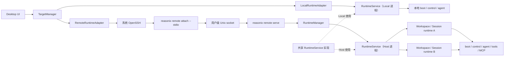

# Reasonix Remote 架构设计

> 状态：Remote V1 产品、架构与协议语义已冻结；阶段 1–6 与阶段 7 当前环境自动化已完成，
> 实机人工验收状态见
> [`REMOTE_IMPLEMENTATION_STATUS.zh-CN.md`](./REMOTE_IMPLEMENTATION_STATUS.zh-CN.md)。
>
> 最后更新：2026-07-18
>
> 首个正式支持组合：Windows Desktop → Linux Host
>
> 注意：本文中的 Remote 命令、RPC 方法与 RuntimeAPI 语义是冻结基线；内部包路径和文件名是
> 初始工程布局，可以在不改变依赖方向与 wire 的前提下调整。实现完成度只由状态文档中的代码
> 与测试证据确认。

本文记录 Reasonix Remote V1 的产品边界、架构不变量、协议契约、实施阶段和验收标准。
实现阶段可以调整内部包名、私有结构和工程拆分，但 wire 方法、身份、状态语义、固定限额和
能力边界不得在没有重新评审的情况下改变。阶段 1 生成的规范化 JSON schema 是本文契约的
机器可校验表达，不是重新讨论协议的阶段。

## 1. 背景与目标

Reasonix 当前的 CLI 和 Desktop 都在本机运行 Agent、Session、工具、Shell、Git、MCP
以及配置读取。Remote 的目标是把执行环境放到一台用户可达的 Host 上，同时继续使用
现有 Desktop 的工作台和交互逻辑。

Remote V1 的典型场景是：

```text
Windows Desktop
  └─ 通过系统 OpenSSH 连接 Linux Host
       └─ Linux Host 运行 Reasonix daemon、Agent、Session 和工具
```

核心目标：

- Linux Host 持有工作区、会话和所有执行状态。
- Windows Desktop 负责连接、认证交互、渲染和用户操作。
- 连接前允许有 Remote 专属流程；连接后复用当前 Desktop 工作台，不建设第二套 Remote UI。
- SSH 断开不终止 Host 已接受的任务，Desktop 重连后恢复状态。
- Local 与 Remote 通过同一 RuntimeAPI 接入，业务逻辑不复制。
- 架构保持跨平台，Remote V1 只对 Linux Host 作正式交付和验收承诺。

## 2. V1 非目标

Remote V1 不解决以下问题：

- 多客户端协作、多人同时观察或控制同一个 Host。
- 同一 Desktop 同时连接多个 Host，或混合 Local/Remote 标签页。
- 手机客户端；协议设计需避免阻塞未来客户端，但 V1 不交付手机端。
- Relay、VPN、内网穿透、DDNS、端口映射和云端账号体系。
- 对公网暴露的 TCP/WebSocket 服务或额外的 Reasonix Token 认证。
- Remote Terminal、用户可见 PTY 和 SFTP 文件系统。
- 通用文件上传下载、拖放传输、剪贴板图片和附件。
- Remote 工作区图片/PDF内容预览。
- Desktop 自动安装、启动、停止、重启、升级、卸载或修复 Host。
- Windows/macOS Host 的正式安装、服务管理和兼容性承诺。
- Git stage、commit、checkout、discard、reset 等面板写操作。

这些限制只适用于 Remote V1，不移除 Local Desktop 当前已有的能力。

## 3. 术语

| 术语 | 含义 |
|---|---|
| Host | 运行 Reasonix daemon、Agent、Session、工具和工作区操作的机器 |
| Desktop / Client | 发起连接并呈现工作台的桌面程序；V1 主要为 Windows Desktop |
| Target | Desktop 当前绑定的执行目标，取值为 Local 或某一个 Remote Host |
| Attach | 经 SSH stdio 建立的临时 Remote 协议连接 |
| daemon | Host 用户级后台进程，持有 Controller 和 Session runtime |
| Runtime | 面向 UI 提供会话、执行、文件及 Git 等能力的统一抽象 |
| Build ID | Desktop、attach CLI 和 daemon 用于严格兼容校验的 Remote 构建身份 |
| lease | Host 对当前唯一客户端连接的占用记录 |
| hostEpoch | daemon 当前进程实例的随机身份；重启后变化 |
| runtimeEpoch | 某个 SessionRuntime 当前实例的随机身份；重建后变化 |

## 4. 架构不变量

以下规则已经冻结：

1. Host 是工作区、Session、Agent、工具、Git、MCP、配置、凭据和审批状态的权威端。
2. Desktop 只负责连接与交互，不把本地 Provider 凭据或 Host 配置上传到 Remote。
3. 一个 Host 同一时刻只允许一个客户端 attach；一个客户端可以操作多个 workspace/session。
4. 一个 Desktop 同一时刻只绑定一个 Target，不允许 Local/Remote 或多个 Host 混合标签页。
5. Remote 内置在唯一的 `reasonix` CLI 中，不发布独立 `reasonixd`。
6. Desktop、attach CLI 与 daemon 的 Build ID 必须完全一致，否则拒绝连接。
7. 唯一的 V1 传输是系统 OpenSSH 上的 JSON-RPC 2.0 NDJSON stdio。
8. Remote Protocol 独立于 ACP，只共享中立的 JSON-RPC/NDJSON wire 实现。
9. Controller 生命周期属于 daemon；attach 断开不能取消已接受的 turn。
10. Host 是运行状态权威；Desktop 通过 snapshot 和有序事件恢复。
11. Workspace 路径语义与当前 CLI 一致，不增加 Remote 专用路径白名单。
12. Local 模式不得因 Remote 引入而回归。

## 5. 总体组件关系



### 5.1 Desktop 职责

- 保存非敏感 Host 条目，例如 SSH Host alias、SSH config 文件和最近工作区。
- 启动和管理系统 `ssh` 进程。
- 处理 Host Key 确认、密码、密钥口令、keyboard-interactive/2FA 等认证交互。
- 呈现连接阶段、错误、重试、断开与重连状态。
- 选择 LocalRuntimeAdapter 或 RemoteRuntimeAdapter，并把同一个工作台绑定到当前 Target。
- 渲染 Session、事件、审批、文件和 Git 查询结果。

Desktop 不负责：

- 自动运行 Host 的 install/start/stop/restart/upgrade/uninstall。
- 保存 SSH 密码或私钥口令。
- 代替 Host 读取 Provider/MCP 凭据。
- 在连接失败时静默回退到 Local。

### 5.2 Host 职责

- 持有 Controller、Session runtime、Agent turn 和事件序列。
- 执行 Shell、工具、Git、MCP、技能、插件和工作区文件操作。
- 读取 Host 自己的 Reasonix 配置与凭据。
- 提供 snapshot、实时事件、会话操作以及受限的文件/Git 查询。
- 在 attach 断开后继续执行已经接受的任务。
- 执行单客户端 lease、Build ID 校验和请求幂等。

### 5.3 CLI 职责

Remote 是现有 `reasonix` CLI 的一个命令组，而不是独立产品。V1 冻结的公开命令为：

```text
reasonix remote install
reasonix remote start
reasonix remote stop
reasonix remote restart
reasonix remote status
reasonix remote doctor
reasonix remote logs
reasonix remote uninstall
```

V1 冻结的内部命令为：

```text
reasonix remote serve
reasonix remote attach --stdio
```

其中：

- `install` 安装、enable 并启动 systemd user service；操作仍由用户显式执行。
- `status --json` 供用户和 CLI 诊断使用，提供机器可读的只读结果。
- `doctor` 只诊断，不自动修复。
- `uninstall` V1 保留配置和 Session，不提供 purge。
- `attach --stdio` 只附着已有服务，不启动、升级或修复 daemon。

Desktop 建立 Remote 连接时只执行一次 `reasonix remote attach --stdio`，由 attach 返回 service、
版本和 busy 等结构化状态；不额外建立第二条 SSH 连接执行 `status --json`。

## 6. 平台、进程和服务生命周期

### 6.1 平台范围

Reasonix Host 的协议、RuntimeManager 和 Session 模型必须保持跨平台，不在核心包中写死
Linux。Remote V1 仅正式支持 Linux Host：

| 平台 | V1 状态 |
|---|---|
| Linux | 正式支持并完成安装、服务管理及端到端验收 |
| macOS | 核心保持可编译；LaunchAgent、TCC 和签名等后续处理 |
| Windows | 核心保持可编译；用户级服务、IPC 和 sandbox 差异后续处理 |

### 6.2 Linux daemon

- 每个 Linux 用户运行一个 daemon，不以 root 身份运行。
- 使用 systemd user service，设置 `Restart=on-failure`。
- systemd `ExecStart` 永久指向 `<Reasonix Home>/remote/bin/reasonix` 的绝对路径；该文件是当前
  CLI 原生 Go 二进制的单一 managed copy，不是独立 `reasonixd`。
- managed copy 所在目录权限为 `0700`，二进制由当前用户拥有、不可被 group/world 写、不得是
  符号链接；同步使用同目录临时文件、完整 Build ID 校验和原子 rename。
- unit 不通过 shell、`/usr/bin/env`、npm shim、Homebrew Cellar 或 systemd `PATH` 查找
  `reasonix`，因此包管理器和 nvm/pnpm 安装路径变化不影响开机启动。
- Unix socket 位于 `$XDG_RUNTIME_DIR/reasonix/remote.sock`，权限为 `0600`。
- daemon 不监听 TCP。
- daemon 日志进入 journald；协议 stdout 不得混入日志。
- CLI 检测 systemd lingering 状态并提示用户，V1 不自动执行 sudo 或修改系统策略。
- 不提供 nohup/tmux 备用守护方式。

### 6.3 升级

Remote 不建设第二套升级器。升级流程保持现有 CLI 语义：

```text
reasonix upgrade
reasonix remote restart
```

使用 npm 安装时由用户使用相应包管理器升级，然后手动执行 `reasonix remote restart`。生命周期
命令的同步规则为：

- `remote install` 把当前 `os.Executable()` 对应的原生 Go 二进制同步到 managed path，验证
  Build ID 后写 unit、daemon-reload、enable 并启动。
- `remote start` 只在 daemon 未运行时先同步当前 CLI 再启动；已运行且版本不同时只提示使用
  `remote restart`。
- `remote restart` 先同步并验证新副本，成功后才重启；同步失败时不停止仍在运行的 daemon。
- `remote stop/status/doctor/logs` 不修改 managed binary；`attach --stdio` 也绝不启动、同步、
  升级或修复服务。

managed path 始终只有一个当前文件，原子覆盖后由用户显式 restart 生效。V1 不提供：

- Remote 专用 upgrade 命令。
- 多版本二进制目录或 `current` 指针。
- 自动健康检查、自动回滚或 Desktop 代升级。

`remote status --json` 和 `remote doctor` 同时报告并比较：

1. 当前调用命令的 `cliBuildId`。
2. managed binary 的 `installedBuildId`。
3. 通过 Unix socket 读取的运行进程 `daemonBuildId`。

CLI 与 installed 不同表示升级后尚未同步；installed 与 daemon 不同表示新文件已经落盘但旧
进程尚未重启。doctor 还检查 systemd user manager、unit enabled/active、ExecStart 精确路径、
文件属主/权限/非符号链接、socket 类型/属主/`0600`、service 最近状态和 lingering；它只给出
命令，不自动修复。若 lifecycle 命令解析出的 Reasonix Home 与 unit 记录的安装 profile 不同，
必须拒绝静默切换并提示用户使用原 profile 或先 uninstall。

## 7. Desktop 连接流程与 SSH 边界

### 7.1 SSH 配置

系统 OpenSSH config 是连接配置的权威来源。Desktop 可以保存或创建标准 SSH Host 条目，
但 ProxyJump、ProxyCommand 等高级配置继续由用户维护。

Desktop 负责完整连接体验，而不是要求用户先在外部终端登录：

1. 用户添加或选择一个 SSH Host。
2. Desktop 启动系统 `ssh`。
3. Desktop 呈现 Host Key 指纹确认。
4. Desktop 通过 AskPass 或专用交互通道处理密码、私钥口令和 2FA。
5. SSH 远端执行 `reasonix remote attach --stdio`。
6. attach 启动 bootstrap stdio，Desktop 首先发送 `remote/initialize`。
7. attach 校验自身 Build ID，检查 service 并连接本用户的 daemon Unix socket，再把 initialize
   交给 daemon 完成 daemon Build ID、lease 与能力握手。
8. 任一步失败都以 9.7 的 bootstrap RPC error 或 ConnectionFailure 停留在连接错误页；全部
   成功后才进入现有工作台。

V1 不提供用户可见 Remote Terminal。SSH 认证所需的专用交互通道不属于 Remote PTY。

### 7.2 网络与认证

- 用户负责让 Host 可达，例如 LAN、Tailscale、WireGuard 或自建 VPN。
- Reasonix 不提供 Relay、NAT 穿透、DDNS、自动端口映射或 VPN 管理。
- SSH 用户和 Host 文件权限是 V1 的安全边界。
- 不增加 Reasonix 账号、设备绑定、Token 或第二套 TLS 身份。
- 私钥继续由 OpenSSH/ssh-agent 管理；Desktop 不保存密码或口令。
- Host Key 发生变化时必须阻止连接，不能静默接受。

## 8. 严格版本身份与发布

### 8.1 Build ID

Remote Build ID 由以下字段组成：

```text
productVersion
sourceRevision
protocolVersion
schemaHash
```

以下内容不进入 Build ID，以保证 Windows Desktop 与 Linux CLI 可以匹配：

- OS、架构和编译器版本。
- 构建时间、安装路径和 artifact hash。

Desktop、SSH 启动的 attach CLI 和已运行 daemon 必须具有完全相同的 Build ID。
任一字段不一致都拒绝进入工作台。不得提供版本范围、降级连接、`--force`、忽略按钮或
自动 fallback。

开发构建也不能只使用通用的 `dev` 身份，必须包含 commit 和 schema 身份。

`schemaHash` 不是人工维护的第二套版本号。Remote 的 Go wire 类型和显式协议注册表是唯一
来源；RPC router 也必须读取同一注册表，不能另写 method/error 清单。生成输入包括：

- 所有 Remote method、notification、params、result 和 error data 类型。
- JSON 字段名、required/optional/nullable、枚举和稳定错误码。
- 完整 `eventwire.Event` 结构及稳定 event kind。
- 会改变客户端行为的固定资源限制，包括 RMT-030。

注释、描述、源码顺序、Go/TypeScript 符号名、Wails-only UI、ACP、产品版本、Git revision、
OS、架构和构建时间不进入 schema。生成器按 wire 名排序，输出不含时间戳、绝对路径或随机
顺序的规范化 UTF-8 JSON，并对精确字节计算完整的
`sha256:<64 位小写十六进制>`。

计划生成并提交：

```text
internal/remote/protocol/schema.generated.json
internal/remote/protocol/schema_hash.generated.go
desktop/frontend/src/generated/remoteProtocol.generated.ts
```

Go runtime 直接使用协议源类型；TypeScript 只生成 UI 真正消费的 Remote event/RuntimeAPI
view 类型，不复制整个 Wails API。CI 使用同一生成器在临时目录重建并逐字节比较生成物，
同时校验 router、错误表和注册表完全一致。任何 wire 字段、方法、错误、枚举、event kind 或
固定协议限制变化都会自动改变 schemaHash；仅注释、排序或内部实现重构不会改变。

普通 schema 变化不需要人工提升 `protocolVersion`。只有 framing、握手或协议根语义进入新
世代时才提升它；V1 不维护兼容范围或降级表。

### 8.2 协调发布

CLI 与 Desktop 是同一个产品版本的协调发布单元，但仍是不同平台 artifact。稳定发布使用
`vX`、`npm-vX`、`desktop-vX` 等现有 tag 族时，所有对应 tag 必须指向同一个 Git commit；
CI 应拒绝来源提交不一致的发布。

attach 必须区分：

- 安装的 CLI 与 Desktop 不一致：`VERSION_MISMATCH`。
- 安装的 CLI 已升级，但 daemon 尚未重启：`DAEMON_RESTART_REQUIRED`。

## 9. Remote Protocol

### 9.1 与 ACP 的关系

Reasonix Remote Protocol 是独立协议，不复用 ACP 方法、`_meta`、`_reasonix/*` 扩展或
ACP 的 connection-owned Session 生命周期。

原因是当前 ACP 连接结束时会取消请求并关闭该连接持有的 Controller/MCP，而 Remote 要求
daemon 在 SSH attach 断开后继续运行；当前 ACP 事件投影还会丢失或降级部分 Desktop 所需
事件。

两者只共享中立的实现层：

```text
internal/acp    ─┐
                 ├─> internal/rpcwire
internal/remote ─┘
```

现有 `reasonix acp` 的 wire 和行为必须保持兼容。

### 9.2 传输与握手

- JSON-RPC 2.0。
- 每条消息一行的 NDJSON framing。
- 一个 SSH stdio 连接复用所有 workspace/session。
- stdout 只输出协议；诊断信息写 stderr/journald。
- 第一条请求必须是 `remote/initialize`。
- 握手完成前的其他方法一律拒绝。

Remote 入站和出站的单条 NDJSON 帧均以最终 JSON UTF-8 编码结果计算，连同换行不得超过
8 MiB。超限入站是 framing 错误；Host 不得写出超限帧，而应在编码前使用分页或
`contentRef` 外置大内容。该限制独立于 ACP 当前的帧上限。

JSON-RPC `id` 只关联当前 wire 请求/响应；会产生状态变化的操作另带稳定 `requestId`，用于
断线重试幂等。

### 9.3 V1 方法注册表

V1 的 wire 方法注册表冻结如下。阶段 1 必须从同一 Go 注册表生成 router、schema、错误表和
前端消费类型；实现不得在 router 中增加未注册的隐藏方法。

```text
连接与 Host
  remote/initialize              remote/ping
  remote/detach                  host/capabilities
  host/configSummary

Workspace 与能力目录
  workspace/browse               workspace/open
  workspace/list                 workspace/close
  workspace/changes              catalog/workspace
  catalog/session

Topic 与持久 Session
  topic/list                     topic/create
  topic/rename                   topic/delete
  topic/trash                    session/list
  session/create                 session/rename
  session/close                  session/trashList
  session/trash                  session/restore
  session/purge

状态、历史与事件
  session/subscribe              session/unsubscribe
  session/history                session/content
  session/event                  # Host -> Desktop notification
  session/resync_required        # Host -> Desktop notification
  catalog/changed                # Host -> Desktop notification

输入、Turn 与 Prompt
  session/submit                 turn/steer
  turn/cancel                    prompt/approve
  prompt/answer                  shell/run
  operation/cancel

Session 运行操作
  session/new                    session/clear
  session/fork                   session/rewind
  session/compact                session/summarize
  session/profile/set            session/goal/set
  session/goal/resume            session/goal/clear
  session/context                session/balance
  job/list                       job/cancel

工作台查询与当前业务面
  composer/slashArgs             composer/history
  file/list                      file/search
  file/preview                   git/history
  git/commitDetail               memory/get
  memory/suggestions             memory/remember
  memory/forget                  memory/document/save
  memory/suggestion/accept       skill/suggestion/accept
  research/status                research/list
  research/findings              research/evidence/record
```

列表是 Remote V1 的业务边界而不是现有 Wails 方法的逐项镜像。`ToolResultForTab` 由 snapshot、
event 和 `contentRef` 取代；todo、goal、context、checkpoint、jobs 的实时状态首先进入 snapshot
聚合器。Desktop 本机设置、Host 管理写入以及明确后置能力不进入注册表，详见 14.2。

所有业务方法复用以下身份与 mutation 外壳：

```text
RuntimeTarget {
  workspaceId
  sessionId
}

HostMutation {
  requestId
  expectedHostEpoch
}

SessionMutation {
  requestId
  expectedHostEpoch
  target: RuntimeTarget
  expectedRuntimeEpoch
}

SessionRecordMutation {
  requestId
  expectedHostEpoch
  target: RuntimeTarget
}

RuntimeQuery {
  expectedHostEpoch
  target: RuntimeTarget
  expectedRuntimeEpoch
}
```

字段均为非空 opaque string。普通只读 Session 方法显式携带 `RuntimeTarget` 和调用方已知的
host/runtime epoch，但不带 requestId。`SessionRecordMutation` 操作可以处于 cold/trash 状态的
持久 Session，因此不要求并不存在的 runtimeEpoch。三个非 RuntimeQuery 入口分别是：
`session/subscribe` 用 expectedHostEpoch + target 发现或重建 runtime 身份；
`session/unsubscribe` 只操作当前 transport 的 subscriptionId；`session/content` 只操作当前
lease 下已经签发的 opaque contentRef。它们都不能演变成隐式“当前 Session”。
lease 和 connection generation 由当前 transport 上下文隐式绑定，不在每个业务方法中重复
发送。Turn/Prompt mutation 还必须分别携带 Host 生成的 opaque `turnId` 或 `promptId`；
Desktop 不能使用本地 tabId、递增 turn 数字、Session 路径或 Controller 内部 prompt ID 作为
协议身份。Checkpoint 同样使用 runtime 生成的 opaque `checkpointId`，不能使用会在 Rewind
后复用的 turn 序号作为 mutation 目标。

`session/event` 的 `event` 字段传递完整、通用的 `eventwire.Event`，不得像 ACP
`updateSink` 一样做有损降级。新增通用事件类型不应要求 Remote 再维护一套事件映射；协议
兼容性由 Build ID/schemaHash 和通用 wire schema 约束。

连接级方法冻结为：

```text
remote/initialize {
  buildId
  clientInstanceId
  resumeLeaseId?
} -> {
  buildId
  hostEpoch
  lease { leaseId, ttlMs: 30000, pingIntervalMs: 10000 }
  host { os, arch, shellKind, sandboxBackend }
  capabilities
}

remote/ping { leaseId }
  -> { hostEpoch, leaseTtlMs: 30000 }

remote/detach { leaseId }
  -> { detached: true }
```

initialize 校验顺序固定为 Desktop Build ID 与 attach CLI、attach CLI 与 daemon、lease
续接/获取，全部成功后才返回 Host 能力。Host 空闲时为无效或已过期的旧 resumeLeaseId 签发
新 lease；有效 lease 被不匹配的 `clientInstanceId + leaseId` 持有时返回 HOST_BUSY 和剩余
retryAfterMs，不泄露持有者。initialize、ping 和 detach 均为连接级操作，不使用 requestId。

### 9.4 订阅、Snapshot、历史与大字段

打开 cold Session、首次连接和重同步都使用同一个原子入口，不建立先 snapshot 再 subscribe
的竞态窗口：

```text
session/subscribe {
  expectedHostEpoch
  target
  pageTurns                 # 1..200，由 Desktop 设置提供，默认 60
  replaceSubscriptionId?
} -> {
  subscriptionId
  snapshot: SessionSnapshot
}

SessionSnapshot {
  snapshotId
  hostEpoch
  target
  runtimeEpoch
  boundarySeq
  meta                      # topic/title/resolvedProfile/goal/capabilities
  runtime                   # running/currentTurn/currentOperation/cancelRequested/
                            # lastOutcome/interruption
  history: HistoryPage
  pendingPrompt?
  todos[]
  context
  jobs[]
  checkpoints[]             # 每项携带 opaque checkpointId
  externalized[]
}

session/unsubscribe { subscriptionId }
  -> { unsubscribed: true }

session/history {
  RuntimeQuery
  snapshotId
  cursor
  pageTurns                 # 1..200
} -> HistoryPage

HistoryPage {
  snapshotId
  messages[]
  startTurn                 # 0-based、半开区间，仅供展示
  endTurn
  totalTurns
  actualTurns
  hasOlder
  nextCursor?
  externalized[]
}
```

`session/subscribe` 是 attachment 与 runtime 发现入口，不带 requestId 或
expectedRuntimeEpoch。Host 先为新 subscription 建立缓冲，再在 Session sequencer 中以
`boundarySeq=N` 冻结 snapshot，并只为该 subscription 接收 `N+1` 之后的事件。
`replaceSubscriptionId` 必须先安装新订阅再移除旧订阅。编码期间产生的通知可以先于 RPC
response 到达，因此 Desktop 按未知 subscriptionId 暂存，收到 response 后再从 `N+1` 连续
应用；不能按 JSON-RPC response 与 notification 的到达先后推断状态顺序。
`session/unsubscribe` 是当前 transport 内的连接级幂等操作，重复调用仍返回成功；
`SUBSCRIPTION_NOT_FOUND` 只用于 subscribe 携带了不属于当前 transport 的
replaceSubscriptionId。
transport 断开会删除其全部 subscription；SSH/lease 续接后的新 transport 重新 subscribe 时
不携带旧 transport 的 replaceSubscriptionId，而是直接取得新 snapshot。

```text
session/event {
  subscriptionId
  hostEpoch
  target
  runtimeEpoch
  seq
  turnId?
  operationId?
  event: eventwire.Event
  externalized[]
}

session/resync_required {
  subscriptionId
  hostEpoch
  target
  runtimeEpoch
  lastSeq
  reason: queue_overflow | runtime_replaced | target_replaced
  replacementTarget?
  replacementRuntimeEpoch?
}
```

订阅队列有界；溢出不阻塞 SessionRuntime，而是停止该订阅的普通事件并发送一次
`session/resync_required`。runtime rebuild 使用相同 target + replacementRuntimeEpoch；New/Clear
使用 `target_replaced` + replacementTarget/replacementRuntimeEpoch。Desktop 按通知给出的目标
发起带 `replaceSubscriptionId` 的新 subscribe；旧 subscription 在替换前只保留这条终止通知，
不再发送普通事件。通知本身不续 lease。Fork 保持源订阅不变。

同一 session/event 的 turnId 与 operationId 至多一个非空；普通 Session 状态事件可以两者都
省略。ID 必须与该 event 的 runtimeEpoch 匹配。

历史只能从 snapshot 中的 `nextCursor` 向前读取；协议不接受 `beforeTurn` 作为分页身份。
cursor 绑定 method、target、host/runtime epoch、snapshotId、排序与筛选条件。snapshot 过期
返回 `SNAPSHOT_EXPIRED`，Desktop 重新 subscribe，不把不同 snapshot 的页面拼接。

大字段描述和分块接口冻结为：

```text
ExternalizedField {
  jsonPointer                # RFC 6901，相对拥有 externalized[] 的对象
  contentRef
  totalBytes
  sha256                     # 完整可取回 bytes 的小写 hex SHA-256
  truncated
  originalBytes?
  truncationReason?
}

session/content { contentRef, offset }
  -> {
    contentRef
    offset
    dataBase64
    nextOffset?
    totalBytes
    sha256
    encoding: utf-8
  }
```

offset 和 nextOffset 都是原始 bytes 偏移，不是 rune、UTF-16 或 Base64 字符偏移。每块原始
数据最多 256 KiB。Desktop 取齐、校验 SHA-256、UTF-8 解码并按 jsonPointer 回填后，才把
snapshot/history/event 交给类型化 reducer。该方法只接受 opaque ref 与 offset，不带路径、
target、epoch 或 requestId；未知和已过期引用统一返回 `CONTENT_REF_EXPIRED`。

V1 只外置 schema 标记为 externalizable 的 string 字段。拥有 `externalized[]` 的对象分别是
SessionSnapshot、HistoryPage 或完整 SessionEvent envelope；subscribe 外层 response 不参与
snapshot pointer 计算。原字段在原始 wire JSON 中固定为 `null` 占位，客户端把取回 bytes
解码为 UTF-8 string 并替换该 pointer 后，才执行最终 typed decode。生成 schema 必须表达这种
“wire 可空、rehydrated view 非空”的两阶段类型，不能让不同实现自行选择空串、删除字段或
JSON-quoted bytes。

### 9.5 Composer、Turn、Prompt 与 Session 操作

当前 composer 原始输入既可能启动 Turn，也可能执行 `/new`、`/clear`、`/compact`、Goal、
Memory、MCP prompt、skill/subagent invocation、只读命令或 `!cmd`。因此 wire 原始入口必须是
`session/submit`，不能承诺每次返回 turnId：

```text
session/submit {
  SessionMutation
  input
  displayText
  editedOriginal?
  invocations[]? {
    name
    kind: skill | subagent
  }
  deliveryRecovery?
} ->
  { kind: turn, turnId, target, runtimeEpoch }
| { kind: operation, operationId,
    operation: shell | compact | summarize,
    target, runtimeEpoch }
| { kind: completed,
    effect: none | state_changed | runtime_replaced | session_replaced,
    target, runtimeEpoch, snapshotRequired }
```

只有 `kind=turn` 才存在 turnId。未知/只读 slash command 可以发 Notice 并返回
`completed/none`；不得伪造 Turn。`/new`、`/clear` 和导致 Controller 重建的命令必须先由
RuntimeManager 完成身份迁移，再返回新的 target/epoch；不能让旧 Controller 在异步 goroutine
中自行替换 Session。显式的模型、effort、mode、Goal 等 Desktop 控件仍调用下述类型化方法，
而 raw slash 入口在共享 RuntimeService 中路由到同一业务操作。Local 与 Remote 不各写一套
slash dispatcher。

invocations 数组顺序就是确定的调用顺序，wire 不传字符 offset。当前 Desktop adapter 在发送
前按本地 composer selection 排序并去掉 JavaScript UTF-16 offset；手机或其他客户端只需产生
同样的有序数组，不需要复刻某个平台的字符串索引单位。

Turn 与 Prompt mutation 冻结为：

```text
turn/steer { SessionMutation, expectedTurnId, text }
  -> { accepted: true, turnId }

turn/cancel { SessionMutation, expectedTurnId }
  -> { status: cancel_requested | already_requested, turnId }

prompt/approve {
  SessionMutation
  promptId
  decision: allow_once | allow_session | allow_persistent | deny
} -> { resolved: true, promptId }

prompt/answer {
  SessionMutation
  promptId
  answers[] { questionId, selected[] }
} -> { resolved: true, promptId }
```

Steer 必须走 strict `TrySteer`：没有活动 Turn 或 expectedTurnId 不匹配时返回错误，绝不能
降级为新 Turn。Ask 的空 answers 合法，表示当前 Desktop 的 Skip；questionId 必须唯一且来自
pending prompt，单选问题最多一个 selected。Approval snapshot 携带 `allowedDecisions`，Host
拒绝当前 prompt 不允许的决定。

显式 Session 操作冻结为：

```text
session/new { SessionMutation }
  -> { sourceTarget, target, runtimeEpoch, disposition: created,
       snapshotRequired: true }

session/clear { SessionMutation }
  -> { previousTarget, target, runtimeEpoch,
       disposition: cleared | cleanup_pending,
       snapshotRequired: true }

session/fork { SessionMutation, checkpointId, name? }
  -> { sourceTarget, sourceRuntimeEpoch, childTarget, childRuntimeEpoch }

session/rewind {
  SessionMutation
  checkpointId
  scope: code | conversation | both
} -> { workspaceChanged, conversationRewritten, snapshotRequired: true }

session/compact { SessionMutation, instructions? }
  -> { operationId, disposition: started }

session/summarize {
  SessionMutation
  checkpointId
  direction: from | up_to
} -> { operationId, disposition: started }

shell/run { SessionMutation, command }
  -> { operationId, disposition: started }

operation/cancel { SessionMutation, expectedOperationId }
  -> { status: cancel_requested | already_requested, operationId }
```

New 保存旧 Session 并在同一 Topic 下创建全新 sessionId/runtimeEpoch；Clear 永久丢弃旧
Session 并创建全新身份。两者都继承 additional dirs 与 resolved profile，但新 Session 不继承
Goal。Fork 不隐式决定 Desktop 是否切换，源 runtime 保持不变。Rewind `both` 必须先验证代码
与对话两个 checkpoint 均可用；执行顺序固定为代码恢复成功后才重写 conversation，不得先改
代码后才发现对话不可回退。V1 不为多文件 OS 写入假装提供跨文件事务：若写入开始后失败，
返回 `REWIND_PARTIAL`，error data 标记可能变化的范围并强制 Desktop 刷新 file/Git 与
snapshot；同一 requestId 重试只返回首次错误，不再次写入。Rewind 删除的 checkpointId 立即
失效；以后即使出现相同展示 turn，也生成从未使用过的新 checkpointId。

Compact、Summarize 和一次性 Shell 通过 runtimeEpoch-bound opaque operationId 与事件呈现进度；
snapshot 的 `currentOperation` 固定包含 operationId、kind 和 cancelRequested，断线后可以恢复。
当前 Desktop 的 Cancel 根据 snapshot 当前是 Turn 还是 Operation，分别调用 turn/cancel 或
operation/cancel；迟到 operationId 不能取消后续操作。用户直接输入的 `!cmd`
与显式 `shell/run` 共享同一 Host 操作；这保持当前“用户明确输入的命令不经过模型”的语义，
但不等于提供 Remote PTY。所有 rotation/rebuild 操作在活动 Turn、Prompt 或冲突操作存在时返回
`SESSION_BUSY`。

### 9.6 Profile、Goal 与现有工作台业务面

```text
session/profile/set {
  SessionMutation
  patch { model?, effort?, collaborationMode?, tokenMode?, toolApprovalMode? }
} -> {
  resolvedProfile
  runtimeEpoch
  disposition: updated | rebuilt
  autoResolvedPromptIds[]
}

session/goal/set { SessionMutation, goal }
  -> { goal, status }
session/goal/resume { SessionMutation }
  -> { resumed, goal, status }
session/goal/clear { SessionMutation }
  -> { cleared: true }
```

profile patch 至少包含一个字段并作为整体原子校验。model、effort、tokenMode 需要 rebuild；有
活动工作时返回 `SESSION_BUSY`，成功只更新同一 sessionId 的 runtimeEpoch，并要求重新
subscribe。collaborationMode 与 toolApprovalMode 原地更新。toolApprovalMode 变化只自动处理
当前策略明确允许的 tool approval，并精确返回其 promptId；plan、memory、sandbox escape 等
其他 prompt 继续等待。多字段 patch 最多 rebuild 一次，失败不得部分应用。Goal status 固定为
`running | complete | blocked | stopped`；不可恢复时 `session/goal/resume` 返回
`resumed:false`，不是
RPC error，也不自动提交 Turn。

以下查询/业务方法使用本节既有 envelope，DTO 由同一协议注册表定义：

```text
session/context      RuntimeQuery -> snapshot 中同构的 context/usage view
session/balance      RuntimeQuery -> { available, display }

composer/slashArgs   RuntimeQuery + { input }
  -> { items[] { label, insert, hint, descend }, from }

composer/history {
  expectedHostEpoch, workspaceId, cursor?, limit?
} -> {
  entries[] { text, at, target, turn }
  hasMore, nextCursor?
}

memory/get            RuntimeQuery -> { revision, available, documents, facts,
                                        archives, scopes }
memory/suggestions    RuntimeQuery -> { revision, available, memories, skills }
memory/remember       SessionMutation + { scope, note } -> { memoryId, displayPath }
memory/forget         SessionMutation + { memoryId } -> { forgotten: true }
memory/document/save  SessionMutation + { documentId, body }
                     -> { documentId, saved: true }
memory/suggestion/accept
                     SessionMutation + { suggestionId, expectedRevision }
                     -> { memoryId }
skill/suggestion/accept
                     SessionMutation + { suggestionId, expectedRevision }
                     -> { skillId }

research/status       RuntimeQuery -> { available, task? }
research/list         RuntimeQuery + { cursor?, limit? }
                     -> { items, hasMore, nextCursor? }
research/findings     RuntimeQuery + { taskId, cursor?, limit? }
                     -> { items, hasMore, nextCursor? }
research/evidence/record
                     SessionMutation + { taskId, criterionId, evidence }
                     -> { recorded: true }
```

Prompt history 不返回 Host Session 文件路径，使用 target；Memory 文档用 opaque documentId，
路径只作为用户可读 displayPath。Memory/Skill suggestion 通过 revision 防止接受已经变化的候选。
Research 返回的文件位置使用 workspace-relative display path，不暴露内部状态目录。工具大正文
通过 snapshot/event 的 contentRef 获取，不另设 `tool/result`。Memory 或 AutoResearch 在当前
Host 配置中不可用时，capabilities 明确为 false，相关方法返回
`CAPABILITY_UNAVAILABLE`，Desktop 显示和 Local 相同的不可用状态。

### 9.7 结构化错误

JSON 解析、非法 JSON-RPC request、未知方法、非法参数和内部错误继续使用标准
`-32700/-32600/-32601/-32602/-32603`。所有可预期的 Remote 领域错误统一使用 JSON-RPC
numeric code `-32000`，客户端只按 `error.data.reasonixCode` 分支，不解析英文 message：

```text
RemoteErrorData {
  reasonixCode: ReasonixErrorCode
  retryable: boolean
  action?: none | retry | reconnect | resubscribe |
           restart_daemon | run_command
  target?: RuntimeTarget
  expected?: string
  actual?: string
  retryAfterMs?: non-negative integer
  suggestedCommand?: string
  workspaceMayHaveChanged?: boolean
  conversationMayHaveChanged?: boolean
  snapshotRequired?: boolean
}
```

外层 `message` 是稳定、脱敏的人类可读摘要。error data 不得包含原始 OS/Git 错误、堆栈、
secret、完整命令输出或未经控制的绝对路径；诊断细节只写 Host 日志。`retryAfterMs` 只在
HOST_BUSY 时必填；三个 `*MayHaveChanged/snapshotRequired` 字段只用于 REWIND_PARTIAL。

SSH/CLI 启动失败不伪装成 daemon RPC error。Desktop 另有不进入 Remote schemaHash 的连接
失败 view：

```text
ConnectionFailure {
  code: CLI_NOT_FOUND | AUTH_FAILED | HOST_KEY_CHANGED | TRANSPORT_LOST
  stage: ssh_start | host_key | authentication | bootstrap | transport
  retryable: boolean
  message
}
```

Desktop 根据系统 OpenSSH 的受控进程状态、认证通道、Host Key 检查和退出状态生成该 view，
不把原始 stderr 直接展示或塞进 RPC data。只要 `reasonix remote attach --stdio` 已经启动，它就
必须先读取 Desktop 的 `remote/initialize`：attach 自身 Build ID 不匹配时用相同 JSON-RPC id
返回 VERSION_MISMATCH；service 未安装或未运行时分别返回 REMOTE_NOT_INSTALLED/HOST_STOPPED；
成功连接 Unix socket 后再由 daemon 完成 daemon Build ID 与 lease 校验。因此 bootstrap 失败
仍遵守“首条方法是 initialize”，而 CLI 根本不存在、SSH 认证/Host Key 或 transport 断开属于
ConnectionFailure。

V1 `ReasonixErrorCode` 全集冻结如下：

| 错误 | 含义 |
|---|---|
| `REMOTE_NOT_INSTALLED` | Remote service 尚未安装 |
| `HOST_STOPPED` | service 已安装但 daemon 未运行 |
| `VERSION_MISMATCH` | Desktop 与 attach CLI Build ID 不一致 |
| `DAEMON_RESTART_REQUIRED` | attach CLI 与 daemon Build ID 不一致 |
| `HOST_BUSY` | 已有其他客户端持有 lease |
| `STALE_HOST_EPOCH` | 请求携带的 daemon 实例已失效，包括 query 与 mutation |
| `STALE_RUNTIME_EPOCH` | 请求携带的 SessionRuntime 实例已失效，包括 query 与 mutation |
| `REQUEST_ID_CONFLICT` | 同一 requestId 被用于不同 method、target 或参数 |
| `LEASE_NOT_HELD` | lease 已过期、daemon 已重启或当前连接不再持有它 |
| `STALE_CONNECTION` | 请求来自已被原子替换的旧 transport generation |
| `STALE_DIRECTORY_REF` | 目录选择引用不属于当前 hostEpoch 或已经失效 |
| `DIRECTORY_NOT_FOUND` | 用户选择或输入的 Host 目录不存在 |
| `NOT_DIRECTORY` | 路径存在但不是目录 |
| `PERMISSION_DENIED` | SSH 用户无权浏览或打开目标目录 |
| `WORKSPACE_NOT_FOUND` | workspaceId 不存在或不属于当前 Host profile |
| `WORKSPACE_IN_USE` | workspace 仍有运行、等待交互或后台工作的 SessionRuntime |
| `SESSION_NOT_FOUND` | sessionId 不存在或已不再可用 |
| `WORKSPACE_SESSION_MISMATCH` | sessionId 不属于 target 中的 workspaceId |
| `RUNTIME_START_FAILED` | Host 无法从 Session metadata 构建 Controller/runtime |
| `SESSION_PERSIST_FAILED` | Session snapshot、sidecar 或目录元数据持久化失败 |
| `SESSION_TRASHED` | 目标 Session 已在回收站中，不能作为活动 runtime 使用 |
| `SESSION_BUSY` | 活动工作或 rotation 与请求操作冲突 |
| `SESSION_CLEANUP_PENDING` | 先前 cleanup 未完成，当前新操作必须等待；已接受的清理仍返回成功 disposition |
| `TOPIC_NOT_FOUND` | topicId 不存在或不属于 workspace |
| `TOPIC_NOT_EMPTY` | 仅允许删除空 Topic，当前仍包含 Session |
| `TRASH_ENTRY_NOT_FOUND` | 目标回收站条目不存在 |
| `RECOVERY_GUARD_FAILED` | recovery-only 销毁条件经 Host 复核不成立 |
| `INVALID_PROFILE` | profile patch 内部组合无效 |
| `MODEL_NOT_AVAILABLE` | Host 当前目录中没有请求的模型 |
| `EFFORT_NOT_SUPPORTED` | 当前模型不支持请求的 effort |
| `TURN_ALREADY_RUNNING` | 操作要求空闲 Session，但已有活动 Turn |
| `TURN_NOT_ACTIVE` | Steer/Cancel 时已经没有活动 Turn |
| `TURN_MISMATCH` | expectedTurnId 不是当前活动 Turn |
| `OPERATION_NOT_ACTIVE` | Cancel 时已经没有活动 Operation |
| `OPERATION_MISMATCH` | expectedOperationId 不是当前活动 Operation |
| `PROMPT_NOT_PENDING` | promptId 不存在、已处理或已失效 |
| `PROMPT_KIND_MISMATCH` | 回答方法与待处理 prompt 类型不匹配 |
| `PROMPT_DECISION_NOT_ALLOWED` | 当前 Approval 不允许请求的决定 |
| `SNAPSHOT_EXPIRED` | snapshot 或其历史 cursor 已过期，必须重新 subscribe |
| `SUBSCRIPTION_NOT_FOUND` | replaceSubscriptionId 不属于当前 transport；重复 unsubscribe 仍成功 |
| `CONTENT_REF_EXPIRED` | contentRef 未知、过期或已经释放 |
| `CHECKPOINT_NOT_FOUND` | checkpointId 不属于当前 runtime |
| `CHECKPOINT_SCOPE_UNAVAILABLE` | checkpoint 不支持请求的 rewind 范围 |
| `REWIND_PARTIAL` | Rewind 写入阶段失败，error data 指明哪些范围可能已变化 |
| `STALE_CURSOR` | 非 history 的 catalog/file/git cursor 合法但已过期或上下文不匹配 |
| `PATH_NOT_FOUND` | primary-relative 文件路径不存在 |
| `NOT_FILE` | 路径存在但不是普通文件 |
| `GIT_UNAVAILABLE` | workspace 不是可查询的 Git repository |
| `GIT_OBJECT_NOT_FOUND` | commit 或指定 commit 中的文件不存在 |
| `QUERY_FAILED` | 已脱敏的 Host 只读查询失败 |
| `CAPABILITY_UNAVAILABLE` | Host 当前构建或配置未启用请求能力 |

非法 enum、必填字段、limit、path/hash/cursor 形状、content offset 或 Ask answer 结构使用
`-32602`，不伪装成领域错误；格式正确但状态已变化才使用上表代码。分页、真正截断、binary
metadata、Git 部分不可用的 `workspace/changes` 以及 `job/cancel:not_running` 都是成功结果。

错误必须携带用户可执行的诊断信息，但 Desktop 只提示受控命令和复制按钮，不自动改变
Host。`suggestedCommand` 只能来自固定 CLI 模板，不能回显不受控参数或原始命令。

## 10. Host Runtime 与单客户端模型

### 10.1 RuntimeManager

一个 daemon 可以持有多个 workspace/session runtime。一个客户端可以：

- 打开多个 workspace。
- 在每个 workspace 中创建、恢复和切换多个 Session。
- 同时让不同 Session 执行 turn。

同一个 Session 同时只有一个活动前台执行（Turn 或 Operation）；Steer 只作用于 Turn，Cancel
按 opaque ID 精确作用于当前 Turn/Operation。V1 不做 runtime 空闲淘汰。打开的标签页通过订阅
持有 runtime，标签页切换不释放；只有 unsubscribe 后的明确 close release hint 或 daemon 停止
才释放空闲 runtime。SSH attach 断开只移除订阅，不取消活动工作。

### 10.2 attach 与 daemon 上下文

RPC connection context 只管理 attach handler 和订阅。Host 接受 turn 后，执行上下文必须
派生自 daemon/runtime 根上下文，而不是 SSH 连接上下文。

因此：

- SSH 断开只移除事件订阅。
- 已接受 turn 继续运行。
- Controller、MCP 和 Session 不因 attach EOF 被关闭。
- daemon 停止或明确的 Session 操作才可以终止相应 runtime。

### 10.3 单客户端 lease

一个 daemon 只维护一把 Host 级 lease；它约束客户端控制权，不拥有 workspace/session runtime，
因此 lease 释放或过期都不能取消 Host 已接受的任务。V1 采用固定 TTL，不再建立独立的排队或
多客户端所有权系统：

- Desktop 为每个已保存的 Host 条目生成并持久化随机 `clientInstanceId`。
- Build ID 校验通过且 Host 空闲时，daemon 生成不可预测的 `leaseId` 并授予控制权；Desktop
  把它作为该 Host 的不透明连接状态保存，以便应用崩溃或重启后续接。
- lease TTL 固定为 30 秒。Desktop 每 10 秒发送 `remote/ping`；来自当前 lease 的其他有效
  入站请求也可以续期。Host 发出的事件不能单独证明客户端仍在线，因此不续期。
- 用户主动断开或切换到 Local 时，Desktop 发送 `remote/detach`；Host 立即释放 lease，Host
  runtime 和正在执行的任务继续存在。
- SSH EOF、网络中断或 Desktop 崩溃不会立即释放 lease；它最多保留到当前 30 秒 TTL 到期。
- 持有相同 `clientInstanceId + leaseId` 的 Desktop 可以在 TTL 内立即续接，并原子替换旧的
  attach transport。daemon 递增内部 connection generation，旧 transport 的迟到请求失效。
- 不匹配的客户端在 lease 有效期内收到 `HOST_BUSY`，错误包含剩余 `retryAfter`，但不暴露
  持有者信息。
- TTL 到期后 lease 自动释放；任意客户端都可以取得新 lease，并通过 snapshot 恢复仍在 Host
  上的 runtime 状态。旧 `leaseId` 此后无效。
- lease 只存在 daemon 内存中；daemon 重启清空 lease，同时产生新的 `hostEpoch`，恢复的各
  SessionRuntime 分别产生新 `runtimeEpoch`。
- V1 不提供强制抢占、等待队列、多个观察者或 Host 磁盘 lease。

`leaseId` 不是额外的网络认证 Token，不能绕过 SSH；它只在已经通过 SSH 和 Build ID 校验的
连接之间识别续接关系。单客户端限制不限制该客户端打开的 workspace/session 数量。

ping 成功把 TTL 续满并返回当前 hostEpoch。detach 必须先写出成功响应，再释放 lease 并关闭
当前 transport；重复处理由 `leaseId + connection generation` 保证安全。旧 transport 的
ping/detach 返回 STALE_CONNECTION，失效 lease 返回 LEASE_NOT_HELD。connection generation
始终是 daemon 内部字段，不进入 wire。

## 11. Workspace、路径与配置

### 11.1 路径语义

Remote workspace 必须保持当前 CLI 的路径能力，而不是引入预注册目录：

- `workspace/open` 可以打开 Host 用户有权访问的任意现有目录。
- 每个 Session 有一个 primary workspace。
- additional dirs 对应当前可重复的 `--add-dir` 语义。
- Host 负责 canonicalize，并返回稳定的 workspace identity。
- workspace ID 是身份，不是额外授权；真正权限仍来自 SSH 用户和现有 sandbox/config。
- Remote 不增加路径 allowlist。
- Remote 目录选择器由 Desktop 渲染，通过 Host 级 `workspace/browse` 浏览 SSH 用户有权访问的
  Host 目录；不能弹出 Windows 本机目录对话框选择 Linux 路径。
- Remote 打开 workspace 时选择一个 primary，并可在高级选项中重复选择 additional dirs。

Workspace 方法冻结为：

```text
workspace/browse {
  expectedHostEpoch
  directoryRef? | typedPath?
  cursor?
  limit?
} -> {
  directory { directoryRef, name, displayPath, parentRef? }
  entries[] { directoryRef, name, displayPath }
  hasMore
  nextCursor?
}

workspace/open {
  requestId
  expectedHostEpoch
  primaryDirectoryRef
} -> {
  workspace { workspaceId, name, displayPath }
  disposition: opened | already_open
}

workspace/list { expectedHostEpoch, cursor?, limit? }
  -> { items[], hasMore, nextCursor? }

workspace/close { requestId, expectedHostEpoch, workspaceId }
  -> { disposition: closed | already_closed }
```

workspace/browse 未给定位字段时从 Host 用户 home 开始；`directoryRef` 与 `typedPath` 至多一个，
并且只返回目录。directoryRef 是当前 hostEpoch 内的 opaque 选择引用；typedPath/displayPath 只供
用户输入和显示。list/browse 默认每页 200、单次最多 1000，使用 opaque cursor。

workspace/open 对同一 canonical primary path 始终返回原 workspaceId。additional dirs 不进入
open，而由 Session create 接收，因为它们属于 SessionRuntime 授权且不改变 workspaceId；
Desktop 仍可在同一个选择窗口一次收集 primary 与 additional dirs。

workspace/close 关闭并释放该 workspace 的全部空闲 runtime，并从 Host 当前 workspace 列表
移除，但不删除目录、Session 文件或持久 workspaceId。Desktop 必须先逐一 unsubscribe 该
workspace 的 tab；存在任一订阅、running turn、pending prompt 或后台 job 时整体返回
WORKSPACE_IN_USE，不做部分关闭，也不由 workspace/close 偷偷移除订阅。

Session 基础生命周期方法冻结为：

```text
session/create {
  requestId
  expectedHostEpoch
  workspaceId
  additionalDirectoryRefs[]
  topic: { kind: existing, topicId } | { kind: new, title? }
  profile { model?, effort?, collaborationMode?, tokenMode?, toolApprovalMode? }
} -> {
  target { workspaceId, sessionId }
  runtimeEpoch
  topicId
  topicTitle
  resolvedProfile
}

session/list { expectedHostEpoch, workspaceId, cursor?, limit? }
  -> { items[], hasMore, nextCursor? }

session/close {
  requestId
  expectedHostEpoch
  target
  expectedRuntimeEpoch
} -> {
  disposition: released | retained_active | already_closed
}
```

create 由 Host 校验/canonicalize additional dirs，并把它们和 resolved profile 写入 Session
metadata；冷恢复或 Controller 重建必须沿用。缺省字段使用 Host 当前配置，Desktop 不上传本地
配置或凭据。list 默认每页 200、单次最多 1000；摘要只返回 opaque target、topic/title、preview、
turns、创建/活动时间、分支来源、恢复标记和可选 runtime 状态，不返回 Session 路径或 Desktop
焦点/tab 状态。

`session/unsubscribe` 才解除具体 tab/transport 的事件订阅。Desktop 关闭 tab 时先 unsubscribe，
随后可以发送 `session/close` 作为 runtime release hint；close 本身不创建、查找或移除
subscription。没有其他订阅且 runtime 空闲时，Host 先 snapshot 再释放；仍有订阅、running
turn、pending prompt 或后台 job 时返回 retained_active 并继续持有。它不取消任务、不删除
Session，也不代替明确的 trash/restore mutation。

Topic 与持久 Session 目录方法冻结为：

```text
topic/list { expectedHostEpoch, workspaceId, cursor?, limit? }
  -> { items[] { topicId, title, createdAtMs, sessionCount,
                 lastActivityAtMs }, hasMore, nextCursor? }

topic/create { HostMutation, workspaceId, title? }
  -> { topicId, title, createdAtMs, sessionCount: 0 }
topic/rename { HostMutation, workspaceId, topicId, title }
  -> { title }
topic/delete { HostMutation, workspaceId, topicId }
  -> { deleted: true }
topic/trash { HostMutation, workspaceId, topicId }
  -> { disposition: trashed | cleanup_pending, trashedSessions }

session/rename { SessionRecordMutation, title }
  -> { title }
session/trashList { expectedHostEpoch, workspaceId, cursor?, limit? }
  -> { items[], hasMore, nextCursor? }
session/trash {
  SessionRecordMutation
  guard: normal | redundant_recovery_only
} -> { disposition: trashed | cleanup_pending | already_trashed }
session/restore { SessionRecordMutation }
  -> { target, topicId, disposition: restored }
session/purge {
  SessionRecordMutation
  guard: normal | redundant_recovery_only
} -> { purged: true }
```

`topic/delete` 只删除空 Topic metadata，非空返回 `TOPIC_NOT_EMPTY`。`topic/trash` 级联 trash
其全部 Session：停止对应 Turn、Prompt 和 jobs，使旧 promptId/runtimeEpoch 失效，等待 autosave
quiesce，再移动持久 artifacts。Topic pin/order、Project 颜色/pin/order 是 Desktop 按 Target 保存
的界面偏好，不进入 Host 业务状态。

Session trash 的目标是持久逻辑 Session，因此即使当前有 runtime，也由 Host 在同一目录
sequencer 中终止该 incarnation；它不依赖调用方猜测 runtimeEpoch。Restore 恢复原 Topic 索引
但保持 cold，不自动 subscribe。Purge 后 sessionId 永久失效。`redundant_recovery_only` 必须由
Host 在执行时重新验证父分支确实覆盖待删 recovery copy；不能只相信 Desktop 展示时的旧判断。
逻辑操作已完成但 job/artifact 清理尚未结束时返回 `cleanup_pending`，并通过 catalog 通知继续
呈现，不回滚已经完成的逻辑状态。

Host daemon 不能通过进程级 `os.Chdir` 在 workspace 之间切换。Remote 请求通过明确的
workspace/session identity 路由，Controller 构建时绑定 workspace root，避免多 workspace
并发时串读串写。

`workspaceId` 和 `sessionId` 都是 Host 持久化的随机 opaque ID，而不是路径别名：

- Host workspace registry 把 canonical primary path 映射到 workspaceId；绝对路径只在 Host
  内作为解析数据保存。
- sessionId 写入 Session sidecar，不能直接复用当前基于文件 basename 的 BranchID；重命名
  Session 文件不得改变身份。
- 旧 Session 缺少 ID 时在首次发现/迁移时生成并持久化，之后所有 Remote target 只使用 ID。
- `runtimeEpoch` 表示当前运行实例，不是持久身份；Desktop tabId 只属于本地 UI。
- `displayPath` 可以返回给用户查看和选择，但不得参与 target、幂等 identity 或权限判断。

### 11.2 路径能力继承

现有 CLI 的以下语义继续有效：

- 相对 additional dir 以 primary workspace 为基准解析。
- additional dir 必须存在，并执行 symlink 解析与去重。
- additional dirs 追加到当前 Host 配置解析出的写根；若配置显式设置 sandbox workspace root，
  仍遵循现有配置语义，不由 Remote 强行把 primary 再加入。
- 读取仍受 Host OS 权限、`forbid_read` 和敏感路径保护约束。
- Linux Shell sandbox 的实际能力以 Host 配置和运行环境为准。

additional dirs 只是 SessionRuntime 的工具写入/Shell/MCP sandbox 授权参数，不是额外
workspace：

- 不改变 workspaceId、工具 CWD、Git 根、LSP、配置、skills 或 memory 根。
- 不自动成为文件树、搜索、预览或 `@` 引用根。
- Controller 重建时必须原样携带；Agent 仍可按现有工具、Host 权限和读取限制使用显式绝对
  路径。

### 11.3 配置与凭据

Remote 模式下 Host 配置是权威：

- Provider、API key、模型、MCP、skills、plugins 和 sandbox 均从 Host 读取。
- Desktop 不把 Local 凭据发送到 Host。
- Host 不把密钥值返回 Desktop。
- Desktop 根据 Host capabilities 填充模型、模式和 effort 选项。
- Host 全局配置在当前设置布局中只读显示；提供刷新、路径和 CLI 命令提示。
- Session 级 model、mode 和 effort 仍沿用当前 Desktop 交互进行选择。
- Local 与各 Remote Host 配置互不覆盖。

`remote/initialize` 的 `capabilities` 字段和独立查询使用同一个 `Capabilities` 类型。独立 wire
固定为 `host/capabilities { expectedHostEpoch } -> { hostEpoch, capabilities: Capabilities }`，
只用于刷新，不带 requestId：

```text
Capabilities {
  features {
    coreSession: boolean
    primaryFileQueries: boolean
    userShell: boolean
    jobCancel: boolean
    memory: boolean
    research: boolean
    mediaPreview: boolean
    attachments: boolean
    clipboardImages: boolean
    sftp: boolean
    localPathOperations: boolean
    gitWrite: boolean
    pty: boolean
    deliveryWorktree: boolean
  }
  limits {
    frameBytes: 8388608
    snapshotHistoryBytes: 2097152
    externalizeFieldBytes: 65536
    contentRefChunkBytes: 262144
    contentRefObjectBytes: 8388608
    contentRefIdleMs: 900000
    contentRefMaxAgeMs: 3600000
    historyMaxTurns: 200
    pageDefaultItems: 200
    pageMaxItems: 1000
    searchDefaultItems: 20
    searchMaxItems: 100
    searchMaxVisitedItems: 10000
    previewBytes: 262144
    gitHistoryCommits: 100
    gitPatchBytes: 1048576
  }
}
```

合格的 Remote V1 Host 对 `coreSession/primaryFileQueries/userShell/jobCancel` 固定返回 true；
`memory/research` 表示 Host 当前配置是否可用，可以动态为 true/false，但对应方法始终存在；
`mediaPreview/attachments/clipboardImages/sftp/localPathOperations/gitWrite/pty/deliveryWorktree`
固定为 false。Desktop 不能把 false 猜成旧 Host 或静默 fallback，Build ID 已经保证 schema
一致。

创建 Session 前和 runtime 建立后分别读取两层目录：

```text
catalog/workspace { expectedHostEpoch, workspaceId }
  -> {
    revision
    models[] { ref, provider, model,
               effort { supported, default, levels[] } }
    collaborationModes[]
    tokenModes[]
    toolApprovalModes[]
    defaultProfile
  }

catalog/session { RuntimeQuery }
  -> {
    revision
    commands[]
    mcpServers[]
    skills[]
    plugins[]
  }

host/configSummary { expectedHostEpoch }
  -> {
    revision
    effectiveScopes[]
    displayPaths[]
    featureStates[]
    cliHints[]
  }
```

catalog/session 是安全投影：MCP 不返回 command、args、URL、env/header key 或 auth URL；Skill
不返回正文、model override 或绝对 root；Plugin 不返回安装路径；Provider 不返回 key、endpoint
或凭据环境变量。Memory suggestion 中等待用户审阅的正文不属于 catalog，可由 memory 方法
返回。configSummary 允许返回用户本来可在 SSH 中看到的配置 display path 和固定 CLI 提示，
但不返回配置正文、secret、动态 shell 命令或诊断堆栈。

```text
catalog/changed {
  hostEpoch
  revision
  scope: host | workspace
  affectedWorkspaceIds[]?
  kinds[]: topics | sessions | trash | workspaceCatalog |
           sessionCatalog | memory | research
}
```

Topic/Session create、rename、new、clear、trash、restore、purge，turn_done 导致的 preview/
activity 变化，profile rebuild，以及 Host 目录显式刷新都会发 catalog/changed。Desktop 收到后
只使对应缓存失效并按需查询，不把通知内容当完整目录，也不由通知续 lease。Topic/Session 和
project/local Memory 变化使用 `scope=workspace` 且 affectedWorkspaceIds 非空；user-scope Memory、
全局 Skill suggestion 或 Host catalog 变化使用 `scope=host`，不携带 workspace IDs，并使所有
已打开 workspace 的对应缓存失效。revision 是 daemon 内 Host-wide 单调递增的 opaque 目录版本，
只用于缓存比较，不作为 mutation precondition。

## 12. 状态、事件、重连与幂等

### 12.1 状态权威与语义快照

Host 是状态权威，Desktop 只保存显示缓存。重连恢复采用“snapshot + 有序实时事件”：

```json
{
  "hostEpoch": "...",
  "sessionId": "...",
  "runtimeEpoch": "...",
  "seq": 42,
  "event": {}
}
```

- `hostEpoch` 在 daemon 启动时随机生成且不落盘；只在 daemon 重启时变化。
- `runtimeEpoch` 在每个 SessionRuntime 创建时随机生成且不落盘；`seq` 在同一
  `sessionId + runtimeEpoch` 中严格递增。
- `runtimeEpoch` 变化表示不能把旧事件序列与新 runtime 直接拼接，但不会使其他 Session
  的 runtime 失效。
- Desktop 发现 seq gap 时请求新 snapshot，不自行猜测缺失状态。

Host 需要维护平台无关的 `SessionRuntime` 语义状态聚合器，而不是序列化 React/Wails
界面状态。现有持久化历史不能表达尚未完成的流式内容，也不能单独恢复完整的 Approval/Ask，
因此实时事件必须先更新该聚合器，再发送给 Desktop。

V1 的类型化核心 snapshot 固定包含：

- `snapshotId`、`hostEpoch`、`sessionId`、`workspaceId`、`runtimeEpoch` 和 `boundarySeq`。
- 模型、模式、effort、goal 和 capabilities 等 Session 元数据。
- running、cancelRequested、当前 turn、最近 outcome、错误和中断状态。
- 当前 Session 权威保留历史的最近一页、总 turns 数量和更早历史 cursor。
- 当前已接受的 prompt、部分响应、部分 reasoning、工具卡片、通知、阶段、重试和 compaction。
- 完整的待处理 Approval 或 Ask payload，而不只是是否存在的布尔值。
- todo、context/usage、jobs 和 checkpoints；每个 checkpoint 使用 opaque checkpointId，turn
  范围只作展示。

snapshot 不包含 Desktop 尚未提交的草稿或排队输入、布局、主题、滚动位置、文件/Git 查询缓存、
Host 全局设置、balance 和 Session 列表；这些状态分别由 Desktop 或独立查询管理。

### 12.2 历史分页与加载配置

“完整可恢复会话历史”表示当前 canonical/retained Session 历史都可以继续访问，不表示首次
snapshot 必须一次性下载全部历史。Compaction、Rewind 等当前就会重写 Session 的操作不需要
额外保留被替换前的原始 turns。V1 使用按逻辑 turn 分页的历史，并同时受编码字节预算保护：

- Desktop 提供“每次加载历史 turns”用户配置，Local 与 Remote 共用同一配置。
- 默认值保持当前 Desktop 行为，为 60 turns；它不是 Remote 协议中的固定常量。
- 打开、恢复、重连 Session 以及“加载更早历史”都使用该配置作为请求页大小。
- 修改配置只影响后续请求，不改变 Host 的历史保留范围，也不删除当前已加载内容。
- Host 在 capabilities 中声明硬上限并最终执行字节预算；响应返回实际页范围、`hasOlder` 和
  `nextCursor`，因此单条超大内容不会迫使 Host 违反资源上限。
- 前端 hot/warm/cold 渲染分区属于本地界面性能策略，与从 Local/Host 拉取多少 turns 分离。

answer、reasoning、工具参数/输出/diff、compaction archive/summary、notice detail 等所有可能
无界的字段都使用统一的大内容外置规则。snapshot 与历史页中的 `contentRef` 绑定当前
`snapshotId`；实时事件中的 `contentRef` 绑定 `runtimeEpoch + seq`。Desktop 按 offset 取回并
校验完整内容后再交给现有 reducer，因此 `session/event` 仍保持完整 `eventwire.Event` 语义，
不会因帧大小而丢弃事件类型或字段。

历史 cursor 同样绑定 `snapshotId`，避免后续页面来自不同状态时刻。压缩可以作为传输优化，
但不参与一致性语义，也不采用“压缩整个大 JSON 后任意字节切片”的分页方式。

Remote V1 的固定资源契约如下：

- snapshot 或单个历史页的最终 JSON UTF-8 编码结果最多 2 MiB。Host 可以减少本页实际
  turns，但只能在完整逻辑 turn 边界停止，并返回 `hasOlder`、`nextCursor` 和实际范围。
- 历史请求默认 60 turns，Host 接受的单次请求硬上限为 200 turns；字节预算优先级更高。
- 任一可外置的 Session 语义字段超过 64 KiB，或内联后将使响应/事件超过预算时，改用
  `contentRef`，不因帧限制丢失事件类型。
- `contentRef` 每次固定读取最多 256 KiB，携带 `nextOffset`、`totalBytes` 和 SHA-256；单个
  被引用对象最多 8 MiB。
- `contentRef` 空闲 15 分钟失效，且创建 1 小时后绝对失效。失效返回
  `CONTENT_REF_EXPIRED`，Desktop 重新请求 snapshot、历史页或原查询，不猜测缺失正文。
- `contentRef` 只能引用 snapshot、history 或 session event 已经产生的 UTF-8 会话语义内容；
  读取接口只接受 opaque ref 和 offset，不接受路径，也不用于 `workspace/browse`、`file/*`
  或 `git/*`。
- 单一语义正文超过 8 MiB 时才进行有标记的头尾截断，并返回原始/已返回字节数和原因。

`hasOlder/nextCursor` 只表示可以继续分页，`externalized/contentRef` 表示完整正文已经外置；
只有内容确实被永久丢弃时才设置 `truncated=true`。除每页历史 turns 外，这些安全上限均为
协议常量，不增加用户设置项。

### 12.3 Snapshot 与事件边界

每个 Session runtime 使用同一个串行 sequencer/actor 建立无竞态边界。所有会影响 snapshot
的 mutation 接受、幂等判断和状态提交都必须进入该顺序，不能等到后续事件出现才更新状态：

1. Submit、Steer、Cancel、Approve 和 Answer 在被接受时，先完成 requestId 去重，并原子提交
   running、accepted prompt、pending prompt 等对应语义状态。
2. 后续实时事件取得递增 `seq`。
3. 在同一串行顺序中把事件应用到 Host 的 `SessionRuntime` 语义状态。
4. Host 再发送 `session/event`。
5. `session/subscribe` 作为 barrier 进入同一个 sequencer，在 `boundarySeq=N` 冻结轻量状态
   视图，同时登记只接收 `N+1` 之后事件的订阅；JSON 编码和分页传输在 sequencer 外完成。
6. Desktop 装载 snapshot 时缓存 `seq>N` 的事件，完成后从 `N+1` 连续应用。

发生 seq gap、订阅队列溢出、epoch 变化、snapshot/cursor 过期时，Desktop 丢弃不完整恢复结果
并重新请求 snapshot。Host 不要求为长时间断线回放动画；Desktop 先呈现组装后的语义状态，
再继续消费实时事件。

每个 Controller 的 event sink 在创建时不可变地绑定 `sessionId + runtimeEpoch`。RuntimeManager
在广播前再次校验该元组仍是 registry 中的当前实例；Controller 被替换后，旧 goroutine 的迟到
事件直接丢弃，不能进入新 runtime 的 seq 或 snapshot。

epoch 换代规则：

- daemon 重启：生成新 `hostEpoch`，所有重新创建的 SessionRuntime 也使用新 `runtimeEpoch`。
- 同一 Session 的 Controller/actor 被重建或替换：只更新该 Session 的 `runtimeEpoch`。
- New/Clear：产生新的逻辑 `sessionId + runtimeEpoch`。
- Resume 已仍在 RuntimeManager 中存活的 SessionRuntime：保留其 runtimeEpoch；从持久化历史
  重新创建或切换到另一 Session 时使用目标 runtime 的新 runtimeEpoch。
- Fork：源 runtimeEpoch 不变，分支使用新的 `sessionId + runtimeEpoch`；切换型 Fork 的当前
  绑定随新 Session 更新。
- Rewind 不替换 runtimeEpoch，只通过 mutation 结果、事件和 snapshot 表达状态重写。
- 普通 turn、Approval/Ask、SSH 重连、lease 续接、subscribe，以及原地更新的
  collaborationMode/toolApprovalMode 都不更换 epoch；model、effort、tokenMode 实际触发 rebuild
  时必须更换 runtimeEpoch。

Host 级 mutation 携带 `expectedHostEpoch`，Session mutation 同时携带
`expectedRuntimeEpoch`。未命中幂等记录且 epoch 过期的请求分别返回 `STALE_HOST_EPOCH` 或
`STALE_RUNTIME_EPOCH`，不得转发到新实例；同一 hostEpoch 内已经执行且命中相同 requestId 的
重试仍返回首次缓存结果，但不再次执行。

### 12.4 请求幂等

所有可能改变 Host 状态且可由外部调用的 Remote mutation 都必须使用稳定 `requestId`，而不是
只为当前方法逐项增加例外。注册表中的 HostMutation、SessionMutation 和
SessionRecordMutation 方法无一例外。subscribe、history、文件/Git 查询、capabilities、
事件订阅、`contentRef` 读取、initialize 和 ping 等只读或连接级操作不需要 `requestId`；
`remote/detach` 由 `leaseId + connection generation` 保证重复调用安全。

Desktop 每次新的语义操作生成随机、不透明的 `requestId`。只有在同一操作的响应未知并因断线
重试时才复用该 ID；用户再次主动执行相同内容仍生成新 ID。JSON-RPC `id` 只关联一条 wire
请求/响应，不能替代 `requestId`。

daemon 在当前 epoch 内维护内存 idempotency registry。记录不绑定 SSH transport、JSON-RPC
`id` 或 `leaseId`，因此 lease 续接或替换 transport 后仍然有效。每条记录包含：

- `requestId`、method、目标 Host/workspace/session identity。
- 从类型化参数计算的 canonical fingerprint，不依赖 JSON 字段顺序。
- pending/completed 状态。
- 第一次 mutation 准入响应，或第一次确定性的业务拒绝。

处理规则：

- 顺序固定为 framing/initialize/Build ID/lease 和参数解码校验，随后先查询 requestId registry；
  只有未命中时才校验 expected epoch 并准入业务操作。
- canonical fingerprint 包含 method、target 和除 requestId 外的全部类型化参数，包括调用方携带
  的 expected epoch。相同 ID 不能通过修改 epoch 变成新请求。
- 新 ID 的去重登记、mutation 准入和 snapshot 语义状态提交在同一个 Host/Session sequencer
  中原子完成，然后才能返回响应。
- 相同 ID 与相同 method、target、fingerprint 再次到达时，pending 请求等待同一准入结果，
  completed 请求直接返回第一次结果，不再次调用业务逻辑。
- 相同 ID 携带不同 method、target 或参数时返回 `REQUEST_ID_CONFLICT`，且不执行操作。
- 参数解码、SSH、Build ID、lease 和旧 epoch 等准入前错误不进入缓存；准入后的确定性业务
  拒绝也必须缓存，避免稍后状态变化让同一请求产生不同作用。

缓存只保存短小的即时 RPC 准入结果，不保存事件流或最终回答。`session/submit` 缓存完整的
SubmitResult 判别联合：只有 `kind=turn` 携带 turnId，`kind=operation` 携带 operationId，
`kind=completed` 不伪造前台 ID；后续输出仍由 `session/event` 和 snapshot 恢复。操作当前
turn/operation 的 Cancel 分别携带 expectedTurnId/expectedOperationId；Approval/Ask 回答携带
Host 生成且绑定 epoch 的不透明 promptId。这样迟到的首次请求也不能误作用于后续执行或新
prompt。

RuntimeService 负责生成 epoch-bound turnId/operationId/promptId/checkpointId，并维护到当前
Controller 内部身份的映射。事件和 snapshot 只暴露 opaque ID。Remote Steer 必须走可返回
成功/失败的 strict `TrySteer` 语义；expectedTurnId 不匹配或 turn 已结束时返回结构化错误，
绝不能沿用当前 Controller 把未消费 Steer 降级成普通新 turn 的本地兜底。

V1 资源边界固定为：completed 结果最多保留 24 小时，每个 Session 最多 1024 条，整个 Host
最多 8192 条；达到上限时只按 LRU 淘汰 completed 条目，pending 条目不能淘汰。这些是内部
资源常量，不提供用户配置。Desktop 不得在已知窗口外盲目自动重发旧 mutation。

registry 不写入磁盘。daemon 重启会清空 registry 并产生新 epoch；Desktop 发现 epoch 变化后
先拉取 snapshot，不自动重发旧 mutation。该边界避免为了跨进程 exactly-once 引入 Session
业务落盘与幂等日志之间的事务。

### 12.5 Approval 与 Ask

- 网络断开时，待处理 Approval/Ask 保留在 Host。
- Host 不因断线自动允许、拒绝或填写答案。
- 同一 daemon/SessionRuntime 的 SSH 重连 snapshot 恢复完整待处理交互。
- daemon 重启后旧等待协程和 prompt channel 已不存在，所有 pending Approval/Ask 永久失效；
  新 runtime 不恢复可操作弹窗。
- daemon 重启不能把旧 Approval/Ask 自动解释为允许、拒绝或回答，也不能自动继续旧 turn。
- 旧 `promptId` 绑定旧 host/runtime epoch，后续回答返回 stale，不得作用于新 prompt。

崩溃恢复复用当前 Session 的 `InFlightTurnMeta`，不建设第二套 durable workflow：

- turn 开始时写入现有 in-flight marker；进程崩溃会自然留下它。
- daemon 正常关闭时，活动 turn 也保留该 marker，而不是按普通用户 Cancel 清除。
- Session 恢复时沿用当前逻辑：删除不完整 assistant/tool 尾部，保留真实用户消息，然后清除
  marker。RuntimeService 同时把本次恢复记录为通用中断结果。
- 首次恢复 snapshot 返回 `pendingPrompt: null`、`lastOutcome: interrupted`、
  `previousTurnInterrupted: true` 和通用原因 `host_restarted`。
- Desktop 关闭旧 modal，在当前工作台交互中显示中断状态卡，由用户检查工作区后决定是否发送
  新 turn。

V1 不额外持久化完整 Approval/Ask 内容或 `waitingKind`。崩溃可能发生在用户决定、工具启动和
副作用之间的任意位置，细分并恢复旧 prompt 会错误暗示旧执行栈可以安全续跑。用户之后发送
“继续”是带新 requestId 的新 turn。

### 12.6 daemon 重启

- daemon 重启产生新的 `hostEpoch`；所有恢复的 SessionRuntime 产生新 `runtimeEpoch`，事件 seq
  重新开始。
- 正在执行的 turn 标记为 interrupted。
- 旧 Approval/Ask 终止并失效，不进入新 runtime 的 pendingPrompt。
- Host 不自动续跑 turn。
- Desktop 不自动重发 Submit。
- 用户在恢复状态后显式决定下一步。

## 13. Desktop RuntimeAPI 与 TargetManager

### 13.1 RuntimeAPI

UI 不直接区分 Local/Remote，也不在组件内散布 `if (remote)`。冻结结构为：

```text
Desktop UI
  └─ RuntimeAPI
       ├─ LocalRuntimeAdapter  → 当前 Wails App/Controller 或共享 RuntimeService
       └─ RemoteRuntimeAdapter → Reasonix Remote Protocol
```

V1 RuntimeAPI 的领域面固定为：

```text
Connection / HostCapabilities / HostConfigSummary
Workspace / Catalog / Topic / SessionRecord
AttachAndSubscribe / History / Content / Events
ComposerSubmit / Turn / Prompt / SessionOperation / Profile / Goal / Shell
Context / Balance / Jobs / Memory / Research
FileQuery / GitQuery
```

其中 `AttachAndSubscribe` 映射 `session/subscribe`，不是两个可竞态调用；ComposerSubmit 返回
判别联合，不假设必然产生 Turn。RuntimeAPI view 不暴露 tabId、Session path、Wails 回调或
JSON-RPC transport 概念。

已有 Desktop-only 逻辑按 Remote 所需能力逐步提取，不进行一次性大重构。新 Host 业务能力
应实现于共享 RuntimeService，Local/Remote 只保留传输和生命周期差异。

阶段 1 建立一份由类型和测试维护的 `RuntimeParityManifest`：当前 Desktop bridge 的每个用户
可达操作必须被分类为 `shared-runtime`、`desktop-local`、`host-readonly`、`deferred-v1` 或
`out-of-scope`，不能处于未分类状态。Local adapter 和 Remote adapter 对
`shared-runtime` 使用同一 DTO、错误、分页、限制和状态转换；CI 对新增未分类 bridge 方法
失败。这比让两套 adapter 靠人工记忆保持一致更可靠。

后续功能维护遵循：

- 纯 UI、主题、快捷键和已有事件的渲染通常不需要修改 Remote。
- 新的 Host 执行、Session、文件或 Git 业务能力只实现一次 RuntimeService；若 wire 需要新
  request/result 字段，则同步扩展协议注册表并自然改变 schemaHash。
- 业务规则只在共享 RuntimeService 实现一次，不在 Local/Remote adapter 中复制。
- 通用 `eventwire.Event` 直接透传，避免为每个新事件增加 Remote 专属转换。
- Desktop 可以先增加纯呈现；只要消费既有 RuntimeAPI/event，就不需要修改 Remote Host。

### 13.2 TargetManager

TargetManager 负责整个工作台的唯一执行目标：

```text
Disconnected
LocalConnected
RemoteConnecting
RemoteConnected
RemoteReconnecting
Switching
```

规则：

- Remote 断线时保持 Remote 身份，绝不自动回退到 Local。
- Remote → Local：Desktop 明确提示 Host 任务将继续运行，然后主动断开 attach 并释放 lease。
- Local → Remote：若任一本地 Session 正在执行或等待 Approval/Ask，则阻止切换，提示用户
  等待或自行取消；空闲后释放 Local Controller 再连接 Remote。
- Host A → Host B：先断开 A，再连接 B。
- 切换中的异步操作携带 Target generation；旧 Target 的迟到结果必须丢弃。
- Desktop 可以按 Target 保存标签页布局和最近工作区，但 Session 内容仍由 Runtime 决定。

## 14. Desktop 交互一致性

### 14.1 工作台一致性

连接成功后继续使用当前 Desktop 工作台。Remote V1 必须覆盖：

- workspace/session 标签页。
- Topic/Session 创建、重命名、历史、恢复、回收站、Fork、Rewind、New、Clear、Compact 和
  Summarize。
- Composer 原始输入、skill/subagent/MCP invocation、一次性 `!cmd`、Steer 和 Cancel。
- reasoning、工具过程与完整事件。
- Approval、Ask、todo、goal、context、checkpoint 和 jobs。
- Host 返回的模型、模式、effort、Session profile、balance 与安全能力目录。
- Prompt history、slash argument completion、Memory 和 AutoResearch 工作台能力。
- 文件树、搜索、文本预览和只读 Git 查询。

允许的 V1 能力差异仅限已明确后置或客观客户端原生的操作：

| 能力 | Local | Remote V1 |
|---|---:|---:|
| 核心会话与 Agent 操作 | 支持 | 支持 |
| 多 workspace/session 标签页 | 支持 | 支持 |
| Topic、回收站、Profile、Goal | 支持 | 支持 |
| 一次性用户 Shell（非 PTY） | 支持 | 支持 |
| Memory、AutoResearch、Prompt history | 支持 | 支持 |
| 文件树、搜索、文本预览 | 支持 | 支持 |
| Git 状态、历史、历史 patch | 支持 | 支持 |
| Host 全局设置查看 | 支持 | 只读安全摘要与 CLI 提示 |
| Provider/MCP/Skill/Plugin/Hook 等设置写入 | 支持 | 由用户在 Host CLI/配置处理 |
| 工作区图片/PDF内容预览 | 支持 | 后置 |
| 剪贴板图片与现有附件输入 | 支持 | 后置 |
| 跨机器通用文件传输 | 不适用 | 后置 |
| 在本机文件管理器显示 Host 路径 | 本机可用 | 禁用 |
| Remote Terminal/PTY | 不适用 | 后置 |

Host 工作区中已有图片被当前 Controller 处理时的继承行为，不作为 Remote V1 的媒体能力
承诺；Remote Protocol V1 不新增图片传输或预览语义。

### 14.2 当前 Desktop 能力分类

为避免“看起来连接成功，但 Remote 少一块当前工作台能力”，V1 以以下分类作为验收输入：

| 分类 | 当前能力 |
|---|---|
| `shared-runtime` | Workspace 选择/生命周期与 catalog、Session/Topic 生命周期、composer submit/prompt history/slash args、Turn/Prompt、Shell、Profile/Goal、历史/checkpoint、context/balance/jobs、Memory、AutoResearch、文件与只读 Git |
| `host-readonly` | 模型与 capability catalog、MCP/Skill/Plugin 状态、安全配置摘要和固定 CLI 提示 |
| `desktop-local` | 窗口、主题、语言、缩放、快捷键、tab 激活/排序、Project/Topic pin 与颜色、连接条目、导出、Desktop updater |
| `deferred-v1` | 附件、剪贴板图片、媒体正文预览、通用文件传输、SFTP、PTY、Git 写、delivery worktree 创建 |
| `out-of-scope` | Provider key 与 Host 配置写入、MCP/Skill/Plugin/Hook/Bot/Sandbox/Network 管理、外部 IM/channel、Heartbeat |

`AutoResearchOpenTask`、reveal 和 external opener 在 Remote 下属于 Desktop 本机路径操作，不能
对 Linux displayPath 调用 Windows shell；UI 可复制显示路径，但不伪装成功。Memory 文档编辑
不是 Host 全局设置写入，仍属于 shared-runtime，并通过受限 opaque documentId 保存。由当前
Memory 建议流产生、展示并由用户明确接受的单个 Skill suggestion 也属于该受限业务流程；
通用 Skill 路径、启停、安装和编辑仍是 Host 管理写入，不因此开放。
service status/doctor 的完整诊断继续由用户运行 CLI；Desktop 不通过未注册 RPC 拉取原始诊断。

## 15. 文件与 Git 查询

Remote V1 的文件/Git 面板是 Host 侧只读查询视图，不是远程 IDE 文件系统。

### 15.1 接口契约

```text
FileEntry { name, path, isDir }

file/list { RuntimeQuery, path, cursor?, limit? }
  -> { entries: FileEntry[], hasMore, nextCursor? }

file/search { RuntimeQuery, query, limit? }
  -> { entries: FileEntry[], truncated,
       truncationReason?: result_limit | scan_limit,
       returnedItems, totalItems? }

file/preview { RuntimeQuery, path }
  -> { name, path, kind: text | binary | image | pdf,
       sizeBytes, returnedBytes, binary, truncated,
       truncationReason?: byte_limit, body? }

workspace/changes { RuntimeQuery, cursor?, limit? }
  -> {
    files[] { path, oldPath?, sources[]: session | git,
              gitStatus?, turns?, latestPrompt?, latestTime? }
    gitAvailable
    gitBranch?
    hasMore
    nextCursor?
  }

git/history { RuntimeQuery, path? }
  -> {
    commits[] { hash, author, date, message }
    truncated
    truncationReason?: history_limit
    returnedItems
  }

git/commitDetail { RuntimeQuery, hash, path?, cursor?, limit? }
  -> { kind: files, files[], hasMore, nextCursor? }
   | { kind: patch, path, body, sizeBytes, returnedBytes,
       truncated, truncationReason?: byte_limit }
```

请求目标必须显式包含：

```text
RuntimeTarget {
  workspaceId
  sessionId
}
```

`sessionId` 不能省略，因为 checkpoint 改动和 Runtime 缓存可能属于具体 Controller/Session。
不能使用 Desktop `tabId` 或“当前活动工作区”作为 Host 目标。

`workspace/browse` 是例外：选择 primary 之前尚无 workspaceId/sessionId，因此它是 lease 下的
Host 级只读目录浏览方法。它只返回目录和必要元数据，不读取文件内容，也不改变 Host 状态。

file path 是 primary-relative POSIX-like path，根为 `""`；不得接受绝对路径、additional-dir
虚拟前缀或 symlink 逃逸。所有 cursor 都是 opaque，并绑定 method、target、epoch、排序和
筛选条件。`git/history` 只返回完整 40 hex hash 与 RFC 3339 date；commitDetail 只接受该 hash，
不接受 branch、tag、range 或任意 revision 表达式。commitDetail 有 path 时禁止 cursor/limit，
无 path 时返回文件分页。

file/preview 字段不变量固定如下：`sizeBytes` 永远是源文件总 bytes。`kind=text` 时
`binary=false`，body 是有效 UTF-8，256 KiB 预算按源文件 bytes 计算并只在 UTF-8 边界截断，
`returnedBytes` 是 body 对应的源前缀 bytes，且只有 `sizeBytes > returnedBytes` 才设置
`truncated=true/byte_limit`。`kind=binary|image|pdf` 时统一 `binary=true`、
`returnedBytes=0`、省略 body、`truncated=false`；这里只承诺 metadata，不把“未请求正文”
误标为截断。空文本文件是 body 空串、returnedBytes=0、truncated=false。

### 15.2 能力范围

- 目录逐层列举及当前噪声目录过滤。
- primary workspace 的文件搜索、预览与 `@` 补全/解析。
- 文本、代码和 Markdown 预览，保持当前 256 KiB 上限。
- 二进制文件返回名称、类型和大小，不返回内容。
- 合并当前 Session checkpoint 和 Git working-tree 状态。
- 最近 commit 历史、commit 文件列表和单文件历史 patch。
- 工作台文件树只展示 primary workspace。`file/list`、`file/search`、`file/preview` 和 `@`
  补全/解析都不把 additional dirs 拼成虚拟根；Agent 对 additional dirs 的授权能力继续与
  CLI 一致。

Local 与 Remote 共用以下 RuntimeService 查询边界和返回语义，避免两个 Target 出现不同
能力：

- `workspace/browse` 和 `file/list` 默认每页 200 项，单次最多请求 1000 项；使用 cursor、
  `hasMore` 和 `nextCursor` 继续读取，不标记为截断。
- `file/search` 默认返回 20 项，单次最多请求 100 项；超过结果上限时返回
  `truncated=true` 和原因，最多扫描 10000 项且不提供 cursor。
- `file/preview` 固定只读取源文件前 256 KiB，返回文件总大小、已返回字节数、binary 和
  truncated；不接受 offset/range，也不返回 `contentRef`。binary、image 和 pdf 是成功的
  metadata 结果，省略 body，不报 unsupported。
- `workspace/changes` 的 Git 查询失败时仍返回 Session checkpoint changes，并设置
  `gitAvailable=false`；不得把 raw gitErr 返回 Desktop。
- `workspace/changes` 使用通用 pageDefaultItems=200/pageMaxItems=1000；通过 cursor 完整分页，
  分页结果不设置 truncated。
- `git/history` 保持当前 Desktop 行为，只返回最近 100 条 commit。
- commit 文件列表默认每页 200 项，单次最多请求 1000 项，并可通过 cursor 继续读取。
- 单文件历史 patch 最多返回 1 MiB UTF-8 正文，同时仍受最终 JSON 帧预算约束；超过时返回
  已返回/原始字节数和 `truncated=true`，不通过 `contentRef` 继续下载。

Local 现有 external-folder refs、图片/PDF媒体 URL 和 GitCheckout 可以暂留为
`LocalNativeFileOverlay`/legacy Wails-only surface；它们不进入 shared FileQuery DTO，也不改变
上述共同 primary-only `file/preview`/Git query 语义。UI 通过 adapter capability 使用 overlay，
不在组件中散布 transport 判断。这样保留 Local 当前能力，同时不会让 Remote 伪造不可访问的
本机 URL 或把 external folder 误当 additional-dir 虚拟根。

Remote V1 不提供：

- SFTP。
- 未提交 diff、stage、unstage、commit、discard、reset 或 checkout。
- 图片/PDF二进制内容读取和 Desktop 媒体 URL。
- Remote Session 外部文件夹拖放/注册；以后如支持，应复用 Session 级 opaque folder token，
  不自动暴露全部 additional dirs。
- Windows 打开或定位 Linux Host 路径。

Remote capabilities 对此明确返回 `mediaPreview: false`，并对附件输入和本机路径操作声明
不可用。WorkspacePanel 应显示不可用状态，而不是生成一个 Windows 无法访问的 Linux
临时 URL。

所有真正截断的查询都返回稳定 reason，以及已返回的条数/字节数；能够廉价确定总量时同时
返回总条数/字节数。分页结果和外置内容不得误用 `truncated`。

### 15.3 Jobs

```text
job/list { RuntimeQuery, cursor?, limit? }
  -> {
    jobs[] { id, kind: bash | task, label,
             status: running, startedAt }
    hasMore
    nextCursor?
  }

job/cancel { SessionMutation, jobId }
  -> { disposition: cancelled | not_running }
```

job/list 只返回该 Session 当前仍运行的 jobs；默认 200、最大 1000。job/cancel 是 mutation，
必须走 requestId 幂等和 session-scoped cancellation。未知、已结束或已取消 job 统一返回
`not_running`，不作为 RPC error。`session/close -> retained_active` 不取消 jobs。

### 15.4 刷新模型

采用“按需读取 + 语义事件刷新”：

- 打开面板、展开目录、选择文件时查询。
- `turn_done` 后刷新文件树、Changed 视图和 Git 信息。
- Rewind、checkpoint 恢复等可能修改文件的操作完成后刷新。
- 可能修改工作区的后台 job 完成后刷新。
- 用户点击刷新按钮时查询。
- Remote 重连或 epoch 改变后清空该 Target 缓存并按需重取。

V1 不建立文件 watcher、不定时轮询 Git，也不持续同步 Linux 目录到 Windows。Host 外部
进程产生的变化通过用户手动刷新获取。

## 16. 实现包边界

初始代码布局如下；文件名可调整，但下述依赖方向不可改变：

```text
internal/rpcwire/
  conn.go
  errors.go
  framing.go

internal/remote/protocol/
  methods.go
  types.go
  errors.go
  build_id.go

internal/remote/host/
  daemon.go
  runtime_manager.go
  session_runtime.go
  snapshot.go
  client_lease.go

internal/remote/client/
  client.go
  reconnect.go

internal/remote/service/
  service.go
  service_linux.go

internal/cli/remote.go

desktop/remote_connection_app.go
desktop/remote_runtime_adapter.go
```

依赖方向：

- ACP → `rpcwire`。
- Remote protocol → `rpcwire`。
- Remote Host → `boot` / `control` / `eventwire`。
- Remote client → Remote protocol。
- CLI → Remote Host / service。
- Desktop → Remote client。
- Remote 不导入 ACP 或 Desktop；protocol 不依赖 Wails。

包名和文件名可以在实现时调整，但依赖方向已经冻结。

## 17. 七阶段实施计划

### 阶段 1：协议基础

- 提取中立 `rpcwire`。
- 保持 ACP wire 和行为不变。
- 按 9.3 注册全部 Remote method/notification、envelope、DTO、错误、固定 limits 和 event kind；
  不在阶段 1 重新命名或增删业务面。
- 建立 Remote protocol、Build ID、结构化错误、严格握手和 8 MiB 对称帧限制。
- 建立协议类型/注册表生成器，提交规范化 schema、完整 schemaHash 和前端消费类型；CI
  重新生成并拒绝任何漂移。
- 为分页、截断、`contentRef` 和资源常量建立协议测试。
- 建立 RuntimeParityManifest，对当前 Desktop 用户可达 bridge 方法完成全量分类。

验收：ACP 回归测试通过；注册表、router、错误表、schema 和生成类型无漂移；当前 bridge 无
未分类操作；任一 Build ID 字段不一致都拒绝连接。

### 阶段 2：Host 最小闭环

- daemon、Unix socket、内存 Host lease、`remote/ping` 和 `remote/detach`。
- 内部 `remote serve` 和 `remote attach --stdio`。
- 一个 workspace、一个 Session、原子 `session/subscribe`、`session/submit`、Cancel 和完整事件。
- turn 使用 daemon/runtime 上下文。

验收：attach 断开后任务继续执行。

### 阶段 3：状态恢复与多 Session

- Host/protocol 提供类型化 snapshot、按请求 turns 分页、cursor/字节预算、runtimeEpoch、seq
  和固定事件边界。
- 实现 64 KiB 大字段外置、256 KiB 分块、8 MiB 单对象限制和失效后的重新同步路径。
- daemon 级 hostEpoch、SessionRuntime 换代规则和旧 Controller 事件隔离。
- 全部 Remote mutation 的 requestId 幂等、目标身份校验和内存 registry。
- Approval、Ask、Steer，以及同 runtime 重连恢复和 daemon 重启中断语义。
- 多 workspace、多 Session 并发和客户端锁。

验收：随机断线、响应丢失和重连不会重复执行请求。

### 阶段 4：CLI 生命周期

- `install/start/stop/restart/status/doctor/logs/uninstall`。
- systemd user service。
- 单一 managed binary 的原子同步，以及 `status --json`/doctor 的 CLI、磁盘副本、daemon 三方
  Build ID 诊断。

验收：普通 Linux 用户可以显式完成全部 Host 管理操作。

### 阶段 5：Desktop 最小连接

- SSH Host 管理、认证交互、Host Key 和连接日志。
- Host 条目 `clientInstanceId`、`leaseId` 保存、心跳、TTL 续接和旧 transport 替换。
- Host 级 `workspace/browse`、primary 目录选择和可重复 additional-dir 高级选项。
- TargetManager、LocalRuntimeAdapter、RemoteRuntimeAdapter。
- 一个 Remote workspace 和一个 Session 的 Windows → Linux 闭环。

入口在达到可用门槛前可以隐藏，避免半成品影响现有用户。

### 阶段 6：Desktop 功能对齐

- 多标签页、多 workspace、多 Session。
- Desktop 历史 turns 设置接入 Local/Remote adapter，并对齐 Topic/回收站、New/Clear、Fork、
  Rewind、Compact/Summarize、Steer、Approval 和 Ask。
- todo、goal、context、checkpoint、jobs、一次性 Shell、balance、Prompt history 和 slash args。
- Memory 与 AutoResearch 当前工作台能力。
- Profile、Host 配置与能力安全只读展示。
- 文件树、搜索、文本预览和只读 Git 查询，并让 Local/Remote 共用 RMT-030 的分页与截断
  语义。

验收：除本文明确后置能力外，工作台交互与 Local 一致。

### 阶段 7：发布验收

- CLI 与 Desktop 从同一提交协调发布。
- CI 校验 Build ID 和 tag commit。
- Windows Desktop → Linux Host 真实环境测试。
- 断网、daemon 崩溃、Desktop 重启、Host busy 和版本不一致测试。
- 完整 Local 模式回归。

## 18. Remote V1 验收标准

V1 必须全部满足：

1. Linux 安装同版本 Reasonix CLI，并由用户手动管理 Remote service。
2. Windows Desktop 通过系统 OpenSSH 完成 Host Key、密码、密钥和 2FA 交互。
3. Desktop、attach CLI、daemon Build ID 完全一致；不一致时拒绝连接。
4. 一个 Host 同时只允许一个客户端；一个客户端可操作多个 workspace/session。
5. workspace 路径和 additional dirs 与当前 CLI 语义一致。
6. Submit、Steer、Cancel、Approval、Ask、完整事件、历史、Fork、Rewind 可用。
7. SSH 断线后 Host 任务继续；重连通过 snapshot/epoch/seq 恢复且不重复请求。
8. daemon 重启时活动 turn 标记为中断，不自动续跑。
9. 文件树、搜索、文本预览、checkpoint 变化、Git 状态/历史/commit patch 可用。
10. Local/Remote 整体切换安全；连接失败不自动把操作发送到 Local。
11. Local 模式现有功能和构建测试不回归。
12. 完成真实 Windows Desktop → Linux Host 端到端验收。
13. 历史每页 turns 可由 Desktop 配置且 Local/Remote 共用；当前 Session 权威保留的更早历史
    仍可按需访问。
14. 正常 detach 立即释放 Host lease；半断开连接最多占用 30 秒，相同客户端可以无损续接，
    且 lease 过期不取消 Host 任务。
15. mutation 响应丢失后使用相同 requestId 重试不会重复执行；迟到的 Steer、Cancel 或 prompt
    回答不能作用于后续 turn/prompt，epoch 变化后不自动重发。
16. 单个 SessionRuntime 重建只使该 Session epoch 失效；daemon 重启使 host 及全部 runtime
    epoch 更新，旧 Controller 的迟到事件不能进入新状态。
17. SSH 重连可恢复待处理 Approval/Ask；daemon 重启后旧 prompt 失效并显示通用中断状态，
    不自动决定或续跑。
18. Remote 可选择任意 Host primary/additional dirs；文件树、搜索、预览和 `@` 只覆盖 primary，
    additional dirs 保持 CLI 授权语义而不成为虚拟 workspace。
19. 超大 Session 内容通过受限 `contentRef` 保持事件语义；文件预览、搜索、目录和 Git 查询
    遵守共同的分页/截断边界，任一入站或出站 Remote 帧不超过 8 MiB。
20. Remote schema、router、错误表和前端消费类型由同一 Go 协议注册表生成；CI 重建结果必须
    与提交文件逐字节一致，任一 schemaHash 不一致都拒绝连接。
21. systemd 只执行固定 managed binary；显式 install/start/restart 同步当前 CLI，升级后不
    自动重启，status/doctor 能区分 CLI、磁盘副本和运行 daemon 的版本状态。
22. workspace/session 使用持久 opaque ID；所有 mutation 使用统一 request/epoch 外壳，
    turn/prompt 使用 Host opaque ID，领域错误统一通过 `-32000 + reasonixCode` 表达。
23. initialize 严格按 Desktop/attach/daemon Build ID 和 lease 顺序握手；ping 使用 10 秒心跳
    续满 30 秒 TTL，detach 先响应再释放，旧 transport 由内部 generation 隔离。
24. workspace/browse 使用 hostEpoch 内的目录引用；open 后只使用持久 workspaceId，additional
    dirs 延至 Session create；close 只释放空闲 runtime，不删除目录或 Session。
25. Session create 持久化 additional dirs 与 Host-resolved profile；list 不暴露路径；
    unsubscribe 解除具体订阅，close 只是空闲 runtime release hint，回收站使用独立 mutation。
26. `session/subscribe` 原子建立 snapshot 边界与事件订阅；历史只使用 snapshot-bound cursor，
    大字段按 byte offset/Base64 分块并经 SHA-256 校验后回填。
27. Composer raw input 使用 `session/submit` 判别联合；`/new`、`/clear`、管理命令和 Shell 不
    伪造 turnId，身份迁移由 RuntimeManager 完成。
28. Steer、Turn/Operation Cancel、Prompt、Fork、Rewind 都使用 opaque
    turnId/operationId/promptId/checkpointId；迟到请求不得命中后续执行、Prompt 或被重用的
    turn 序号。
29. Topic、回收站、Profile、Goal、Memory、AutoResearch、Prompt history、slash args、balance、
    jobs 和一次性 Shell 的协议与 UI 路径在 Remote V1 可用；Memory/AutoResearch 随 Host
    capability 显式显示可用或不可用，Host 全局配置保持安全只读。
30. RuntimeParityManifest 中没有未分类的 Desktop 用户操作；所有 shared-runtime 行为在
    Local/Remote 使用相同 DTO、错误、上限和状态转换。
31. host/configSummary 与 catalog 不返回 secret、transport 命令/参数/URL、Skill 正文、安装路径或
    未受控诊断；Desktop 不解析 Host 内部路径作为本机路径。

## 19. 已否决或后置的替代方案

| 方案 | 结论 | 原因 |
|---|---|---|
| 直接复用 ACP service/updateSink | 否决 | 连接生命周期与事件完整性不满足 Remote |
| 以 ACP `_reasonix/*` 扩展承载全部 Remote | 否决 | 无标准客户端收益，反而绑定 ACP 语义和生命周期 |
| 独立 `reasonixd` 二进制 | 否决 | 增加发布、版本和安装复杂度 |
| Desktop 自动运维 Host | 否决 | 用户要求 Host 生命周期由 CLI 手动管理 |
| 多版本 Host 目录和自动回滚 | 否决 | 与当前 CLI 升级流程不一致，复杂度过高 |
| 多客户端或 Local/Remote 混合标签页 | V1 否决 | 显著扩大状态和冲突模型 |
| SFTP | V1 否决 | 当前只需受限查询，引入第二套路径和连接语义收益不足 |
| TCP/WebSocket daemon | V1 否决 | SSH stdio 已满足，且不应扩大网络暴露面 |
| 剪贴板图片、附件和媒体传输 | 后置 | 需要和大文件、预览、生命周期统一研究 |
| Remote Terminal/PTY | 后置 | 需要独立的终端与跨平台后端设计 |

## 20. 实施入口与变更控制

实现开始前不存在阻止阶段 1 开始的产品或架构待决项。本文已经冻结 V1 方法注册表、公共 envelope、
关键 request/result 判别、状态与恢复语义、错误 data、能力边界和固定资源限制。阶段 1 执行的是
把这些契约编码为 Go 类型、规范化 schema、生成物和测试，而不是继续扩展产品范围。

第一批实现已按以下顺序展开；以下保留为实施与变更控制记录：

1. 从 ACP 提取 `internal/rpcwire` 的 NDJSON connection/framing/error 基础，只做等价移动并补
   8 MiB 可配置帧限制；先证明现有 ACP 行为与测试不变。
2. 建立 `internal/remote/protocol` 的 method registry、公共 envelope、错误常量、limits、
   Build ID 和 schema generator；生成并提交 canonical schema/hash 与前端消费类型。
3. 建立 protocol contract tests：注册表/router 完整性、schema determinism、所有 union、
   cursor/contentRef DTO、错误 data 脱敏与 Build ID mismatch。
4. 建立 RuntimeParityManifest 并把当前 bridge 全量分类；本步只建立边界和 CI gate，不迁移
   大量 Desktop 业务代码。
5. 上述门槛通过后进入阶段 2 daemon/lease/单 Session 闭环，避免协议、Host 和 UI 同时
   大范围变化。

如果实现证据证明某个冻结字段不可行，必须先在本文增加新的 RMT 决策、说明迁移影响并让
schemaHash 显式变化；不得通过未注册字段、宽松 JSON、Desktop 特判或 fallback 悄悄绕过。

## 21. 决策记录

| 编号 | 已冻结决策 |
|---|---|
| RMT-001 | Host 执行 Agent、Session、工具、Shell、Git、MCP、配置与审批；Desktop 负责连接和交互 |
| RMT-002 | 架构跨平台；V1 只正式支持 Linux Host |
| RMT-003 | 一个 Host 只允许一个客户端；一个客户端可同时运行多个 workspace/session |
| RMT-004 | Desktop 同时只绑定一个 Target，不混合 Local/Remote 或多个 Host 标签页 |
| RMT-005 | Remote 内置于单一 `reasonix` CLI，不发布独立 `reasonixd` |
| RMT-006 | Host 安装、生命周期和升级由用户通过 CLI 手动执行 |
| RMT-007 | Desktop、attach CLI、daemon Build ID 必须完全一致 |
| RMT-008 | V1 唯一传输为系统 OpenSSH 上的 JSON-RPC 2.0 NDJSON stdio |
| RMT-009 | SSH 用户和 Host 文件权限是安全边界，不增加 Reasonix 账号、Token 或 Relay |
| RMT-010 | Linux Host 使用当前用户的 systemd user daemon 和 `0600` Unix socket |
| RMT-011 | Remote Protocol 独立于 ACP，只共享中立 `rpcwire` |
| RMT-012 | 第一条方法必须为 `remote/initialize`，握手前拒绝其他方法 |
| RMT-013 | Controller 生命周期属于 daemon；attach 断开不取消已接受的 turn |
| RMT-014 | Host 是状态权威；Desktop 通过 snapshot、hostEpoch、runtimeEpoch 和 seq 恢复 |
| RMT-015 | 所有外部 Remote mutation 使用稳定 requestId 幂等；只读和连接级操作除外 |
| RMT-016 | Workspace 和 additional dirs 保持当前 CLI 语义，不加 Remote 白名单 |
| RMT-017 | Host 配置与凭据权威；Desktop 不上传本地凭据，Host 不返回秘密 |
| RMT-018 | UI 复用当前 Desktop，通过 Local/Remote adapter 接入共享 RuntimeAPI |
| RMT-019 | Remote 文件/Git 面板只提供 Host 查询，不暴露 Git 写操作或 SFTP |
| RMT-020 | 文件状态按需查询和语义刷新，不做 watcher、轮询或同步 |
| RMT-021 | Remote V1 不支持附件、剪贴板图片、通用文件传输及图片/PDF内容预览 |
| RMT-022 | 按协议、Host、恢复、CLI、Desktop、功能对齐、发布验收七阶段实施 |
| RMT-023 | Snapshot 使用类型化核心状态、逻辑历史分页和 Session sequencer 固定事件边界 |
| RMT-024 | 每页历史 turns 由 Desktop 配置，默认 60 且 Local/Remote 共用；Host 执行资源上限，当前权威保留历史可继续分页 |
| RMT-025 | Host 使用内存单客户端 lease；10 秒心跳、30 秒 TTL、同 lease 原子续接，过期不取消任务 |
| RMT-026 | 幂等 registry 按 method/target/参数校验首次准入结果，24 小时、每 Session 1024、Host 8192，daemon 重启清空 |
| RMT-027 | 使用 daemon 级 hostEpoch 与 SessionRuntime 级 runtimeEpoch；仅相应实例重建时换代并隔离旧事件 |
| RMT-028 | SSH 重连恢复 pending Approval/Ask；daemon 重启使旧 prompt 终止失效并通过 in-flight marker 显示通用中断 |
| RMT-029 | 文件树、搜索、预览和 @ 仅覆盖 primary；additional dirs 只保留 CLI 授权语义，Host 目录选择使用 workspace/browse |
| RMT-030 | Remote 使用 8 MiB 帧、2 MiB snapshot/history、64 KiB 大字段外置和受限 contentRef；Local/Remote 共用文件与 Git 分页/截断边界 |
| RMT-031 | schemaHash 由 Go wire 类型与统一协议注册表规范化生成；router、错误、事件、资源常量和前端消费类型由 CI 校验不漂移 |
| RMT-032 | systemd 使用单一固定 managed binary；显式 install/start/restart 同步当前 CLI，status/doctor 诊断 CLI、磁盘副本和 daemon 三方 Build ID |
| RMT-033 | workspace/session 使用持久 opaque ID；Host/Session mutation 统一 requestId 与 expected epoch 外壳，turn/prompt 使用严格 opaque ID，领域错误统一为 -32000 + reasonixCode |
| RMT-034 | initialize 按 Desktop/attach/daemon Build ID 与 lease 顺序握手；ping 续满固定 TTL，detach 先响应再释放，旧 transport 由内部 generation 隔离 |
| RMT-035 | workspace/browse 使用 hostEpoch 内目录引用；open 后只使用持久 workspaceId，additional dirs 属于 Session create，close 只释放空闲 runtime |
| RMT-036 | Session create 持久化 additional dirs 与 Host-resolved profile；list 不暴露路径；unsubscribe 解绑，close 只提示释放无订阅的空闲 runtime |
| RMT-037 | 增加 SessionRecordMutation 处理 cold/trash Session；Topic、回收站、Profile、Goal 与目录通知进入 V1 |
| RMT-038 | session/subscribe 原子返回 snapshot 并建立 N+1 事件订阅；runtime/target replacement 显式迁移订阅；history cursor 绑定 snapshotId，contentRef 按字节/Base64/SHA-256 取回 |
| RMT-039 | raw composer 使用 session/submit 判别联合；Turn/Operation 分别使用 opaque ID 并可精确取消，身份迁移由 RuntimeManager 管理 |
| RMT-040 | Turn、Prompt 与 Checkpoint 全部使用 Host 生成的 opaque ID；Steer 严格失败；Rewind both 先完整预检，跨文件失败显式返回 REWIND_PARTIAL |
| RMT-041 | New/Clear 创建新 sessionId/runtimeEpoch；Profile rebuild 只换当前 runtimeEpoch，Fork 不隐式切换 Desktop |
| RMT-042 | capabilities、workspace/session catalog 与 configSummary 分层；Host/global 与 workspace 缓存失效范围显式；Host 配置只读且投影脱敏 |
| RMT-043 | 文件、Git 与 jobs 的最终分页、截断、metadata、partial-success 和错误语义由 Local/Remote 共用；Local 原生能力保留为 overlay |
| RMT-044 | Memory、AutoResearch、Prompt history、slash args、balance 与一次性 Shell 属于 V1 shared-runtime；Desktop 本机和 Host 管理写入按 14.2 分类 |
| RMT-045 | 架构讨论收口；阶段 1 只把冻结契约编码为 registry/schema/tests，并以 RuntimeParityManifest 阻止功能漏接 |

## 22. 当前代码依据

本文是未来架构设计，但决策基于当前代码边界：

- `internal/cli/cli.go`、`internal/cli/upgrade.go`：当前 CLI 路由与升级流程。
- `internal/acp/server.go`：现有 JSON-RPC/NDJSON connection 实现，可作为 `rpcwire` 提取来源。
- `internal/acp/service.go`、`internal/acp/dispatch.go`：ACP 的 connection-owned 生命周期与
  有损事件投影，说明 Remote 不能直接复用 ACP service。
- `internal/boot/boot.go`、`internal/control`、`internal/agent`：Host runtime 的现有构建、
  Controller、Session 与 Agent 主链。
- `internal/agent/branch.go`、`internal/control/controller.go`：现有 in-flight turn marker 与
  崩溃后清理不完整 assistant/tool 尾部的恢复逻辑。
- `internal/control/controller.go` 的 Submit/SubmitDisplay、NewSession、ClearSession、Compact、
  Summarize 和 RunShell：说明 raw composer 是 dispatcher，且 Session identity 迁移必须上移到
  RuntimeManager。
- `internal/control/checkpoint.go`：当前 turn 序号会在 Rewind 后重用，说明 wire 必须引入
  opaque checkpointId 并在 `both` 前完整预检。
- `desktop/app.go`：当前 Wails App、workspace/session 绑定和文件预览能力。
- `desktop/tabs.go`：Topic 创建、重命名和 trash 语义。
- `desktop/app.go` 的 Session trash/restore/purge、profile rebuild、Goal、Memory、AutoResearch、
  balance 和 slash args：用于确定 V1 工作台对齐面与敏感字段投影边界。
- `desktop/workspace_changes.go`：当前 checkpoint/Git 查询组合逻辑。
- `desktop/frontend/src/components/WorkspacePanel.tsx`：当前文件树、文本/媒体预览和只读 Git UI。
- `desktop/frontend/src/lib/bridge.ts`、`desktop/frontend/src/lib/useController.ts`：当前 Desktop
  用户可达 bridge 与完整 Controller 事件面，是 RuntimeParityManifest 的初始审计来源。

实现者应以 `main-v2` 上的实际代码为准，并在开始每一阶段前重新确认这些边界是否发生变化。
