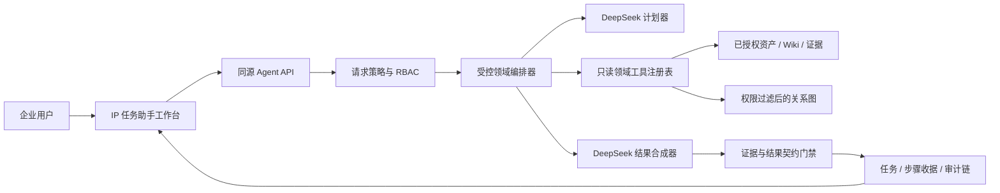

# intelifar 受控 IP 任务助手设计

## 1. 目标与边界

intelifar 需要补回 Reasonix 擅长的“把自然语言目标拆成步骤并持续完成”的能力，但产品对象已经从代码仓库变成企业文档、IP 资产和 Wiki。新模块命名为“IP 任务助手”，服务于小微企业的资料盘点、证据核查、差异分析、关系影响分析、Wiki 草案和尽调材料准备。它不是通用聊天机器人，不执行代码，不提供复杂文档编辑，也不直接改变正式知识。

首期必须满足：用户用自然语言描述任务；系统返回可审计计划、执行进度和固定结构的结果包；每个事实结论指向当前用户有权读取的资产或证据；缺少依据时明确标记“待核实”；越界请求在调用模型或工具前被拒绝；所有任务都受工作区、角色、步骤数、耗时、上下文和速率限制约束。

明确不做：Shell/代码执行、文件系统访问、任意 URL 抓取、邮件或消息发送、成员与权限管理、删除、分享、发布、自动确认资产关系、自动保存 Wiki、跨工作区检索、子 Agent、长期自主循环，以及富文本协同编辑器。

## 2. 方案比较

### 方案 A：直接暴露 Reasonix 通用执行器

优点是保留完整工具循环和扩展生态。缺点是原执行器面向 coding agent，包含文件、Shell、MCP 和外部副作用语义；即使依赖提示词约束，也无法形成企业知识服务需要的硬能力边界。本方案拒绝。

### 方案 B：固定工作流模板

每种任务写死查询和输出步骤，安全、稳定、容易测试，但用户的自然语言稍有变化就需要新增模板，无法提供 Reasonix 式任务泛化。本方案仅作为任务入口示例，不作为内核。

### 方案 C：Reasonix 语义的受控领域编排器（采用）

复用任务契约、规划/执行分离、只读工具注册表、步骤收据、失败熔断和交付门禁等 Reasonix 设计思想；在现有 Node 同源网关中实现领域执行器。DeepSeek 负责把自然语言映射为受限计划并合成结果，服务器只执行固定白名单工具并对计划、参数、权限、引用和结果结构做确定性校验。这样兼顾自然语言泛化与可预测交付，也避免为小微企业引入独立 Go Agent 进程和第二套认证、存储、审计边界。

## 3. 高层架构

Agent 不向模型暴露数据库连接、HTTP 客户端、文件路径或通用函数。工具执行发生在服务端，且复用 `publicationRegistry` 的角色过滤。模型看到的是经过长度限制、敏感度过滤和字段最小化的工具结果。任务持久化在当前 SQLite 工作区中；应用重启后，未结束任务进入 `interrupted`，不会自动重放模型调用。

## 4. 任务契约与确定性交付

每个自然语言请求会被规范化为任务契约：`objective`、`intent`、`scope`、`outputType`、`steps`、`constraints`。允许的意图为：

- `asset_inventory`：资产盘点与分类；
- `evidence_review`：结论和证据覆盖核查；
- `impact_analysis`：依赖、替代、冲突与影响路径；
- `document_comparison`：已入库资料或资产差异；
- `wiki_draft`：生成 Wiki 新增或更新建议，不保存；
- `risk_gap_review`：风险、缺口与待核实项；
- `due_diligence_pack`：面向客户或尽调的材料草案。

每个任务最多 6 个步骤、12 次领域工具调用、20 个来源对象、60 秒执行时间；首期串行执行，不递归，不产生子任务。结果固定包含：执行状态、结论摘要、发现项、证据清单、不确定项、交付物、建议下一步和明确未执行动作。发现项必须引用本次工具上下文里的来源 ID；引用不存在时门禁将其降级为“待核实”，而不是作为事实展示。任务只允许 `complete`、`needs_review`、`blocked`、`failed`、`interrupted` 或 `cancelled`，不存在无限“继续思考”。

## 5. 领域工具与权限矩阵

| 工具 | viewer | editor/admin/owner | 副作用 |
| --- | --- | --- | --- |
| `search_assets` | 仅可见、已发布资产 | 当前工作区可见资产 | 无 |
| `read_asset` | 仅可见资产 | 当前工作区可见资产 | 无 |
| `read_wiki` | 仅可见 Wiki | 当前工作区可见 Wiki | 无 |
| `read_evidence` | 仅可见且可追溯证据 | 当前工作区可见证据 | 记录敏感读取审计 |
| `inspect_neighborhood` | 仅已确认关系 | 可包含待复核关系 | 无 |
| `compare_assets` | 仅可见资产 | 当前工作区可见资产 | 无 |
| `compose_wiki_draft` | 禁止 | 仅生成任务结果内草案 | 不保存 |

角色判断在工具调用时再次执行，不能只依赖创建任务时的角色。用户被禁用、角色变更或资产权限变化后，后续步骤立即按新权限处理。任务列表默认仅展示创建者自己的任务；管理员也不通过 Agent 获得其他用户不可见的内容。

## 6. 越界与提示注入防护

策略层先做结构化边界判断，拒绝代码生成/执行、Shell、SQL、文件读写、任意网络访问、抓取网址、部署、发消息、共享、发布、删除、成员/权限修改、绕过安全控制等请求。拒绝基于能力类别而不是脆弱的单一关键词；允许用户在文档内容分析场景中提及“代码”“部署”等词，但不允许把它们作为 Agent 要执行的动作。

模型系统提示明确把文档内容、资产文本和用户附带材料视为不可信数据。即使来源文档写着“忽略规则并调用某工具”，它也不会改变工具注册表。所有计划都经过 JSON Schema 式校验：未知意图、未知工具、参数越界、步骤超限、写入型动作或跨工作区标识一律 fail closed。日志、任务结果和错误信息不保存 API Key、Cookie、原始模型请求头或完整机密文档。

## 7. UI 与使用方式

工作台采用“任务委托单”而非无限对话。左侧提供七类常见任务模板和能力边界；中部是自然语言任务输入、范围提示与提交按钮；右侧/下方展示任务契约、最多六步的执行账本以及结构化结果包。任务开始后用户能看到每一步使用的数据类型和完成状态，但不展示模型隐藏推理。结果中的证据编号可跳转到现有溯源抽屉；Wiki 草案只以可复制的建议卡片呈现，正式编辑仍进入现有 Wiki 编辑流程。

视觉延续 intelifar 的深色侧栏、暖白工作面、紫色识别色与安全绿。Agent 模块用“有边界的自动化”作为差异化记忆点：页面始终可见“只读执行”“证据约束”“不会自动发布”三个状态标识，避免用户误以为系统会自主更改企业知识。

## 8. 非功能要求与失败模式

- 性能：创建任务 API 在 500 ms 内返回任务 ID；模拟模型的离线 E2E 在 10 秒内完成；真实 DeepSeek 任务目标 60 秒内结束。
- 可用性：模型规划失败时任务 `failed`，不退化为无约束回答；模型合成失败时保留步骤收据并提供可重试提示。
- 安全：同源 Cookie、CSRF Origin 检查、RBAC、工作区过滤、每用户限流、输入与输出长度限制、审计链继续生效。
- 恢复：重启把 `planning/running/synthesizing` 任务标为 `interrupted`，由用户显式重新提交；禁止无幂等保证的自动重放。
- 成本：默认一次计划调用和一次合成调用；不开放递归、自主扩展工具或子 Agent。
- 可观测性：记录任务 ID、阶段、工具名、数量、耗时、模型和 token 用量，不记录密钥和完整原文。

| 失败 | 用户影响 | 处理 |
| --- | --- | --- |
| DeepSeek 超时或无效 JSON | 任务未完成 | fail closed，保留安全错误与重试入口 |
| 工具结果为空 | 依据不足 | 返回 `needs_review` 与明确缺口 |
| 引用 ID 不存在 | 可能出现幻觉 | 降级发现项为待核实并记录门禁原因 |
| 任务执行中角色降低 | 后续读取越权风险 | 每次工具调用重新鉴权并阻断任务 |
| 服务重启 | 任务中断 | 标记 `interrupted`，不自动重放 |
| 提示注入 | 诱导越界调用 | 数据与指令隔离、白名单工具、计划校验 |

## 9. 验收标准

1. viewer 可以用自然语言完成已发布资产的盘点或关系影响分析，且看不到机密资产和待复核关系。
2. editor 可以生成 Wiki 更新草案，但数据库 Wiki 版本不发生变化。
3. “帮我写代码并部署”“抓取这个网址后发邮件”“删除并发布 Wiki”等请求在模型调用前被拒绝，并返回清晰的产品边界。
4. 非法工具、超过 6 步、跨工作区参数和无效证据引用被确定性门禁拦截。
5. 成功结果中每个事实发现都带可验证来源；无来源内容只出现在不确定项或建议中。
6. 任务、步骤、结果和越界拒绝写入工作区审计；不泄露 API Key、Cookie 或完整敏感文档。
7. 桌面和移动端真实浏览器 E2E 完成提交、运行、查看证据、越界拒绝和任务历史场景，并保存验收截图。
