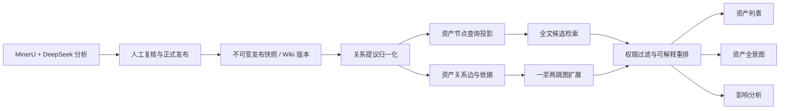

# intelifar IP 资产关系图与图搜索设计

## 1. 目标

在 IP 资产库中增加“列表 / 资产全景”双视图，并将全景图背后的关系数据建设为可检索、可审计、可重建的后端关系索引。它不只是展示组件，而是支撑以下业务问题：

- 一项核心技术被哪些资产依赖、引用或复用；
- 一个许可证、权属或生命周期风险会影响哪些下游资产；
- 哪些资产形成了技术簇，哪些资产长期孤立；
- 哪些方案重复、冲突、替代或从旧版本演化而来；
- 用户为什么会在搜索结果中看到某项资产，以及经过了哪条关系路径。

## 2. 设计边界

### 本期范围

- 节点只表示已正式发布的 IP 资产；
- 关系具有方向、类型、置信度、确认状态和原文依据；
- 支持关键词搜索后的一至两跳关系扩展；
- 支持按类型、部门、密级、关系类型、确认状态筛选；
- 支持人工确认、拒绝和替代 AI 建议关系；
- 提供全景图及等价的关系列表，保证键盘和读屏可用；
- 所有图查询严格限定在工作空间和当前用户可见资产内。

### 本期不做

- 不让图数据库取代发布快照、Wiki 版本或审计账本；
- 不把任意模型生成的概念直接创建为正式资产节点；
- 不默认进行无限深度遍历或跨企业工作空间分析；
- 不在小微企业版本首期引入独立 Neo4j 等重型服务；
- 不将关系图包装成自动决策工具，重要关系仍需人工确认。

## 3. 当前状态与问题

当前 `publications` 表将完整发布记录保存在 `payload_json`，Wiki 关系则作为 `wiki_versions.content_json` 的一部分保存。关系两端是模型输出的名称字符串，不是稳定资产 ID。搜索会加载工作空间全部资产，再对标题、摘要、标签和证据文本做字符串包含匹配。

这种实现适合演示和少量资产，但存在四个问题：

1. 同名、别名或名称变更会产生重复节点和错误连线；
2. 无法高效查询上游、下游、最短关联路径和影响范围；
3. 关系没有独立的确认状态、依据集合和生命周期；
4. 搜索不能利用关系距离解释和扩展结果。

## 4. 总体架构



采用轻量 CQRS 思路：发布快照和 Wiki 版本继续作为审计真相；节点、边和搜索索引是面向查询的投影，可通过正式记录幂等重建。投影故障不能破坏发布数据，重建也不能改变人工确认记录。

## 5. 数据模型

### 5.1 资产节点投影

```sql
CREATE TABLE asset_nodes (
  workspace_id TEXT NOT NULL,
  asset_id TEXT NOT NULL,
  publication_id TEXT NOT NULL,
  title TEXT NOT NULL,
  normalized_title TEXT NOT NULL,
  asset_type TEXT NOT NULL,
  owner TEXT NOT NULL,
  sensitivity TEXT NOT NULL,
  summary TEXT NOT NULL,
  tags_json TEXT NOT NULL,
  confidence REAL NOT NULL,
  status TEXT NOT NULL,
  version TEXT NOT NULL,
  updated_at TEXT NOT NULL,
  PRIMARY KEY (workspace_id, asset_id)
);
```

节点投影只保存查询所需字段。完整文档、Wiki、证据与版本仍从原有正式记录读取。

### 5.2 资产关系

```sql
CREATE TABLE asset_relationships (
  workspace_id TEXT NOT NULL,
  relationship_id TEXT NOT NULL,
  source_asset_id TEXT NOT NULL,
  target_asset_id TEXT NOT NULL,
  relation_type TEXT NOT NULL,
  confidence REAL NOT NULL,
  verification_status TEXT NOT NULL,
  origin TEXT NOT NULL,
  created_by TEXT,
  created_at TEXT NOT NULL,
  updated_at TEXT NOT NULL,
  superseded_by TEXT,
  PRIMARY KEY (workspace_id, relationship_id),
  UNIQUE (workspace_id, source_asset_id, target_asset_id, relation_type)
);
```

首期关系类型限制为：

| 类型 | 方向 | 业务含义 |
| --- | --- | --- |
| `depends_on` | 有向 | 源资产依赖目标资产 |
| `implements` | 有向 | 源资产实现目标方案或规则 |
| `derived_from` | 有向 | 源资产由目标资产演化而来 |
| `replaces` | 有向 | 源资产替代目标资产 |
| `references` | 有向 | 源资产引用目标资产 |
| `part_of` | 有向 | 源资产属于目标资产组成部分 |
| `similar_to` | 对称 | 两项资产具有明显相似性 |
| `conflicts_with` | 对称 | 两项资产存在规则、权属或实现冲突 |

关系状态为 `proposed`、`confirmed`、`rejected`、`superseded`；来源为 `model`、`manual` 或 `import`。正式搜索默认只使用 `confirmed`，用户主动开启“AI 建议”后才显示 `proposed`。

### 5.3 关系依据与别名

```sql
CREATE TABLE relationship_evidence (
  workspace_id TEXT NOT NULL,
  relationship_id TEXT NOT NULL,
  evidence_id TEXT NOT NULL,
  PRIMARY KEY (workspace_id, relationship_id, evidence_id)
);

CREATE TABLE asset_aliases (
  workspace_id TEXT NOT NULL,
  asset_id TEXT NOT NULL,
  alias TEXT NOT NULL,
  normalized_alias TEXT NOT NULL,
  source TEXT NOT NULL,
  PRIMARY KEY (workspace_id, asset_id, normalized_alias)
);
```

每条正式关系至少绑定一个证据编号或一条人工确认审计事件。关系详情必须能回答“谁在何时确认、依据是什么、来源资产版本是什么”。

## 6. 关系生成与实体归一化

1. DeepSeek 输出关系提议，服务端只接受受控关系类型；
2. 优先使用模型返回的稳定资产 ID；没有 ID 时按同工作空间内的正式编号、标准标题和别名匹配；
3. 多个候选匹配或置信度不足时，关系保持未解析，不创建伪节点；
4. 匹配成功后写入 `proposed` 关系并绑定原文依据；
5. 编辑者可确认或拒绝，所有状态变化追加审计事件；
6. Wiki 版本更新后重新生成提议，但不能覆盖人工确认结果；需要变化时创建新边并将旧边标记为 `superseded`。

模型置信度不能替代实体一致性校验。标题相似只用于生成候选，不能自动形成正式关系。

## 7. 搜索设计

图搜索与文本搜索互补，不能互相替代。

### 7.1 查询流程

1. 对标题、编号、摘要、标签和允许检索的证据文本进行全文候选召回；
2. 对前 N 个候选资产沿 `confirmed` 关系扩展一至两跳；
3. 在扩展前过滤工作空间、角色、密级和资产状态；
4. 综合文本相关性、关系距离、关系类型、确认状态、证据置信度和更新时间重排；
5. 返回搜索命中原因和最多两跳的解释路径。

示例响应：

```json
{
  "assetId": "IP-2026-0838",
  "title": "异构执行时编排框架",
  "matchedBy": "graph-expansion",
  "path": [
    {
      "sourceAssetId": "IP-2026-0841",
      "relationType": "depends_on",
      "targetAssetId": "IP-2026-0838",
      "relationshipId": "REL-001"
    }
  ],
  "explanation": "与关键词命中的资产存在已确认技术依赖关系"
}
```

### 7.2 排序原则

- 精确编号和标题命中优先于图扩展；
- 一跳关系优先于两跳关系；
- 人工确认关系优先于 AI 建议；
- 有多条独立依据的关系可以提升排序，但不能压过无权限边界；
- `conflicts_with`、`replaces` 等高业务价值关系可按查询意图提升；
- 实际权重通过固定金标查询集评估，不在代码中散落不可解释常量。

### 7.3 小微企业实现

首期使用 SQLite 规范化表、关系索引、字符友好的全文索引和受限递归查询。查询深度最大为 2，默认返回不超过 100 个节点和 200 条边。语义向量检索放在后续阶段，不作为全景图上线前置条件。

## 8. API 设计

| 接口 | 用途 |
| --- | --- |
| `GET /api/assets/graph` | 获取工作空间全景子图，支持筛选、游标和节点上限 |
| `GET /api/assets/:id/neighborhood` | 获取某项资产一至两跳关系网络 |
| `GET /api/assets/search` | 统一全文与图扩展搜索，返回解释路径 |
| `GET /api/relationships/:id` | 获取关系详情、依据和确认历史 |
| `POST /api/relationships/:id/confirm` | 编辑者确认 AI 建议关系 |
| `POST /api/relationships/:id/reject` | 编辑者拒绝关系并填写原因 |
| `POST /api/relationships` | 编辑者手工创建有依据的关系 |

所有接口从服务端会话获得 `workspace_id`，不接受客户端指定其他工作空间。viewer 只能读取可见关系；editor、admin、owner 可以确认或拒绝；关系删除采用状态变更，不物理删除审计历史。

## 9. 前端全景图

### 9.1 布局

- 资产库标题区增加“列表 / 资产全景”切换；
- 左侧为资产类型、部门、密级、关系类型和确认状态筛选；
- 中央为可缩放关系网络，默认按技术主题或关系密度聚类；
- 右侧为选中资产或关系详情，提供“打开 Wiki”“查看依据”“影响分析”；
- 顶部搜索会聚焦匹配节点，同时保留列表搜索结果；
- 提供“只看上下游”“隐藏孤立节点”“显示 AI 建议”等开关。

### 9.2 视觉语义

- 节点颜色表示资产类型，外圈或徽标表示密级；
- 实线表示已确认关系，虚线表示 AI 建议；
- 方向关系使用箭头，对称关系不使用箭头；
- 边宽不能只代表置信度，同时显示数值和依据数量；
- 风险关系使用图标和线型，不只依赖红绿色；
- 默认只展示可读数量的核心节点，用户按需展开，避免“毛线团”。

### 9.3 可访问性和移动端

- 图形旁提供完全等价的关系列表；
- 节点可以 Tab 聚焦，方向键切换邻接节点，Enter 打开详情；
- 所有筛选和状态变化有可读状态提示；
- 移动端默认使用关系路径列表和单节点邻域，不渲染完整全景；
- `prefers-reduced-motion` 下关闭布局动画。

## 10. 权限与安全

权限过滤必须发生在图遍历之前：

1. 先得到当前用户可见资产集合；
2. 只在该集合内选择起点和遍历关系；
3. 目标节点不可见时，整条边直接消失，不显示“受限节点”占位；
4. 搜索解释路径中的每个节点和每条依据都单独授权；
5. 图缓存键包含工作空间、角色、用户策略版本和筛选条件；
6. 关系确认、拒绝、创建和批量重建写入哈希审计链。

这可防止通过节点数量、边方向或搜索解释推断机密资产存在。

## 11. 一致性、错误处理与重建

| 故障 | 行为与恢复 |
| --- | --- |
| 发布成功但投影失败 | 发布仍成功，记录投影待修复状态；后台或管理员操作幂等重建 |
| 模型输出未知关系类型 | 拒绝该关系提议，保留安全错误码，不写边 |
| 两端资产无法唯一匹配 | 保存为待解析提议，不出现在正式图和正式搜索 |
| 出现循环关系 | 允许合法业务环，但遍历记录已访问节点并受深度/数量限制 |
| 查询节点过多 | 服务端截断并返回 `truncated=true`，前端提示继续筛选 |
| 投影与发布快照不一致 | 校验任务报告差异；可从快照重建节点，但保留人工关系状态 |
| Wiki 更新导致关系变化 | 新建议进入 `proposed`，不静默覆盖 `confirmed` |

## 12. 非功能要求

| 类别 | 首期目标 |
| --- | --- |
| 规模 | 单工作空间 10,000 个资产节点、100,000 条关系内稳定运行 |
| 搜索性能 | 常用关键词与一跳扩展 p95 小于 400 ms |
| 图查询性能 | 单根节点两跳、200 条边以内 p95 小于 500 ms |
| 前端性能 | 100 节点首屏布局 2 秒内可交互，超量时服务端截断 |
| 完整性 | 人工确认关系及依据 RPO 为 0，与状态变更事务一致提交 |
| 可恢复性 | 查询投影可从正式记录重建，10,000 节点规模目标 RTO 小于 30 分钟 |
| 安全 | 工作空间隔离、服务端关系级授权、无隐藏节点侧信道 |
| 可观测性 | 记录查询耗时、候选数、扩展节点数、截断率、未解析提议数和投影延迟 |

## 13. 测试与验收

### 数据与接口

- 数据迁移、唯一约束、工作空间隔离和事务回滚；
- 节点投影和关系重建幂等性；
- 人工确认关系不会被模型更新覆盖；
- 环、重复边、对称边、失效资产和超量截断；
- viewer/editor/admin/owner 权限矩阵；
- 隐藏目标节点与解释路径不得泄露；
- 中文标题、编号、标签和证据全文搜索；
- 一跳、两跳、关系类型和确认状态排序；
- 每个图扩展结果都有可验证解释路径。

### E2E

1. 发布至少三项真实资产并生成关系提议；
2. 编辑者确认一条、拒绝一条关系；
3. 列表切换至全景图并按类型、密级和关系筛选；
4. 点击节点打开资产详情，点击边查看原文依据；
5. 搜索一个资产并验证关联资产及解释路径；
6. viewer 无法看到机密节点或间接推断其关系；
7. 桌面、键盘、缩减动画和移动端关系路径全部通过；
8. 保存全景、节点邻域、关系依据和移动端截图。

### 业务验收

- 至少 90% 的人工确认关系可以在两次点击内打开原文依据；
- 金标查询 Top 10 中的相关资产召回率不低于现有搜索；
- 图扩展结果全部说明“为何关联”，不出现无解释推荐；
- 20 名以内试用用户能够独立完成“找到核心资产的所有下游影响”任务。

## 14. 分阶段交付

### P1：真实关系底座

规范化节点、关系、依据和别名；完成迁移、重建、状态生命周期和接口测试。

### P2：图增强搜索

上线全文候选、一至两跳扩展、可解释排序和关系管理 API。

### P3：资产全景 UI

上线列表/全景双视图、筛选、节点详情、边依据、关系列表和移动端路径。

### P4：质量与运营

加入孤立资产、核心资产、风险传播统计，完成真实 E2E、性能基准、权限渗透测试和用户手册截图。

## 15. 独立图数据库升级条件

只有出现以下已测量需求之一，才评估独立图数据库：

- 在线查询经常超过两跳并需要复杂路径算法；
- 单工作空间关系达到百万级，SQLite 在正确索引后仍不能满足 p95；
- 需要图计算服务独立扩缩容或高可用；
- 需要持续运行社区发现、中心性或大规模影响传播算法；
- 大型企业已有批准的图数据库基础设施并要求接入。

升级时仍把图数据库作为查询投影，不把发布快照、Wiki 版本和审计真相迁移成不可重建的图数据。
